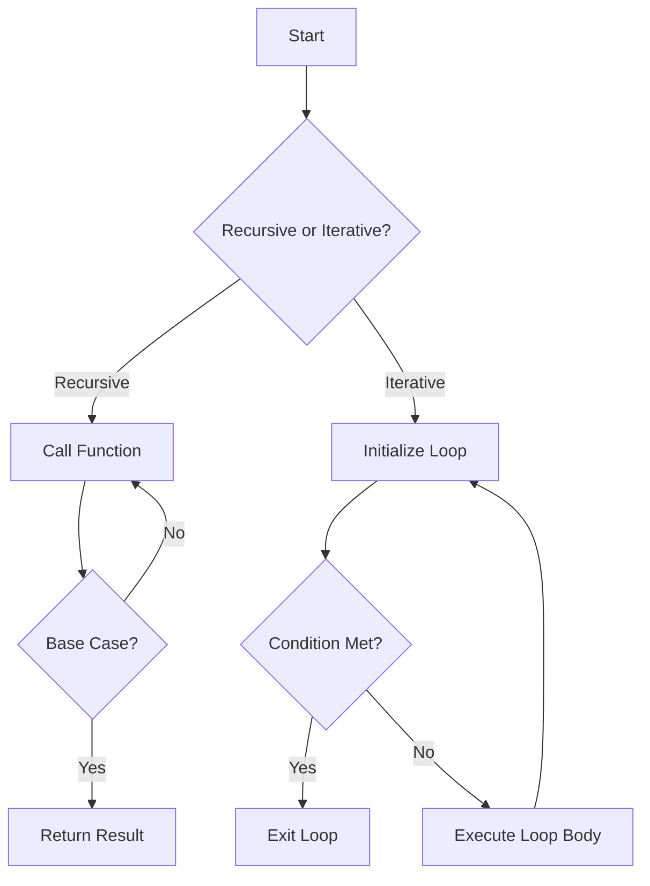

## 5.7 Recursion vs. Iteration

In the realm of programming, recursion and iteration are two fundamental techniques used to perform repetitive tasks. While both can achieve similar outcomes, they differ significantly in their approach and application, especially in a functional programming language like Clojure. In this section, we will explore the differences between recursion and iteration, discuss the advantages of using recursion, provide guidelines on when to use each, and delve into the performance considerations, particularly focusing on Clojure's optimizations for recursion.

### Differences Between Recursion and Iteration

**Recursion** is a technique where a function calls itself in order to solve a problem. It is a natural fit for problems that can be broken down into smaller, similar sub-problems, such as navigating hierarchical data structures like trees or graphs. Recursion often leads to more elegant and concise code, as it allows developers to express complex problems in a more declarative manner.

**Iteration**, on the other hand, involves using loops to repeat a block of code until a certain condition is met. It is a more imperative approach, often seen in languages like Java, where constructs such as `for`, `while`, and `do-while` loops are used to iterate over data structures or perform repeated actions.

#### Code Example: Factorial Calculation

To illustrate the difference, let's consider the problem of calculating the factorial of a number. We'll implement this in both recursive and iterative styles in Clojure.

**Recursive Factorial:**

```clojure
(defn factorial-recursive [n]
  (if (<= n 1)
    1
    (* n (factorial-recursive (dec n)))))
```

**Iterative Factorial:**

```clojure
(defn factorial-iterative [n]
  (loop [acc 1
         counter n]
    (if (<= counter 1)
      acc
      (recur (* acc counter) (dec counter)))))
```

In the recursive version, the function calls itself with a decremented value until it reaches the base case (`n <= 1`). In the iterative version, we use a `loop` and `recur` to maintain state across iterations.

### Advantages of Recursion

Recursion offers several advantages, particularly in functional programming:

1. **Elegance and Simplicity**: Recursive solutions often lead to cleaner and more readable code. They allow you to express the solution in a way that closely mirrors the problem statement, making it easier to understand and maintain.

2. **Natural Fit for Hierarchical Data**: Recursion is ideal for processing hierarchical or nested data structures, such as trees or graphs. It allows you to traverse these structures naturally, applying operations at each level of the hierarchy.

3. **Immutability and State Management**: In functional programming, recursion aligns well with the principles of immutability and statelessness. Each recursive call creates a new scope, avoiding shared state and side effects.

#### Example: Traversing a Binary Tree

Consider a binary tree where each node contains a value and references to left and right children. Recursion is a perfect fit for traversing this structure.

```clojure
(defn inorder-traversal [node]
  (when node
    (concat
      (inorder-traversal (:left node))
      [(:value node)]
      (inorder-traversal (:right node)))))
```

This recursive function performs an in-order traversal of a binary tree, visiting the left subtree, the current node, and then the right subtree.

### When to Use Each

Choosing between recursion and iteration depends on the problem context and the specific requirements of your application. Here are some guidelines to help you decide:

- **Use Recursion When**:
  - The problem naturally fits a recursive solution, such as navigating hierarchical data.
  - You want to leverage the elegance and simplicity of recursive code.
  - You are working in a functional programming paradigm that encourages immutability and statelessness.

- **Use Iteration When**:
  - Performance is a critical concern, and you need to avoid the overhead of recursive function calls.
  - The problem involves simple repetitive tasks that do not benefit from a recursive approach.
  - You are working in an imperative programming environment where iteration is more idiomatic.

### Performance Considerations

Recursion can introduce performance challenges, particularly due to the overhead of function calls and the risk of stack overflow for deep recursion. However, Clojure provides optimizations that can mitigate these issues.

#### Tail Recursion Optimization

Clojure supports tail call optimization through the `recur` special form. Tail recursion occurs when the recursive call is the last operation in the function, allowing the compiler to optimize the call and reuse the current stack frame.

**Tail Recursive Example:**

```clojure
(defn factorial-tail-recursive [n]
  (letfn [(helper [acc n]
            (if (<= n 1)
              acc
              (recur (* acc n) (dec n))))]
    (helper 1 n)))
```

In this example, the `helper` function is tail recursive, as the recursive call to `recur` is the last operation. This allows Clojure to optimize the recursion and prevent stack overflow.

#### Performance Comparison with Java

In Java, recursion can be less efficient due to the lack of built-in tail call optimization. Iteration is often preferred for performance-critical tasks. However, in Clojure, tail recursion can provide similar performance to iteration, making it a viable option even for performance-sensitive applications.

### Try It Yourself

Experiment with the provided examples by modifying the recursive and iterative functions to handle different problems, such as calculating the Fibonacci sequence or traversing different data structures. Observe how the structure of the code changes and consider the trade-offs between recursion and iteration.

### Visual Aids

To further illustrate the differences and applications of recursion and iteration, let's use a flowchart to visualize the control flow of both approaches.



**Diagram Description**: This flowchart demonstrates the control flow of recursive and iterative approaches. In recursion, the function calls itself until a base case is met. In iteration, a loop executes until a condition is satisfied.

### References and Links

For further reading and exploration, consider the following resources:

- [Clojure Official Documentation](https://clojure.org/reference)
- [Clojure Community Resources](https://clojure.org/community/resources)
- [Transitioning from OOP to Functional Programming](https://www.lispcast.com/oo-to-fp/)

### Knowledge Check

To reinforce your understanding of recursion and iteration, consider the following questions and exercises:

- What are the main differences between recursion and iteration?
- Provide an example where recursion is more advantageous than iteration.
- Explain how tail recursion optimization works in Clojure.
- Modify the recursive factorial function to calculate the Fibonacci sequence.
- Compare the performance of recursive and iterative solutions for a given problem.

### Encouraging Engagement

Embracing functional programming can be challenging, but with each step, you'll gain a deeper understanding and see tangible benefits in your codebase. By mastering recursion and iteration, you'll be well-equipped to tackle a wide range of problems in Clojure.

### Test Your Knowledge: Recursion vs. Iteration Quiz



### What is the primary difference between recursion and iteration?

- [x] Recursion involves a function calling itself, while iteration uses loops.
- [ ] Recursion is always more efficient than iteration.
- [ ] Iteration can only be used in imperative languages.
- [ ] Recursion requires more memory than iteration.

> **Explanation:** Recursion involves a function calling itself to solve a problem, while iteration uses loops to repeat a block of code.

### When is recursion more advantageous than iteration?

- [x] When dealing with hierarchical data structures.
- [ ] When performance is the primary concern.
- [ ] When working with simple repetitive tasks.
- [ ] When using imperative programming languages.

> **Explanation:** Recursion is more advantageous when dealing with hierarchical data structures, as it naturally fits the problem.

### How does Clojure optimize tail recursion?

- [x] By reusing the current stack frame with the `recur` special form.
- [ ] By converting recursion into iteration automatically.
- [ ] By using a larger stack size.
- [ ] By eliminating all recursive calls.

> **Explanation:** Clojure optimizes tail recursion by reusing the current stack frame with the `recur` special form, preventing stack overflow.

### What is a base case in recursion?

- [x] A condition that stops the recursion.
- [ ] The first call of the recursive function.
- [ ] The last line of the function.
- [ ] A loop that executes at the end of the function.

> **Explanation:** A base case is a condition that stops the recursion, preventing infinite recursion and stack overflow.

### Which of the following is a tail recursive function?

- [x] A function where the recursive call is the last operation.
- [ ] A function that calls itself multiple times.
- [x] A function that uses `recur` in Clojure.
- [ ] A function that does not have a base case.

> **Explanation:** A tail recursive function is one where the recursive call is the last operation, and in Clojure, it often uses `recur`.

### What is the risk of deep recursion without optimization?

- [x] Stack overflow.
- [ ] Infinite loops.
- [ ] Memory leaks.
- [ ] Compiler errors.

> **Explanation:** Deep recursion without optimization can lead to stack overflow, as each recursive call consumes stack space.

### Why might iteration be preferred in performance-critical tasks?

- [x] It avoids the overhead of function calls.
- [ ] It is always more readable than recursion.
- [x] It is more idiomatic in imperative languages.
- [ ] It uses less memory than recursion.

> **Explanation:** Iteration avoids the overhead of function calls and is often more idiomatic in imperative languages, making it suitable for performance-critical tasks.

### How does recursion align with functional programming principles?

- [x] By promoting immutability and statelessness.
- [ ] By using loops to manage state.
- [ ] By encouraging side effects.
- [ ] By requiring mutable variables.

> **Explanation:** Recursion aligns with functional programming principles by promoting immutability and statelessness, as each call creates a new scope.

### What is the purpose of the `recur` special form in Clojure?

- [x] To enable tail call optimization.
- [ ] To create infinite loops.
- [ ] To initialize variables.
- [ ] To handle exceptions.

> **Explanation:** The `recur` special form in Clojure enables tail call optimization, allowing recursive functions to be optimized for performance.

### True or False: In Clojure, recursion is always more efficient than iteration.

- [ ] True
- [x] False

> **Explanation:** False. While Clojure provides optimizations for recursion, iteration can still be more efficient in certain cases, especially without tail call optimization.


