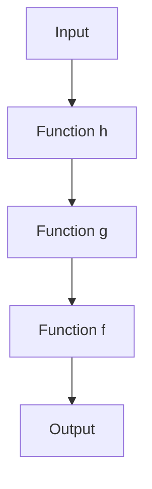

## 6.1 The `comp` Function for Composition

In the realm of functional programming, the ability to compose functions is a powerful tool that allows developers to build complex operations from simpler ones. Clojure, a functional language that runs on the Java Virtual Machine (JVM), provides a robust mechanism for function composition through its `comp` function. This section explores the `comp` function in detail, illustrating how it can be used to create elegant and efficient code.

### **Deep Dive into `comp`**

The `comp` function in Clojure is a higher-order function that takes a variable number of functions as arguments and returns a new function. This new function is the result of composing the input functions such that the output of one function becomes the input to the next. This is analogous to the mathematical concept of function composition, where \\( f \circ g \\) means \\( f(g(x)) \\).

#### **Understanding `comp` Syntax**

The syntax for `comp` is straightforward:

```clojure
(comp f g h)
```

This expression creates a new function that, when called with an argument `x`, computes `f(g(h(x)))`. The functions are applied from right to left, meaning the last function in the argument list is applied first.

#### **Why Use `comp`?**

- **Modularity**: By composing functions, you can break down complex operations into smaller, reusable components.
- **Readability**: Function composition can make your code more readable by reducing the need for deeply nested expressions.
- **Maintainability**: Composed functions are easier to test and maintain, as each function can be developed and tested independently.

### **Usage Patterns**

#### **Common Patterns and Best Practices**

When using `comp`, consider the following patterns and best practices to enhance your code's readability and maintainability:

1. **Compose Small Functions**: Start by composing small, single-purpose functions. This makes it easier to understand and debug the composed function.

2. **Limit the Number of Composed Functions**: While `comp` can take any number of functions, composing too many can make the resulting function difficult to understand. Aim for a balance between composition and clarity.

3. **Use Descriptive Function Names**: Ensure that the functions you are composing have descriptive names, which can help convey the purpose of the composition.

4. **Comment Complex Compositions**: If a composition is particularly complex, consider adding comments to explain the logic.

#### **Readability and Maintainability Considerations**

Function composition can greatly enhance code readability, but it requires careful consideration:

- **Avoid Over-Composition**: Composing too many functions can lead to code that's difficult to follow. Break down complex compositions into smaller parts if necessary.
- **Use Intermediate Variables**: If a composition becomes too complex, consider breaking it into smaller compositions or using intermediate variables to clarify the steps.

### **Nested Functions Simplification**

One of the primary advantages of using `comp` is its ability to simplify nested function calls. Consider the following example without `comp`:

```clojure
(defn process-data [data]
  (let [step1 (transform1 data)
        step2 (transform2 step1)
        step3 (transform3 step2)]
    step3))
```

Using `comp`, this can be rewritten as:

```clojure
(def process-data
  (comp transform3 transform2 transform1))
```

This version is more concise and highlights the sequence of transformations applied to the data.

### **Examples of `comp` in Action**

Let's explore some practical examples of using `comp` to compose functions for various tasks.

#### **Example 1: Composing Mathematical Operations**

Suppose we have three simple mathematical functions:

```clojure
(defn add [x] (+ x 5))
(defn multiply [x] (* x 2))
(defn subtract [x] (- x 3))
```

We can compose these functions to create a new function that applies all three operations in sequence:

```clojure
(def math-operation (comp subtract multiply add))

(println (math-operation 10)) ; Outputs 27
```

In this example, `math-operation` is a composed function that first adds 5 to the input, then multiplies the result by 2, and finally subtracts 3.

#### **Example 2: Data Transformation Pipeline**

Consider a scenario where we need to process a collection of data. We have functions to filter, map, and reduce the data:

```clojure
(defn filter-even [coll] (filter even? coll))
(defn square [coll] (map #(* % %) coll))
(defn sum [coll] (reduce + coll))
```

Using `comp`, we can create a data transformation pipeline:

```clojure
(def process-numbers (comp sum square filter-even))

(println (process-numbers [1 2 3 4 5 6])) ; Outputs 56
```

This pipeline filters out odd numbers, squares the remaining numbers, and then sums them up.

### **Try It Yourself**

Experiment with the following code by modifying the functions and observing the results:

```clojure
(defn divide [x] (/ x 2))
(defn increment [x] (+ x 1))

(def custom-operation (comp divide increment))

(println (custom-operation 9)) ; Try changing the input and functions
```

### **Visual Aids**

To further illustrate function composition, consider the following flowchart that represents the data flow in a composed function:



This diagram shows how data flows through each function in the composition, from the input to the final output.

### **References and Links**

- [Clojure Official Documentation](https://clojure.org/reference)
- [Clojure Community Resources](https://clojure.org/community/resources)
- [Transitioning from OOP to Functional Programming](https://www.lispcast.com/oo-to-fp/)

### **Knowledge Check**

To reinforce your understanding of function composition with `comp`, consider the following questions and exercises:

1. What are the benefits of using `comp` for function composition?
2. How does `comp` enhance code readability and maintainability?
3. Rewrite a nested function call using `comp`.
4. Create a composed function that performs a series of string manipulations.
5. Experiment with `comp` by composing functions with different arities.

### **Encouraging Engagement**

Embracing functional programming can be challenging, but with each step, you'll gain a deeper understanding and see tangible benefits in your codebase. As you explore function composition with `comp`, remember to experiment and iterate. The more you practice, the more intuitive these concepts will become.

### **Test Your Knowledge: The `comp` Function for Composition Quiz**



### What is the primary purpose of the `comp` function in Clojure?

- [x] To compose multiple functions into a single function
- [ ] To execute functions in parallel
- [ ] To create anonymous functions
- [ ] To handle errors in functional code

> **Explanation:** The `comp` function is used to compose multiple functions into a single function, allowing for modular and reusable code.

### How does the `comp` function apply functions to arguments?

- [x] From right to left
- [ ] From left to right
- [ ] Randomly
- [ ] Based on function arity

> **Explanation:** The `comp` function applies functions from right to left, meaning the last function in the argument list is applied first.

### What is a common benefit of using `comp`?

- [x] Improved code readability
- [ ] Increased execution speed
- [ ] Automatic error handling
- [ ] Reduced memory usage

> **Explanation:** `comp` improves code readability by simplifying nested function calls and making the sequence of operations clearer.

### Which of the following is a best practice when using `comp`?

- [x] Compose small, single-purpose functions
- [ ] Compose as many functions as possible
- [ ] Avoid using descriptive function names
- [ ] Always use `comp` for every function call

> **Explanation:** Composing small, single-purpose functions is a best practice as it enhances readability and maintainability.

### Which code snippet correctly uses `comp` to compose functions?

- [x] `(comp f g h)`
- [ ] `(comp (f g h))`
- [ ] `(compose f g h)`
- [ ] `(f g h)`

> **Explanation:** `(comp f g h)` is the correct syntax for composing functions using `comp`.

### What is the result of `(comp inc dec)` when applied to the number 5?

- [x] 5
- [ ] 6
- [ ] 4
- [ ] 0

> **Explanation:** The `comp` function will first apply `dec` to 5, resulting in 4, then apply `inc` to 4, resulting in 5.

### How can `comp` help in maintaining code?

- [x] By reducing the need for deeply nested expressions
- [ ] By automatically optimizing code performance
- [ ] By generating documentation
- [ ] By enforcing coding standards

> **Explanation:** `comp` helps maintain code by reducing the need for deeply nested expressions, making the code more readable.

### What is a potential downside of overusing `comp`?

- [x] Reduced code clarity
- [ ] Increased execution time
- [ ] More memory usage
- [ ] Automatic error generation

> **Explanation:** Overusing `comp` can reduce code clarity if too many functions are composed, making it difficult to follow the logic.

### Which of the following is NOT a use case for `comp`?

- [x] Handling exceptions
- [ ] Composing mathematical operations
- [ ] Creating data transformation pipelines
- [ ] Simplifying nested function calls

> **Explanation:** `comp` is not used for handling exceptions; it is used for composing functions.

### True or False: The `comp` function can only be used with functions that take a single argument.

- [ ] True
- [x] False

> **Explanation:** False. The `comp` function can be used with functions of varying arities, but care must be taken to ensure that the output of one function matches the input requirements of the next.




