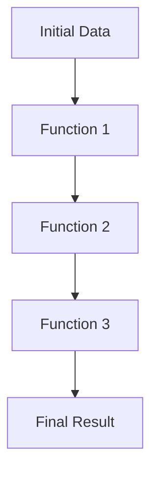

## 6.2 Threading Macros: `->` and `->>`

In the realm of functional programming, readability and maintainability of code are paramount. Clojure, with its rich set of features, offers threading macros `->` (thread-first) and `->>` (thread-last) to enhance these aspects. These macros are particularly useful for developers transitioning from Java object-oriented programming (OOP) to Clojure's functional paradigm, as they provide a clean and intuitive way to compose functions and manage data transformation pipelines.

### Purpose of Threading Macros

Threading macros in Clojure serve the primary purpose of improving code readability by reordering function calls in a way that reflects the logical flow of data through transformations. They allow developers to avoid deeply nested expressions, which can be difficult to read and understand, especially for those accustomed to the more linear flow of imperative programming languages like Java.

#### Why Use Threading Macros?

- **Improved Readability**: By reducing nesting and making the flow of data explicit, threading macros make code easier to read and understand.
- **Simplified Function Composition**: They allow for a more straightforward composition of functions by threading data through a series of transformations.
- **Maintainability**: Code that is easier to read is also easier to maintain, debug, and extend.

### The `->` Macro (Thread-First)

The `->` macro, also known as the thread-first macro, is used to thread an expression through a series of forms by inserting it as the first argument of each form. This is particularly useful when dealing with functions that expect their primary data input as the first argument.

#### How Does `->` Work?

The `->` macro takes an initial expression and a series of forms. It threads the expression through the forms by inserting it as the first argument in each form. This is akin to piping data through a series of transformations.

**Syntax**:

```clojure
(-> initial-expression
    (function1 args...)
    (function2 args...)
    ...)
```

**Example**:

Consider a scenario where we have a series of transformations to apply to a data structure:

```clojure
(defn process-data [data]
  (-> data
      (filter even?)
      (map #(* % 2))
      (reduce +)))
```

In this example, `data` is filtered to retain even numbers, each number is doubled using `map`, and the results are summed using `reduce`. The `->` macro makes the flow of data through these transformations clear and linear.

#### Practical Use Cases for `->`

- **Data Processing Pipelines**: When processing collections or data streams, `->` can simplify the application of multiple transformations.
- **Configuration and Setup**: In scenarios where multiple setup steps are required, `->` can help keep the code clean and organized.

### The `->>` Macro (Thread-Last)

The `->>` macro, or thread-last macro, is similar to `->`, but it threads the expression by inserting it as the last argument in each form. This is useful for functions that expect their primary data input as the last argument.

#### How Does `->>` Work?

The `->>` macro takes an initial expression and a series of forms, threading the expression through by inserting it as the last argument.

**Syntax**:

```clojure
(->> initial-expression
     (function1 args...)
     (function2 args...)
     ...)
```

**Example**:

Let's look at an example where the primary data input is expected as the last argument:

```clojure
(defn transform-data [data]
  (->> data
       (map inc)
       (filter odd?)
       (take 5)))
```

Here, `data` is incremented using `map`, filtered to retain odd numbers, and the first five elements are taken. The `->>` macro ensures that `data` is threaded as the last argument in each transformation, aligning with the functions' expectations.

#### Practical Use Cases for `->>`

- **Stream Processing**: When working with streams or sequences where transformations naturally expect the data as the last argument.
- **Chaining Operations**: In cases where operations are naturally expressed with the data as the last input, such as in certain mathematical computations or data analyses.

### Examples and Comparisons

Let's explore more examples to illustrate the differences and appropriate use cases for `->` and `->>`.

#### Example 1: Using `->` for JSON Data Transformation

Suppose we have a JSON object representing user data, and we want to extract and transform specific fields:

```clojure
(require '[cheshire.core :as json])

(def user-json "{\"name\": \"Alice\", \"age\": 30, \"email\": \"alice@example.com\"}")

(defn transform-user [json-str]
  (-> json-str
      (json/parse-string true)
      (select-keys [:name :email])
      (assoc :status "active")))
```

In this example, `->` is used to parse the JSON string, select specific keys, and associate a new status. The flow of transformations is clear and linear.

#### Example 2: Using `->>` for List Processing

Consider a list of numbers where we want to apply a series of transformations:

```clojure
(def numbers [1 2 3 4 5 6 7 8 9 10])

(defn process-numbers [nums]
  (->> nums
       (map #(* % %))
       (filter #(> % 20))
       (sort)))
```

Here, `->>` is used to map each number to its square, filter numbers greater than 20, and sort the results. The `->>` macro threads `nums` as the last argument, aligning with the functions' expectations.

### Try It Yourself

To deepen your understanding, try modifying the examples above:

- **Experiment with Different Functions**: Replace `map`, `filter`, or `reduce` with other functions to see how the threading macros adapt.
- **Combine `->` and `->>`**: In more complex pipelines, try combining both macros to see how they complement each other.
- **Add Error Handling**: Introduce error handling functions into the pipeline to see how they integrate with the threading macros.

### Visual Aids

To further illustrate the concept, let's use a flowchart to depict the data flow in a threading macro pipeline.



**Diagram Description**: This flowchart represents the linear flow of data through a series of functions using threading macros. Each function transforms the data, which is then passed to the next function in the pipeline.

### References and Links

- [Clojure Official Documentation](https://clojure.org/reference)
- [Clojure Community Resources](https://clojure.org/community/resources)
- [Transitioning from OOP to Functional Programming](https://www.lispcast.com/oo-to-fp/)
- [Cheshire JSON Library](https://github.com/dakrone/cheshire)

### Knowledge Check

To reinforce your understanding of threading macros, consider the following questions:

- How does the `->` macro improve code readability?
- In what scenarios would you prefer `->>` over `->`?
- Can you combine `->` and `->>` in a single pipeline? If so, how?

### Key Takeaways

- **Threading macros enhance code readability** by reducing nesting and making data flow explicit.
- **`->` is ideal for functions expecting data as the first argument**, while `->>` is suited for functions expecting data as the last argument.
- **Experimentation and practice** with threading macros will deepen your understanding and improve your functional programming skills.

## **Test Your Knowledge: Threading Macros: `->` and `->>` Quiz**



### What is the primary purpose of threading macros in Clojure?

- [x] To improve code readability by reordering function calls
- [ ] To increase the execution speed of code
- [ ] To reduce the number of lines of code
- [ ] To enable object-oriented programming in Clojure

> **Explanation:** Threading macros are designed to improve code readability by making the flow of data through functions explicit and reducing nesting.

### How does the `->` macro thread an expression through forms?

- [x] By inserting the expression as the first argument in each form
- [ ] By inserting the expression as the last argument in each form
- [ ] By reversing the order of forms
- [ ] By duplicating the expression in each form

> **Explanation:** The `->` macro threads an expression by placing it as the first argument in each subsequent form, creating a clear data flow.

### Which macro would you use for a function that expects its primary data input as the last argument?

- [ ] `->`
- [x] `->>`
- [ ] `->>>>`
- [ ] `->>>`

> **Explanation:** The `->>` macro is used to thread expressions as the last argument in each form, making it suitable for functions expecting data in this position.

### In the context of threading macros, what does "threading" refer to?

- [x] Passing data through a series of transformations
- [ ] Creating concurrent threads for parallel execution
- [ ] Weaving multiple functions together into a single operation
- [ ] Debugging and testing code

> **Explanation:** "Threading" in this context refers to passing data through a sequence of transformations, making the process explicit and readable.

### Can `->` and `->>` be combined in a single pipeline?

- [x] Yes
- [ ] No
- [ ] Only with special syntax
- [ ] Only in ClojureScript

> **Explanation:** Both `->` and `->>` can be combined in a single pipeline to accommodate functions with different argument expectations.

### What is a common use case for the `->` macro?

- [x] Data processing pipelines where functions expect data as the first argument
- [ ] Mathematical computations requiring high precision
- [ ] Managing concurrent threads
- [ ] Object-oriented programming

> **Explanation:** The `->` macro is commonly used in data processing pipelines where each function expects the data as the first argument.

### Which of the following is NOT a benefit of using threading macros?

- [ ] Improved code readability
- [ ] Simplified function composition
- [x] Increased memory usage
- [ ] Enhanced maintainability

> **Explanation:** Threading macros improve readability, simplify function composition, and enhance maintainability without increasing memory usage.

### How does the `->>` macro differ from the `->` macro?

- [x] `->>` threads expressions as the last argument, while `->` threads as the first
- [ ] `->>` is used for concurrent programming, while `->` is not
- [ ] `->>` is specific to ClojureScript, while `->` is not
- [ ] `->>` requires additional libraries to function

> **Explanation:** The key difference is in how they thread expressions: `->>` as the last argument and `->` as the first.

### What is the effect of using threading macros on nested expressions?

- [x] They reduce nesting, making code more readable
- [ ] They increase nesting, making code more complex
- [ ] They have no effect on nesting
- [ ] They eliminate the need for function calls

> **Explanation:** Threading macros reduce nesting by making the flow of data explicit, which enhances readability.

### True or False: Threading macros can be used to create object-oriented structures in Clojure.

- [ ] True
- [x] False

> **Explanation:** Threading macros are not used for creating object-oriented structures; they are for improving readability in functional pipelines.


