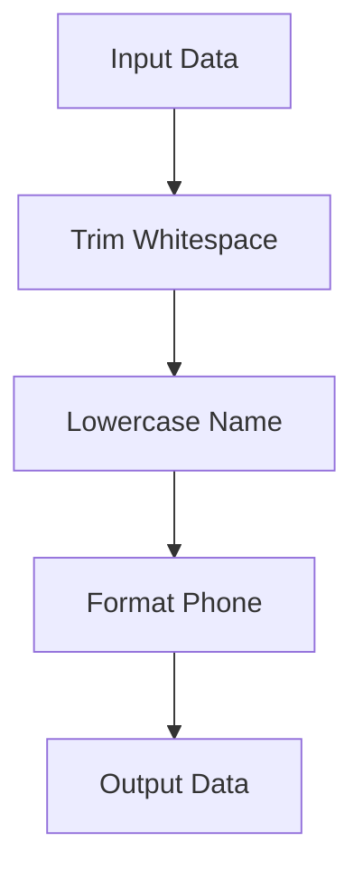

## 6.3 Managing Data Flow with Pipelines

In the realm of functional programming, the concept of data flow is pivotal. It allows us to transform data through a series of operations, akin to an assembly line in a factory. In Clojure, managing data flow efficiently can be achieved using pipelines, which leverage the power of threading macros and functional composition. This section will guide you through the intricacies of building and managing data flow with pipelines, highlighting their advantages and real-world applications.

### Data Flow Concepts

Data flow in programming refers to the process of passing data through a series of transformations. Each transformation step takes input, processes it, and produces output, which becomes the input for the next step. This approach is particularly beneficial in functional programming, where the focus is on transforming data rather than altering state.

#### The Pipeline Paradigm

In Clojure, a pipeline is a sequence of functions applied to a data structure, where the output of one function becomes the input for the next. This is similar to how Unix pipelines work, where the output of one command is passed to the next. Pipelines in Clojure are often constructed using threading macros such as `->` and `->>`, which simplify the process of chaining functions together.

### Building Pipelines

To build effective data transformation pipelines in Clojure, we utilize threading macros and composed functions. Let's explore these tools and see how they facilitate the creation of clean and efficient pipelines.

#### Threading Macros

Threading macros in Clojure, namely `->` and `->>`, are powerful tools for managing data flow. They allow us to write code that is both readable and expressive by threading a value through a series of transformations.

- **The `->` Macro**: This macro threads the value through the first argument position of each function in the pipeline.

```clojure
(-> x
    (f1)
    (f2)
    (f3))
```

- **The `->>` Macro**: This macro threads the value through the last argument position of each function, which is useful for functions that take the data structure as their last parameter.

```clojure
(->> x
     (f1)
     (f2)
     (f3))
```

#### Composed Functions

Function composition is another technique to build pipelines. It involves combining multiple functions into a single function that applies them in sequence. In Clojure, the `comp` function is used for this purpose.

```clojure
(def composed-function (comp f3 f2 f1))
(composed-function x)
```

Here, `f1` is applied first, followed by `f2`, and then `f3`.

#### Example: Processing User Input

Let's consider a practical example of processing user input data. Suppose we have a map representing user data, and we want to normalize the data by trimming whitespace, converting names to lowercase, and formatting the phone number.

```clojure
(defn trim-whitespace [data]
  (update data :name clojure.string/trim))

(defn lowercase-name [data]
  (update data :name clojure.string/lower-case))

(defn format-phone [data]
  (update data :phone #(str "(" (subs % 0 3) ") " (subs % 3 6) "-" (subs % 6))))

(defn process-user-input [user-data]
  (-> user-data
      trim-whitespace
      lowercase-name
      format-phone))

;; Example usage
(def user {:name "  John Doe  " :phone "1234567890"})
(process-user-input user)
```

In this example, the `->` macro threads the `user-data` map through each transformation function, resulting in a clean and readable pipeline.

### Advantages of Pipelines

Using pipelines to manage data flow offers several advantages:

- **Clarity**: Pipelines make the sequence of transformations explicit, improving code readability and maintainability.
- **Modularity**: Each transformation step is encapsulated in a separate function, promoting code reuse and modularity.
- **Testability**: Individual transformation functions can be tested in isolation, ensuring correctness at each step.
- **Flexibility**: Pipelines can be easily extended or modified by adding or removing functions from the sequence.

### Case Studies

Let's explore some real-world scenarios where data transformation pipelines can be effectively utilized.

#### Case Study 1: JSON Data Transformation

Consider a scenario where we need to transform JSON data retrieved from an API. The data includes nested structures that need to be flattened and certain fields renamed for consistency.

```clojure
(require '[cheshire.core :as json])

(defn flatten-nested [data]
  ;; Flatten nested structures
  (assoc data :full-name (str (:first-name data) " " (:last-name data))))

(defn rename-fields [data]
  ;; Rename fields for consistency
  (-> data
      (dissoc :first-name :last-name)
      (assoc :name (:full-name data))))

(defn transform-json-data [json-str]
  (let [data (json/parse-string json-str true)]
    (-> data
        flatten-nested
        rename-fields)))

;; Example JSON
(def json-str "{\"first-name\": \"Jane\", \"last-name\": \"Doe\", \"age\": 30}")

(transform-json-data json-str)
```

In this example, we parse the JSON string into a Clojure map, then use a pipeline to flatten nested structures and rename fields.

#### Case Study 2: Data Processing Pipeline

In a data processing application, we might need to filter, transform, and aggregate data. Pipelines can streamline these operations.

```clojure
(defn filter-adults [data]
  (filter #(>= (:age %) 18) data))

(defn calculate-average-age [data]
  (/ (reduce + (map :age data)) (count data)))

(defn process-data [data]
  (->> data
       filter-adults
       calculate-average-age))

;; Example data
(def people [{:name "Alice" :age 17}
             {:name "Bob" :age 20}
             {:name "Charlie" :age 25}])

(process-data people)
```

Here, the `->>` macro threads the data through filtering and aggregation functions, resulting in a concise and efficient data processing pipeline.

### Try It Yourself

Experiment with the provided examples by modifying the transformation functions or adding new ones. Consider how you might handle additional data formats or requirements.

### Visual Aids

To further illustrate the concept of data flow in pipelines, let's use a diagram to represent the transformation process.



**Figure 1**: Data flow through a pipeline, transforming input data step by step.

### References and Links

- [Clojure Official Documentation](https://clojure.org/reference)
- [Threading Macros in Clojure](https://clojure.org/guides/threading_macros)
- [Functional Composition in Clojure](https://clojure.org/reference/composite)
- [JSON Processing with Cheshire](https://github.com/dakrone/cheshire)

For more on functional programming concepts, refer to [Transitioning from OOP to Functional Programming](https://www.lispcast.com/oo-to-fp/).

### Knowledge Check

- What are the benefits of using pipelines in functional programming?
- How do threading macros enhance code readability?
- Can you modify the provided examples to handle additional data transformations?

### Exercises

1. Create a pipeline that processes a list of transactions, filtering out invalid entries and calculating the total amount.
2. Modify the JSON transformation example to handle nested arrays within the JSON data.
3. Implement a pipeline that processes a CSV file, converting it to a map and applying transformations to each row.

### Summary

Managing data flow with pipelines in Clojure is a powerful technique that enhances code clarity, modularity, and testability. By leveraging threading macros and function composition, we can build efficient and maintainable data transformation pipelines. As you continue to explore functional programming in Clojure, consider how these concepts can be applied to your own projects to improve data processing workflows.

## **Test Your Knowledge: Managing Data Flow with Pipelines Quiz**



### What is the primary purpose of using pipelines in functional programming?

- [x] To transform data through a sequence of operations
- [ ] To store data in a database
- [ ] To create complex UI components
- [ ] To manage user authentication

> **Explanation:** Pipelines are used to transform data through a series of operations, enhancing code clarity and modularity.


### Which threading macro threads the value through the first argument position of each function?

- [x] `->`
- [ ] `->>`
- [ ] `comp`
- [ ] `map`

> **Explanation:** The `->` macro threads the value through the first argument position of each function in the pipeline.


### How does the `->>` macro differ from the `->` macro?

- [x] It threads the value through the last argument position of each function
- [ ] It is used for composing functions
- [ ] It only works with maps
- [ ] It is used for filtering data

> **Explanation:** The `->>` macro threads the value through the last argument position of each function, which is useful for certain function signatures.


### What advantage do pipelines offer in terms of code testability?

- [x] Individual transformation functions can be tested in isolation
- [ ] They eliminate the need for tests
- [ ] They automatically generate test cases
- [ ] They make testing unnecessary

> **Explanation:** Pipelines allow individual transformation functions to be tested in isolation, ensuring correctness at each step.


### In the provided JSON transformation example, what is the purpose of the `flatten-nested` function?

- [x] To flatten nested structures in the data
- [ ] To parse the JSON string
- [ ] To calculate the average age
- [ ] To filter out invalid data

> **Explanation:** The `flatten-nested` function is used to flatten nested structures in the data, preparing it for further transformations.


### What is a key benefit of using threading macros in Clojure?

- [x] They enhance code readability and expressiveness
- [ ] They increase the execution speed of the program
- [ ] They reduce memory usage
- [ ] They simplify error handling

> **Explanation:** Threading macros enhance code readability and expressiveness by making the sequence of transformations explicit.


### How can function composition be achieved in Clojure?

- [x] Using the `comp` function
- [ ] Using the `map` function
- [ ] Using the `filter` function
- [ ] Using the `reduce` function

> **Explanation:** Function composition in Clojure can be achieved using the `comp` function, which combines multiple functions into a single function.


### What does the `->` macro do with the initial value?

- [x] It threads it through the first argument position of each function
- [ ] It threads it through the last argument position of each function
- [ ] It reverses the value
- [ ] It multiplies the value by two

> **Explanation:** The `->` macro threads the initial value through the first argument position of each function in the pipeline.


### True or False: Pipelines can only be used for data transformation in Clojure.

- [ ] True
- [x] False

> **Explanation:** Pipelines can be used for various purposes, including data transformation, processing, and more, in Clojure.


### What is one way to modify a pipeline to handle additional data formats?

- [x] Add new transformation functions to the pipeline
- [ ] Remove existing functions from the pipeline
- [ ] Change the data type to a string
- [ ] Use a different programming language

> **Explanation:** To handle additional data formats, you can add new transformation functions to the pipeline, extending its capabilities.


