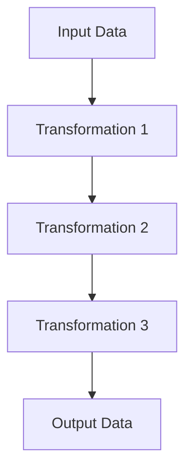

## 6.4 Chaining Functions for Clean Code

In the realm of functional programming, the ability to chain functions effectively is a hallmark of clean, maintainable code. Function chaining allows us to express complex transformations and operations in a concise and readable manner, reducing the cognitive load on developers. In this section, we will explore the techniques for chaining functions in Clojure, delve into the use of anonymous functions for dynamic chaining, and demonstrate how to refactor nested code into elegant chains. We will also share best practices to maintain readability and clarity in your code.

### Function Chaining Techniques

Function chaining is the process of linking multiple function calls together, where the output of one function serves as the input to the next. This approach promotes a linear flow of data transformations, making the code easier to follow and understand. In contrast to nested function calls, which can become unwieldy and difficult to read, chaining functions creates a more streamlined and declarative style.

#### Using Anonymous Functions

Anonymous functions, also known as lambda functions, are a powerful tool in Clojure for creating dynamic and flexible function chains. They allow us to define functions on-the-fly without the need for a formal function declaration. This is particularly useful when we need to apply a series of transformations that may not warrant a named function.

Consider the following example, where we use anonymous functions to chain a series of transformations on a collection of numbers:

```clojure
(def numbers [1 2 3 4 5])

(def transformed-numbers
  (->> numbers
       (map #(* % 2))     ; Double each number
       (filter even?)     ; Keep only even numbers
       (reduce +)))       ; Sum the remaining numbers

(println transformed-numbers) ; Output: 12
```

In this example, we use the `->>` threading macro to chain the transformations. The `map` function applies an anonymous function that doubles each number, `filter` retains only the even numbers, and `reduce` sums them up. This chain of transformations is both concise and expressive.

#### Refactoring Nested Code

Nested function calls can quickly become difficult to manage and understand, especially as the complexity of the operations increases. By refactoring nested code into a series of chained function calls, we can improve readability and maintainability.

Let's refactor a nested function example into a cleaner chain:

```clojure
;; Nested function calls
(def result
  (reduce +
    (filter even?
      (map #(* % 2)
        [1 2 3 4 5]))))

(println result) ; Output: 12

;; Refactored using function chaining
(def result
  (->> [1 2 3 4 5]
       (map #(* % 2))
       (filter even?)
       (reduce +)))

(println result) ; Output: 12
```

By using the `->>` macro, we transform the deeply nested function calls into a linear sequence of operations. This refactoring not only makes the code more readable but also aligns with the functional programming paradigm of composing simple functions to achieve complex behavior.

### Best Practices for Chaining Functions

While function chaining can greatly enhance code readability, it's important to adhere to best practices to maintain clarity and avoid potential pitfalls.

#### Maintain Readability

- **Use Line Breaks and Indentation**: When chaining multiple functions, use line breaks and indentation to clearly separate each step in the chain. This helps to visually distinguish the sequence of operations and makes the code easier to read.

```clojure
(def result
  (->> [1 2 3 4 5]
       (map #(* % 2))
       (filter even?)
       (reduce +)))
```

- **Limit Chain Length**: Avoid excessively long chains that span multiple lines. If a chain becomes too long, consider breaking it into smaller, named functions that can be composed together.

#### Use Descriptive Names

- **Name Intermediate Results**: When the result of a transformation is significant, consider assigning it to a descriptive variable name. This can provide context and improve understanding.

```clojure
(let [doubled (map #(* % 2) [1 2 3 4 5])
      evens (filter even? doubled)
      sum (reduce + evens)]
  (println sum)) ; Output: 12
```

#### Avoid Side Effects

- **Ensure Purity**: Chained functions should ideally be pure, meaning they do not produce side effects or depend on external state. This ensures that the behavior of the chain is predictable and consistent.

### Try It Yourself

Experiment with chaining functions by modifying the examples provided. Try adding additional transformations, such as sorting or grouping, and observe how the chain evolves. Consider using different threading macros, such as `->` for single-argument functions, to see how they affect the readability of your code.

### Visualizing Function Chaining

To further illustrate the concept of function chaining, let's use a flowchart to visualize the data flow through a series of chained transformations.



**Figure 1**: A flowchart representing the linear data flow in a function chain, where each transformation builds upon the previous one to produce the final output.

### References and Further Reading

- [Clojure Official Documentation](https://clojure.org/reference)
- [Clojure Community Resources](https://clojure.org/community/resources)
- [Transitioning from OOP to Functional Programming](https://www.lispcast.com/oo-to-fp/)
- [Understanding the Threading Macros](https://clojure.org/guides/threading_macros)

### Knowledge Check

To reinforce your understanding of function chaining in Clojure, consider the following questions and exercises:

1. What are the benefits of using function chaining over nested function calls?
2. How do anonymous functions facilitate dynamic function chaining?
3. Refactor a nested function call into a chained function using the `->>` macro.
4. What are some best practices for maintaining readability in function chains?
5. Experiment with adding a new transformation to an existing function chain and observe the impact on the output.

### Test Your Knowledge: Chaining Functions for Clean Code Quiz



### What is a primary benefit of function chaining in Clojure?

- [x] Improved readability and maintainability
- [ ] Faster execution time
- [ ] Reduced memory usage
- [ ] Increased complexity

> **Explanation:** Function chaining improves readability and maintainability by creating a linear flow of operations, making the code easier to follow.

### How can anonymous functions be used in function chaining?

- [x] To define transformations dynamically without named functions
- [ ] To improve execution speed
- [ ] To create side effects
- [ ] To increase code complexity

> **Explanation:** Anonymous functions allow for dynamic and flexible transformations in a chain without needing formal function declarations.

### Which threading macro is used for multi-argument functions?

- [ ] ->
- [x] ->>
- [ ] #()
- [ ] map

> **Explanation:** The `->>` threading macro is used for multi-argument functions, passing the result of each step as the last argument to the next function.

### What is a best practice for maintaining readability in function chains?

- [x] Use line breaks and indentation
- [ ] Avoid using descriptive variable names
- [ ] Create long, complex chains
- [ ] Include side effects

> **Explanation:** Using line breaks and indentation helps to visually separate each step in the chain, enhancing readability.

### How can intermediate results be handled in a function chain?

- [x] Assign them to descriptive variable names
- [ ] Ignore them
- [ ] Use them to create side effects
- [ ] Store them in global variables

> **Explanation:** Assigning intermediate results to descriptive variable names provides context and improves understanding.

### What should be avoided in function chains?

- [x] Side effects
- [ ] Pure functions
- [ ] Descriptive names
- [ ] Line breaks

> **Explanation:** Side effects should be avoided in function chains to ensure predictability and consistency.

### Which of the following is a threading macro in Clojure?

- [x] ->
- [ ] lambda
- [ ] defn
- [ ] let

> **Explanation:** The `->` macro is a threading macro used for single-argument functions, passing the result of each step as the first argument to the next function.

### What is a common use case for anonymous functions in Clojure?

- [x] Dynamic transformations in function chains
- [ ] Defining global variables
- [ ] Creating side effects
- [ ] Increasing code complexity

> **Explanation:** Anonymous functions are commonly used for dynamic transformations in function chains, providing flexibility without named functions.

### How can nested function calls be refactored in Clojure?

- [x] By using threading macros like `->>` to create a linear sequence
- [ ] By adding more nested layers
- [ ] By using global variables
- [ ] By increasing function complexity

> **Explanation:** Threading macros like `->>` allow for refactoring nested function calls into a linear sequence, enhancing readability.

### True or False: Function chaining should always include side effects for maximum efficiency.

- [ ] True
- [x] False

> **Explanation:** False. Function chaining should avoid side effects to maintain predictability and consistency in the code.



By mastering the art of function chaining in Clojure, we can write code that is not only clean and readable but also aligns with the core principles of functional programming. Embrace these techniques to transform your codebase into a model of clarity and efficiency.
