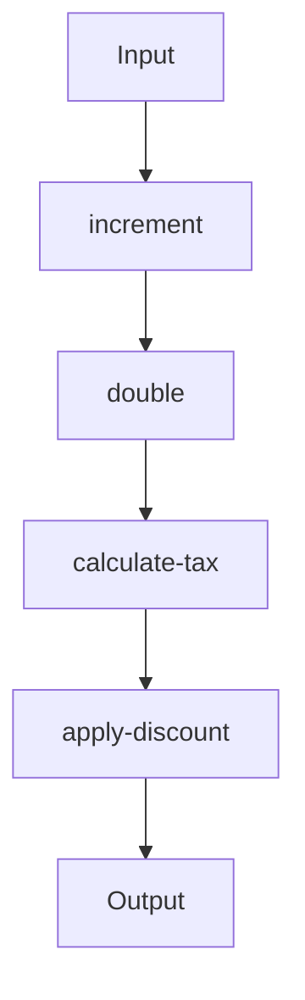

## 6.5 Best Practices for Function Composition

Function composition is a cornerstone of functional programming, allowing developers to build complex operations by combining simpler functions. In Clojure, this practice is not only encouraged but also facilitated by the language's design. Let's explore best practices for composing functions effectively, ensuring that your code remains clean, efficient, and maintainable.

### Write Small, Pure Functions

One of the most fundamental practices in function composition is to **write small, pure functions**. A pure function is one that, given the same input, will always return the same output and has no side effects. This predictability makes pure functions easy to reason about and test.

#### Benefits of Small, Pure Functions

- **Reusability**: Small functions can be reused in different contexts, reducing code duplication.
- **Testability**: Pure functions are easier to test because they do not depend on external state.
- **Composability**: Smaller functions are easier to compose, as they focus on a single task.

#### Example: Small, Pure Functions in Clojure

```clojure
;; Define a pure function to increment a number
(defn increment [n]
  (+ n 1))

;; Define a pure function to double a number
(defn double [n]
  (* n 2))

;; Compose functions to first increment, then double a number
(defn increment-and-double [n]
  (double (increment n)))

;; Usage
(increment-and-double 3) ;; => 8
```

In this example, `increment` and `double` are small, pure functions that can be composed to create more complex behavior.

### Clear Function Names

**Clear function names** are crucial for making composed functions understandable. A well-named function communicates its purpose and behavior, reducing the cognitive load on developers who read the code.

#### Guidelines for Naming Functions

- **Descriptive**: Use names that describe what the function does, not how it does it.
- **Consistent**: Follow a consistent naming convention throughout your codebase.
- **Avoid Abbreviations**: Use full words unless the abbreviation is well-known and unambiguous.

#### Example: Descriptive Function Names

```clojure
(defn calculate-tax [amount]
  (* amount 0.07))

(defn apply-discount [amount]
  (- amount 5))

(defn final-price [amount]
  (-> amount
      apply-discount
      calculate-tax))
```

Here, each function name clearly indicates its role in the computation, making the composed function `final-price` easy to understand.

### Avoid Over-Composition

While function composition is powerful, **avoid over-composition**. Composing too many functions can lead to complex and hard-to-read code. Strive for a balance between composition and readability.

#### Signs of Over-Composition

- **Long Chains**: Excessively long chains of composed functions can be difficult to follow.
- **Nested Compositions**: Deeply nested compositions can obscure the flow of data.

#### Strategies to Avoid Over-Composition

- **Break Down**: Split complex compositions into smaller, named functions.
- **Use Intermediate Variables**: Introduce intermediate variables to clarify the flow of data.

#### Example: Avoiding Over-Composition

```clojure
;; Over-composed function
(defn complex-calculation [x]
  (-> x
      (increment)
      (double)
      (calculate-tax)
      (apply-discount)))

;; Improved readability with intermediate steps
(defn calculate-with-steps [x]
  (let [incremented (increment x)
        doubled (double incremented)
        taxed (calculate-tax doubled)]
    (apply-discount taxed)))
```

In the improved version, intermediate variables enhance readability by clearly showing each step of the computation.

### Testing Composed Functions

Testing is critical to ensure the correctness of your composed functions. **Testing composed functions** involves verifying both individual functions and their compositions.

#### Strategies for Testing Composed Functions

- **Unit Tests**: Test each function independently to ensure it behaves as expected.
- **Integration Tests**: Test the composed function to verify that the integration of individual functions produces the correct result.
- **Property-Based Testing**: Use property-based testing to verify that the function holds certain properties across a wide range of inputs.

#### Example: Testing in Clojure

```clojure
(ns myapp.core-test
  (:require [clojure.test :refer :all]
            [myapp.core :refer :all]))

(deftest test-increment
  (is (= 4 (increment 3))))

(deftest test-double
  (is (= 6 (double 3))))

(deftest test-increment-and-double
  (is (= 8 (increment-and-double 3))))
```

Here, we define unit tests for each small function and an integration test for the composed function `increment-and-double`.

### Try It Yourself

Experiment with the following code examples by modifying the functions or adding new ones to see how composition affects the behavior.

```clojure
;; Try changing the increment value
(defn increment [n]
  (+ n 2))

;; Add a new function to square a number
(defn square [n]
  (* n n))

;; Compose a new function using square
(defn increment-double-square [n]
  (-> n
      increment
      double
      square))

;; Test your new function
(increment-double-square 3) ;; Experiment with different inputs
```

### Visual Aids

To further illustrate function composition, consider the following flowchart that represents the data flow in a composed function pipeline:



**Figure 1**: This flowchart demonstrates how data flows through a series of composed functions, transforming the input step by step.

### References and Links

- [Clojure Official Documentation](https://clojure.org/reference)
- [Clojure Community Resources](https://clojure.org/community/resources)
- [Transitioning from OOP to Functional Programming](https://www.lispcast.com/oo-to-fp/)
- [Clojure Testing Guide](https://clojure.org/guides/testing)

### Knowledge Check

To reinforce your understanding of function composition, consider the following questions and exercises:

1. **What are the benefits of writing small, pure functions?**
2. **Why is it important to use clear function names?**
3. **What are some signs that you may be over-composing functions?**
4. **How can you test composed functions effectively?**

#### Exercise

- Refactor a piece of imperative Java code into Clojure using function composition.
- Write tests for each function and the overall composition to ensure correctness.

### Encouraging Engagement

Embracing functional programming can be challenging, but with each step, you'll gain a deeper understanding and see tangible benefits in your codebase. By following these best practices for function composition, you'll be well on your way to writing clean, maintainable, and efficient Clojure code.

### Test Your Knowledge: Best Practices for Function Composition Quiz



### What is a key benefit of writing small, pure functions?

- [x] They are easier to test and reason about.
- [ ] They require more code to implement.
- [ ] They are less efficient than larger functions.
- [ ] They are harder to compose.

> **Explanation:** Small, pure functions are easier to test and reason about because they have no side effects and always produce the same output for the same input.

### Why should you avoid over-composing functions?

- [x] It can make the code difficult to read.
- [ ] It increases performance.
- [ ] It simplifies debugging.
- [ ] It reduces code duplication.

> **Explanation:** Over-composing functions can lead to complex and hard-to-read code, making it difficult to understand and maintain.

### What is a strategy for testing composed functions?

- [x] Use unit tests for individual functions and integration tests for compositions.
- [ ] Only test the composed function.
- [ ] Rely on manual testing.
- [ ] Avoid testing altogether.

> **Explanation:** Testing both individual functions and their compositions ensures that each part works correctly and that they integrate well together.

### What is the role of clear function names?

- [x] They improve code readability and understanding.
- [ ] They increase execution speed.
- [ ] They reduce memory usage.
- [ ] They are required by the Clojure compiler.

> **Explanation:** Clear function names help developers understand the purpose and behavior of the function, improving code readability.

### What is a sign of over-composition?

- [x] Long chains of composed functions.
- [ ] Short, clear function definitions.
- [ ] High performance.
- [ ] Low memory usage.

> **Explanation:** Long chains of composed functions can indicate over-composition, making the code difficult to follow.

### How can you avoid over-composition?

- [x] Break down complex compositions into smaller, named functions.
- [ ] Write longer functions.
- [ ] Use more global variables.
- [ ] Avoid using intermediate variables.

> **Explanation:** Breaking down complex compositions into smaller, named functions enhances readability and maintainability.

### What is a benefit of using intermediate variables in function composition?

- [x] They clarify the flow of data.
- [ ] They increase code execution time.
- [ ] They reduce the number of functions needed.
- [ ] They are required by the Clojure language.

> **Explanation:** Intermediate variables help clarify the flow of data, making the code easier to understand.

### What is the purpose of property-based testing?

- [x] To verify that a function holds certain properties across a wide range of inputs.
- [ ] To test only the edge cases.
- [ ] To avoid writing tests.
- [ ] To test the function's performance.

> **Explanation:** Property-based testing checks that a function maintains certain properties over a wide range of inputs, ensuring robustness.

### How does function composition relate to data transformation pipelines?

- [x] It allows for the chaining of operations to transform data step by step.
- [ ] It increases the complexity of data transformation.
- [ ] It reduces the need for data transformation.
- [ ] It is unrelated to data transformation.

> **Explanation:** Function composition enables the chaining of operations, allowing data to be transformed step by step in a pipeline.

### True or False: Function composition is only useful in functional programming languages.

- [ ] True
- [x] False

> **Explanation:** Function composition is a useful concept in many programming paradigms, not just functional programming.


