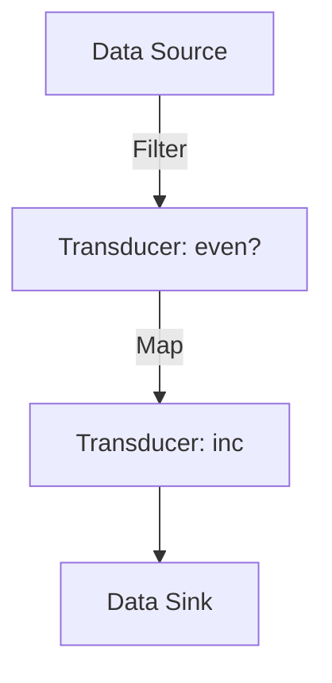

## 6.6 Introduction to Transducers

In the realm of functional programming with Clojure, transducers offer a powerful and flexible way to handle data transformation pipelines. This section will delve into the concept of transducers, their benefits over traditional sequence operations, and how to create and apply them effectively.

### What Are Transducers?

Transducers are composable algorithmic transformations that are independent of the context of their input and output. Unlike traditional sequence operations, which are tied to the creation of intermediate collections, transducers abstract the transformation process itself, allowing it to be applied to different types of data sources and sinks.

#### Key Characteristics of Transducers

- **Composable**: Transducers can be composed together to form complex transformations.
- **Context-Free**: They operate independently of the data source or destination, making them versatile.
- **Efficient**: By eliminating the need for intermediate collections, transducers can improve performance, especially with large datasets.

#### Understanding Transducers with an Analogy

Consider transducers as the functional equivalent of Java's `Stream` API but with more flexibility. While Java streams are tied to a specific data source, transducers can be applied to any data source, whether it's a sequence, a channel, or a custom data structure.

### Benefits Over Sequences

Traditional sequence operations in Clojure, such as `map`, `filter`, and `reduce`, often involve the creation of intermediate collections. This can lead to inefficiencies, particularly when dealing with large datasets or complex transformations.

#### How Transducers Improve Performance

Transducers eliminate the need for intermediate collections by composing transformations into a single operation. This reduces memory overhead and can lead to significant performance gains.

- **Memory Efficiency**: By avoiding intermediate collections, transducers reduce memory usage.
- **Performance Gains**: Fewer allocations and less garbage collection lead to faster execution.
- **Flexibility**: Transducers can be applied to various data sources, including sequences, channels, and custom collections.

### Creating Transducers

Creating transducers involves using existing functions like `map`, `filter`, and `take` in a way that separates the transformation logic from the data source.

#### Basic Transducer Creation

Let's explore how to create a simple transducer using the `map` function.

```clojure
(defn inc-xf
  "A transducer that increments each element."
  []
  (map inc))
```

In this example, `inc-xf` is a transducer that increments each element. Notice that we don't specify the data source; the transducer can be applied to any compatible source.

#### Composing Transducers

Transducers can be composed using the `comp` function to create more complex transformations.

```clojure
(defn even-inc-xf
  "A transducer that filters even numbers and increments them."
  []
  (comp (filter even?) (map inc)))
```

Here, `even-inc-xf` is a composed transducer that filters even numbers and then increments them. The `comp` function allows us to chain multiple transformations together.

### Transducer Functions

Clojure provides several functions to work with transducers, including `transduce`, `sequence`, and `into`.

#### Using `transduce`

The `transduce` function applies a transducer to a collection and reduces it to a single value.

```clojure
(def numbers [1 2 3 4 5 6])

(defn sum-even-increments
  "Sum of even numbers incremented by 1."
  [numbers]
  (transduce (even-inc-xf) + numbers))

(sum-even-increments numbers)
;; => 12
```

In this example, `transduce` applies the `even-inc-xf` transducer to the `numbers` collection and sums the results.

#### Using `sequence`

The `sequence` function returns a lazy sequence of transformed elements.

```clojure
(def transformed-seq
  (sequence (even-inc-xf) numbers))

(transformed-seq)
;; => (3 5 7)
```

The `sequence` function allows us to work with transducers in a lazy fashion, similar to traditional sequence operations.

#### Using `into`

The `into` function applies a transducer and collects the results into a collection.

```clojure
(def transformed-vector
  (into [] (even-inc-xf) numbers))

(transformed-vector)
;; => [3 5 7]
```

The `into` function is useful when we want to collect the results of a transducer into a specific collection type.

### Visualizing Transducer Operations

To better understand how transducers work, let's visualize the data flow using a Mermaid.js diagram.



**Diagram Description**: This diagram illustrates a simple transducer pipeline where data flows from a source through a filter transducer (`even?`), then a map transducer (`inc`), and finally into a data sink.

### Practical Examples of Transducers

Let's explore some practical examples to solidify our understanding of transducers.

#### Example 1: Filtering and Mapping

Suppose we want to filter out odd numbers and double the even numbers in a list.

```clojure
(defn double-even-xf
  "A transducer that doubles even numbers."
  []
  (comp (filter even?) (map #(* 2 %))))

(def doubled-evens
  (into [] (double-even-xf) numbers))

(doubled-evens)
;; => [4 8 12]
```

#### Example 2: Using Transducers with Channels

Transducers can also be applied to channels, making them useful for concurrent programming.

```clojure
(require '[clojure.core.async :as async])

(defn process-channel
  "Processes a channel with a transducer."
  [ch]
  (let [out (async/chan 10 (even-inc-xf))]
    (async/pipe ch out)
    out))

(def input-chan (async/chan 10))
(def output-chan (process-channel input-chan))

(async/>!! input-chan 1)
(async/>!! input-chan 2)
(async/>!! input-chan 3)

(async/<!! output-chan) ;; => 3
(async/<!! output-chan) ;; => 5
```

In this example, we create a channel `input-chan` and process it with a transducer using `async/pipe`, demonstrating the flexibility of transducers in different contexts.

### Try It Yourself

Experiment with transducers by modifying the examples above. Try creating a transducer that filters numbers greater than 3 and squares them. Use `transduce`, `sequence`, and `into` to see how the results differ.

### Knowledge Check

1. What are transducers, and how do they differ from traditional sequence operations?
2. How do transducers improve performance in data transformation pipelines?
3. What functions does Clojure provide to work with transducers?
4. How can transducers be composed to create complex transformations?
5. How do transducers enhance the flexibility of data processing in Clojure?

### Further Reading

- [Clojure Official Documentation](https://clojure.org/reference)
- [Clojure Community Resources](https://clojure.org/community/resources)
- [Transitioning from OOP to Functional Programming](https://www.lispcast.com/oo-to-fp/)

### Test Your Knowledge: Introduction to Transducers Quiz



### What is a transducer in Clojure?

- [x] A composable transformation that is independent of input and output context
- [ ] A function that creates intermediate collections
- [ ] A data structure for storing transformations
- [ ] A type of lazy sequence

> **Explanation:** Transducers are composable transformations that operate independently of the context of their input and output.

### What is one key benefit of using transducers over traditional sequence operations?

- [x] They eliminate intermediate collections, improving performance
- [ ] They create more intermediate collections, enhancing memory usage
- [ ] They are easier to write than traditional sequence operations
- [ ] They are only applicable to sequences

> **Explanation:** Transducers eliminate the need for intermediate collections, reducing memory usage and improving performance.

### Which function applies a transducer to a collection and reduces it to a single value?

- [x] `transduce`
- [ ] `sequence`
- [ ] `into`
- [ ] `map`

> **Explanation:** The `transduce` function applies a transducer to a collection and reduces it to a single value.

### How can transducers be composed to create complex transformations?

- [x] Using the `comp` function
- [ ] Using the `map` function
- [ ] Using the `filter` function
- [ ] Using the `reduce` function

> **Explanation:** Transducers can be composed using the `comp` function to create complex transformations.

### What is the result of applying the `even-inc-xf` transducer to the collection `[1 2 3 4 5 6]` using `into`?

- [x] `[3 5 7]`
- [ ] `[2 4 6]`
- [ ] `[1 2 3 4 5 6]`
- [ ] `[3 4 5 6 7 8]`

> **Explanation:** The `even-inc-xf` transducer filters even numbers and increments them, resulting in `[3 5 7]`.

### Can transducers be applied to channels in Clojure?

- [x] True
- [ ] False

> **Explanation:** Transducers can be applied to channels, making them useful in concurrent programming.

### What function returns a lazy sequence of transformed elements using a transducer?

- [x] `sequence`
- [ ] `transduce`
- [ ] `into`
- [ ] `reduce`

> **Explanation:** The `sequence` function returns a lazy sequence of transformed elements using a transducer.

### How do transducers enhance the flexibility of data processing in Clojure?

- [x] By being applicable to various data sources and sinks
- [ ] By being limited to sequence operations
- [ ] By requiring specific data structures
- [ ] By being tied to a single data source

> **Explanation:** Transducers enhance flexibility by being applicable to various data sources and sinks.

### What is the primary purpose of the `into` function when used with transducers?

- [x] To collect the results of a transducer into a specific collection type
- [ ] To apply a transducer to a single value
- [ ] To create a new transducer
- [ ] To filter elements in a collection

> **Explanation:** The `into` function collects the results of a transducer into a specific collection type.

### Transducers can only be used with sequences in Clojure.

- [ ] True
- [x] False

> **Explanation:** Transducers are not limited to sequences and can be used with various data sources, including channels.



By mastering transducers, we can create efficient, flexible data transformation pipelines in Clojure, enhancing both performance and code clarity. Embrace the power of transducers to elevate your functional programming skills and build scalable applications.
