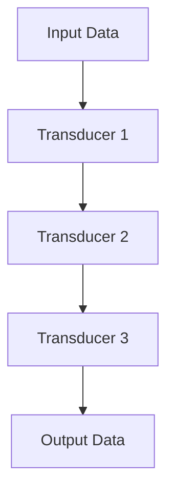

## 6.7 Composing Efficient Pipelines with Transducers

In this section, we delve into the world of transducers in Clojure, a powerful tool for composing efficient data processing pipelines. Transducers offer a novel approach to handling data transformation, allowing developers to build pipelines that are both concise and performant. Let's explore how to leverage transducers to enhance your Clojure applications.

### Building Transducer Pipelines

Transducers are a key feature in Clojure that provide a way to compose data transformation functions without creating intermediate collections. This is particularly useful when dealing with large datasets or real-time data streams. Transducers are independent of the context in which they are used, whether it be a sequence, a channel, or a core.async process.

#### What is a Transducer?

A transducer is a composable and reusable transformation that can be applied to various data sources. They are essentially functions that take a reducing function and return a new reducing function. This allows them to be composed and reused across different contexts.

```clojure
(defn inc-transducer [rf]
  (fn
    ([] (rf))
    ([result] (rf result))
    ([result input] (rf result (inc input)))))

(def inc-xform (map inc-transducer))
```

In the example above, `inc-transducer` is a transducer that increments each input. We can use this transducer with various data sources, such as sequences or channels.

#### Composing Transducers

Transducers can be composed using the `comp` function, allowing you to create complex data processing pipelines by combining simple transformations.

```clojure
(def xform (comp (filter even?) (map inc)))

(transduce xform + 0 (range 10))
```

In this example, we create a transducer pipeline that filters even numbers and then increments them. The `transduce` function applies this transformation to a range of numbers, summing the results.

### Performance Advantages

One of the main advantages of using transducers is their performance. Transducers process data in a single pass, eliminating the need for intermediate collections. This reduces memory overhead and improves performance, especially for large datasets.

#### Single Pass Processing

Unlike traditional lazy sequences, which may create multiple intermediate collections, transducers operate in a single pass. This means that data is transformed and reduced in one go, leading to more efficient processing.

```clojure
(transduce (comp (map inc) (filter even?)) conj [] (range 1000000))
```

In this example, the transducer pipeline processes a million numbers, incrementing and filtering them in a single pass. This is much more efficient than using multiple lazy sequences.

#### Reduced Overhead

By avoiding intermediate collections, transducers reduce both memory and CPU overhead. This makes them ideal for scenarios where performance is critical, such as real-time data processing or handling large datasets.

### Example Use Cases

Transducers are versatile and can be applied to various use cases. Here are a few examples where transducers shine:

#### Processing Large Datasets

When working with large datasets, transducers provide a way to efficiently transform and reduce data without the memory overhead of intermediate collections.

```clojure
(def large-dataset (range 10000000))

(defn process-large-dataset [dataset]
  (transduce (comp (map inc) (filter even?)) conj [] dataset))

(process-large-dataset large-dataset)
```

In this example, we process a dataset of ten million numbers, incrementing and filtering them using a transducer pipeline. This approach is both memory-efficient and fast.

#### Real-Time Data Streams

Transducers are also well-suited for real-time data streams, where data needs to be processed on-the-fly without delay.

```clojure
(require '[clojure.core.async :refer [chan go-loop >! <!]])

(defn process-stream [input-ch output-ch]
  (let [xform (comp (map inc) (filter even?))]
    (go-loop []
      (when-let [value (<! input-ch)]
        (>! output-ch (transduce xform conj [] [value]))
        (recur)))))

(let [input (chan)
      output (chan)]
  (process-stream input output))
```

In this example, we use transducers to process data from an input channel and send the transformed data to an output channel. This is useful for applications that require real-time data processing, such as sensor data or user interactions.

### Comparison with Lazy Sequences

Transducers and lazy sequences both offer ways to process data in Clojure, but they have different use cases and performance characteristics.

#### Lazy Sequences

Lazy sequences are a core feature of Clojure, allowing you to work with potentially infinite sequences of data. They are evaluated on demand, which can be useful for certain applications.

```clojure
(def lazy-seq (->> (range 10)
                   (map inc)
                   (filter even?)))
```

Lazy sequences are ideal for scenarios where you need to work with infinite data or when the overhead of intermediate collections is not a concern.

#### Transducers vs. Lazy Sequences

While lazy sequences are great for certain use cases, transducers offer several advantages:

- **Performance**: Transducers process data in a single pass, reducing overhead and improving performance.
- **Reusability**: Transducers are composable and can be reused across different contexts.
- **Flexibility**: Transducers can be applied to sequences, channels, and other data sources.

### Try It Yourself

Experiment with transducers by modifying the examples above. Try creating your own transducer pipelines and applying them to different data sources. Consider the following challenges:

- Create a transducer pipeline that processes a sequence of strings, converting them to uppercase and filtering out short strings.
- Use transducers to process data from a core.async channel, transforming and reducing the data in real-time.

### Visual Aids

To better understand how transducers work, consider the following diagram that illustrates the data flow in a transducer pipeline:



This diagram shows how data flows through a series of transducers, each transforming the data before passing it to the next stage.

### References and Links

For further reading on transducers and their applications, consider the following resources:

- [Clojure Official Documentation](https://clojure.org/reference)
- [Transducers in Clojure](https://clojure.org/guides/transducers)
- [Clojure Community Resources](https://clojure.org/community/resources)

### Knowledge Check

Reflect on the concepts covered in this section by answering the following questions:

- What are the key advantages of using transducers over lazy sequences?
- How can transducers improve performance in data processing pipelines?
- What are some practical use cases for transducers in real-world applications?

### Encouraging Engagement

Embracing transducers in your Clojure applications can lead to more efficient and maintainable code. As you experiment with transducers, you'll gain a deeper understanding of functional programming principles and see tangible benefits in your codebase.

### Best Practices for Tags

When using transducers, consider the following best practices:

- Use specific and relevant tags to categorize your transducer functions.
- Keep tag names consistent across your codebase.
- Avoid unnecessary complexity by composing simple transducers into more complex pipelines.

### Test Your Knowledge: Composing Efficient Pipelines with Transducers Quiz



### What is a transducer in Clojure?

- [x] A composable transformation function that can be applied to various data sources
- [ ] A lazy sequence that processes data on demand
- [ ] A mutable data structure for efficient data manipulation
- [ ] A concurrency primitive for managing state

> **Explanation:** A transducer is a composable and reusable transformation that can be applied to different data sources, such as sequences or channels.

### How do transducers improve performance?

- [x] By processing data in a single pass without intermediate collections
- [ ] By using mutable data structures for faster access
- [ ] By relying on lazy evaluation to defer computation
- [ ] By using parallel processing to speed up computation

> **Explanation:** Transducers process data in a single pass, eliminating the need for intermediate collections and reducing memory overhead.

### Which function is used to compose transducers?

- [x] `comp`
- [ ] `map`
- [ ] `filter`
- [ ] `reduce`

> **Explanation:** The `comp` function is used to compose transducers, allowing you to create complex data processing pipelines.

### What is a practical use case for transducers?

- [x] Processing large datasets efficiently
- [ ] Implementing a mutable state machine
- [ ] Creating infinite lazy sequences
- [ ] Managing concurrent state changes

> **Explanation:** Transducers are ideal for processing large datasets efficiently, as they reduce memory overhead and improve performance.

### How do transducers differ from lazy sequences?

- [x] Transducers process data in a single pass, while lazy sequences create intermediate collections
- [ ] Transducers rely on lazy evaluation, while lazy sequences process data eagerly
- [x] Transducers can be used with channels, while lazy sequences cannot
- [ ] Transducers are mutable, while lazy sequences are immutable

> **Explanation:** Transducers process data in a single pass without creating intermediate collections, making them more efficient than lazy sequences.

### What is the main advantage of using transducers with core.async channels?

- [x] They allow for real-time data processing without delay
- [ ] They provide mutable state management
- [ ] They enable parallel processing of data
- [ ] They simplify error handling in asynchronous tasks

> **Explanation:** Transducers can be used with core.async channels to process data in real-time, transforming and reducing data on-the-fly.

### How can you create a transducer pipeline?

- [x] By composing simple transducers using the `comp` function
- [ ] By chaining lazy sequences together
- [ ] By using mutable data structures for intermediate results
- [ ] By implementing a custom state machine

> **Explanation:** Transducer pipelines are created by composing simple transducers using the `comp` function, allowing for complex data transformations.

### What is the role of the `transduce` function?

- [x] To apply a transducer pipeline to a data source and reduce the results
- [ ] To create a lazy sequence from a transducer
- [ ] To manage concurrent state changes in a functional program
- [ ] To optimize memory usage in data processing tasks

> **Explanation:** The `transduce` function applies a transducer pipeline to a data source, transforming and reducing the data in a single pass.

### What are some benefits of using transducers in Clojure?

- [x] Improved performance and reduced memory overhead
- [ ] Simplified state management in concurrent programs
- [ ] Easier error handling in asynchronous tasks
- [ ] Enhanced parallel processing capabilities

> **Explanation:** Transducers improve performance by reducing memory overhead and processing data in a single pass, making them ideal for efficient data processing.

### True or False: Transducers are only applicable to sequences in Clojure.

- [ ] True
- [x] False

> **Explanation:** Transducers are not limited to sequences; they can be applied to various data sources, including channels and core.async processes.


