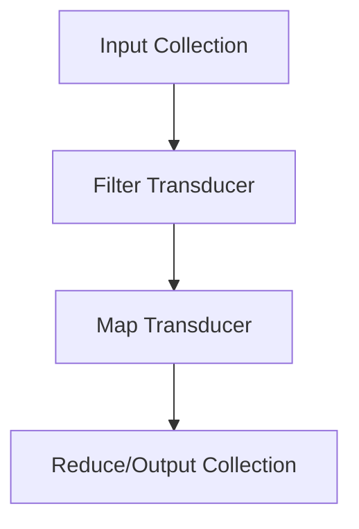

## 6.8 Practical Examples Using Transducers

Transducers are a powerful feature in Clojure that allow us to build efficient, reusable, and composable data transformation pipelines. They provide a way to decouple the transformation logic from the context of its application, making our code more modular and expressive. In this section, we'll explore practical examples of using transducers for various data transformation tasks, focusing on processing collections and integrating with core functions.

### Understanding Transducers

Before diving into examples, let's briefly revisit what transducers are. Transducers are composable algorithmic transformations. They are independent of the context of their input and output, which means they can be applied to different kinds of data sources, such as collections, channels, or streams.

Transducers allow us to define a transformation once and apply it in multiple contexts without rewriting the transformation logic. This is particularly useful for optimizing performance and reducing code duplication.

### Data Transformation Tasks

#### Processing Collections

Transducers shine when it comes to processing collections. Let's look at some common data transformation tasks and how transducers can be applied.

##### Example 1: Filtering and Mapping a List

Suppose we have a list of numbers, and we want to filter out the even numbers and then square the remaining numbers. Here's how we can achieve this using transducers:

```clojure
;; Define a transducer that filters even numbers and squares the rest
(def xf (comp (filter odd?) (map #(* % %))))

;; Apply the transducer to a list
(def numbers [1 2 3 4 5 6 7 8 9 10])
(def transformed (into [] xf numbers))

;; Output the transformed list
(println transformed) ; => [1 9 25 49 81]
```

In this example, we define a transducer `xf` using `comp` to compose a filter and a map operation. We then apply this transducer to the `numbers` list using `into`, which efficiently processes the data in a single pass.

##### Example 2: Reducing a Vector

Let's say we have a vector of strings and we want to concatenate them into a single string, but only include strings that start with the letter "a".

```clojure
;; Define a transducer for filtering and concatenating strings
(def xf (comp (filter #(clojure.string/starts-with? % "a")) (map str)))

;; Apply the transducer to a vector
(def strings ["apple" "banana" "apricot" "cherry" "avocado"])
(def result (transduce xf str "" strings))

;; Output the concatenated string
(println result) ; => "appleapricotavocado"
```

Here, we use `transduce` to apply the transducer `xf` directly to the `strings` vector. The `str` function is used as the reducing function to concatenate the filtered strings.

##### Example 3: Transforming a Map

Consider a map of product prices, and we want to apply a discount to all products priced above $100.

```clojure
;; Define a transducer to apply a discount
(def xf (map (fn [[k v]] [k (if (> v 100) (* v 0.9) v)])))

;; Apply the transducer to a map
(def prices {:laptop 1200 :phone 800 :tablet 300 :headphones 150})
(def discounted-prices (into {} xf prices))

;; Output the discounted prices
(println discounted-prices) ; => {:laptop 1080.0, :phone 800, :tablet 300, :headphones 135.0}
```

In this example, we use a transducer to apply a 10% discount to products priced above $100. The `map` function is used to transform each key-value pair in the map.

#### Interoperability with Core Functions

Transducers can be seamlessly integrated with existing Clojure core functions, enhancing their capabilities and performance.

##### Example 4: Using Transducers with `sequence`

The `sequence` function can be used with transducers to lazily transform data. Let's see how this works with an example:

```clojure
;; Define a transducer for filtering and mapping
(def xf (comp (filter odd?) (map inc)))

;; Use sequence to lazily transform a range of numbers
(def lazy-seq (sequence xf (range 10)))

;; Output the transformed sequence
(println (take 5 lazy-seq)) ; => (2 4 6 8 10)
```

In this example, `sequence` applies the transducer `xf` to a range of numbers, producing a lazy sequence. We use `take` to retrieve the first 5 elements, demonstrating the lazy nature of the transformation.

##### Example 5: Parallel Processing with Transducers

Transducers can also be used with parallel processing functions like `pmap`. Let's see an example:

```clojure
;; Define a transducer for expensive computation
(def xf (map (fn [x] (Thread/sleep 100) (* x x))))

;; Use pmap with transducers for parallel processing
(def results (doall (pmap (comp (transduce xf conj) list) (range 5))))

;; Output the results
(println results) ; => ([0] [1] [4] [9] [16])
```

In this example, we define a transducer `xf` for an expensive computation and use `pmap` to process the data in parallel. The `doall` function forces the evaluation of the lazy sequence, ensuring that the computation is completed.

### Resources

To deepen your understanding of transducers and their applications, consider exploring the following resources:

- [Clojure Transducers Guide](https://clojure.org/reference/transducers)
- [Clojure Community Resources](https://clojure.org/community/resources)
- [Transitioning from OOP to Functional Programming](https://www.lispcast.com/oo-to-fp/)

### Visualizing Data Transformation with Transducers

To better understand how transducers work, let's visualize the data transformation process using a flowchart.



**Figure 1:** This flowchart illustrates the data flow through a series of transducers, starting with an input collection, applying a filter, then a map transformation, and finally reducing to an output collection.

### Knowledge Check

Let's test your understanding of transducers with a few questions:

1. What is a transducer, and how does it differ from regular functions in Clojure?
2. How can transducers improve the efficiency of data processing pipelines?
3. Provide an example of using a transducer with a map data structure.
4. Explain how `sequence` can be used with transducers for lazy data transformation.
5. Discuss the benefits of using transducers with parallel processing functions like `pmap`.

### Exercises

To reinforce your learning, try the following exercises:

1. Create a transducer that filters out negative numbers and doubles the remaining numbers in a list.
2. Use a transducer to transform a vector of names by capitalizing each name and filtering out names shorter than 5 characters.
3. Implement a transducer that processes a map of student scores, applying a curve to scores below 70.

### Summary

In this section, we've explored practical examples of using transducers for data transformation tasks in Clojure. We've seen how transducers can be applied to collections, integrated with core functions, and used for parallel processing. By mastering transducers, you can build efficient, scalable data processing pipelines that are both modular and expressive.

## **Test Your Knowledge: Practical Examples Using Transducers Quiz**



### What is a transducer in Clojure?

- [x] A composable algorithmic transformation independent of input/output context.
- [ ] A function that only works with lists.
- [ ] A type of data structure in Clojure.
- [ ] A method for handling errors in Clojure.

> **Explanation:** Transducers are composable transformations that can be applied to various data sources without being tied to a specific input/output context.

### How can transducers improve performance?

- [x] By allowing transformations to be composed and applied in a single pass.
- [ ] By requiring less memory than traditional functions.
- [ ] By automatically parallelizing the computation.
- [ ] By reducing the need for lazy sequences.

> **Explanation:** Transducers improve performance by composing transformations that can be applied in a single pass over the data, reducing overhead.

### Which function is used to apply transducers to a collection?

- [x] `transduce`
- [ ] `map`
- [ ] `filter`
- [ ] `reduce`

> **Explanation:** The `transduce` function applies a transducer to a collection, combining transformation and reduction in one step.

### What is the benefit of using `sequence` with transducers?

- [x] It allows for lazy transformation of data.
- [ ] It automatically parallelizes the computation.
- [ ] It forces immediate evaluation of the sequence.
- [ ] It only works with vectors.

> **Explanation:** `sequence` applies a transducer lazily, allowing for efficient processing of potentially infinite data streams.

### How can transducers be used with parallel processing?

- [x] By combining them with functions like `pmap`.
- [ ] By using them with `map` and `filter`.
- [ ] By applying them to single-threaded operations.
- [ ] By using them with `reduce` only.

> **Explanation:** Transducers can be combined with parallel processing functions like `pmap` to distribute computation across multiple threads.

### What is the primary advantage of transducers over traditional functions?

- [x] They decouple transformation logic from input/output context.
- [ ] They require less memory to execute.
- [ ] They automatically handle errors.
- [ ] They are easier to write than traditional functions.

> **Explanation:** Transducers decouple transformation logic from the context, allowing for greater flexibility and reusability.

### Can transducers be used with maps?

- [x] Yes, they can transform key-value pairs.
- [ ] No, they only work with lists.
- [ ] Only if the map is converted to a list first.
- [ ] Only with specific functions like `reduce`.

> **Explanation:** Transducers can be applied to maps to transform key-value pairs, just like they can with other collections.

### What is a common use case for transducers?

- [x] Composing data transformations for collections.
- [ ] Handling side effects in functions.
- [ ] Managing state in concurrent applications.
- [ ] Creating new data types in Clojure.

> **Explanation:** Transducers are commonly used for composing and applying data transformations to collections.

### How do transducers relate to function composition?

- [x] They allow transformations to be composed and applied as a single operation.
- [ ] They replace the need for function composition.
- [ ] They are unrelated to function composition.
- [ ] They only work with specific types of functions.

> **Explanation:** Transducers enable function composition by allowing multiple transformations to be composed and applied in a single operation.

### True or False: Transducers can only be used with finite data sets.

- [ ] True
- [x] False

> **Explanation:** Transducers can be used with both finite and infinite data sets, especially when combined with lazy sequences.



By mastering transducers, you can significantly enhance your functional programming skills in Clojure, enabling you to build more efficient and scalable applications.
