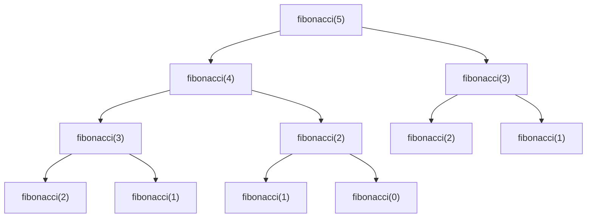

## 7.1 Fundamentals of Recursion

Recursion is a fundamental concept in functional programming and a powerful tool for solving problems that can be broken down into smaller, similar subproblems. In Clojure, recursion is not only a natural fit but also a preferred approach due to its alignment with functional programming principles. Let's delve into the basics of recursion, understand its components, and explore common recursive algorithms.

### Recursion Basics

**Define Recursion**: Recursion is a method of solving a problem where the solution involves solving smaller instances of the same problem. A recursive function calls itself with a modified argument until it reaches a base case, which is a condition that stops the recursion.

In Clojure, recursion is often used in place of iteration due to the language's emphasis on immutability and pure functions. This approach aligns with functional programming paradigms, where functions are first-class citizens and side effects are minimized.

**Role in Problem Solving**: Recursion is particularly useful for problems that have a natural hierarchical structure, such as traversing trees or graphs. It allows you to express complex operations in a concise and readable manner.

### Components of Recursive Functions

Understanding the components of recursive functions is crucial for writing effective recursive solutions.

#### Base Case

The base case is the condition under which the recursive function stops calling itself. It prevents infinite recursion and eventual stack overflow. A well-defined base case is essential for the correctness of a recursive function.

**Example**: Consider a simple recursive function to calculate the factorial of a number:

```clojure
(defn factorial [n]
  (if (<= n 1)
    1
    (* n (factorial (dec n)))))
```

- **Base Case**: When `n` is less than or equal to 1, the function returns 1.
- **Recursive Step**: The function calls itself with `n-1` and multiplies the result by `n`.

#### Recursive Step

The recursive step is where the function calls itself with a modified argument. It should gradually progress towards the base case. The recursive step often involves breaking down the problem into smaller parts.

**Example**: In the factorial function, the recursive step is `(* n (factorial (dec n)))`, which reduces the problem size by one.

### Visualizing Recursion

Visualizing recursion can help in understanding how recursive functions operate. One way to visualize recursion is by using a call stack diagram, which shows the sequence of function calls and returns.

#### Call Stack Illustration

Consider the factorial function for `n = 3`:

1. `factorial(3)` calls `factorial(2)`
2. `factorial(2)` calls `factorial(1)`
3. `factorial(1)` returns `1` (base case)
4. `factorial(2)` returns `2 * 1 = 2`
5. `factorial(3)` returns `3 * 2 = 6`

```mermaid
graph TD;
    A[factorial(3)] --> B[factorial(2)];
    B --> C[factorial(1)];
    C --> D[Return 1];
    B --> E[Return 2];
    A --> F[Return 6];
```

*Diagram 1: Call Stack for Factorial Function*

### Common Recursive Algorithms

Recursion is a natural fit for several algorithms, particularly those involving hierarchical data structures.

#### Tree Traversals

Trees are hierarchical structures that are naturally recursive. Traversing a tree involves visiting each node in a specific order, such as pre-order, in-order, or post-order.

**Example**: In-order traversal of a binary tree:

```clojure
(defn in-order-traversal [tree]
  (when tree
    (concat
      (in-order-traversal (:left tree))
      [(:value tree)]
      (in-order-traversal (:right tree)))))
```

- **Base Case**: When the tree is `nil`, the function returns an empty list.
- **Recursive Step**: The function concatenates the results of traversing the left subtree, the current node, and the right subtree.

#### Fibonacci Sequence

The Fibonacci sequence is a classic example of a recursive problem, where each number is the sum of the two preceding ones.

**Example**: Recursive Fibonacci function:

```clojure
(defn fibonacci [n]
  (cond
    (= n 0) 0
    (= n 1) 1
    :else (+ (fibonacci (- n 1)) (fibonacci (- n 2)))))
```

- **Base Cases**: When `n` is 0 or 1, the function returns `n`.
- **Recursive Step**: The function calls itself with `n-1` and `n-2` and sums the results.

### Try It Yourself

Experiment with the provided examples to deepen your understanding of recursion. Modify the `factorial` function to handle negative numbers gracefully, or optimize the `fibonacci` function using memoization to improve performance.

### Visual Aids

To further enhance understanding, let's incorporate a visual aid for the Fibonacci sequence:



*Diagram 2: Call Tree for Fibonacci Function*

### References and Links

- [Clojure Official Documentation](https://clojure.org/reference)
- [Clojure Community Resources](https://clojure.org/community/resources)
- [Transitioning from OOP to Functional Programming](https://www.lispcast.com/oo-to-fp/)
- [Understanding Recursion in Functional Programming](https://www.functionalprogramming.com/recursion)

### Knowledge Check

To reinforce your understanding, consider these questions:

1. What is the purpose of a base case in a recursive function?
2. How does recursion differ from iteration in terms of problem-solving approach?
3. Why is it important to ensure that a recursive function progresses towards a base case?

### Practice Problems

1. Implement a recursive function to compute the greatest common divisor (GCD) of two numbers.
2. Write a recursive function to reverse a list in Clojure.
3. Develop a recursive solution for the Tower of Hanoi problem.

### Encouraging Engagement

Embracing recursion in Clojure can be challenging, but with each step, you'll gain a deeper understanding and see tangible benefits in your codebase. By experimenting with recursive functions, you'll enhance your problem-solving skills and become more proficient in functional programming.

### Best Practices for Tags

- "Clojure"
- "Functional Programming"
- "Recursion"
- "Java"
- "Algorithms"
- "Data Structures"
- "Programming"
- "Software Development"

### Test Your Knowledge: Fundamentals of Recursion Quiz



### What is recursion?

- [x] A method of solving problems by breaking them down into smaller, similar subproblems
- [ ] A method of solving problems by iterating over a sequence
- [ ] A method of solving problems by using global variables
- [ ] A method of solving problems by using object-oriented principles

> **Explanation:** Recursion involves solving problems by breaking them into smaller, similar subproblems, which is a key concept in functional programming.

### What is the purpose of a base case in a recursive function?

- [x] To stop the recursion and prevent infinite loops
- [ ] To initialize variables
- [ ] To define the recursive step
- [ ] To optimize performance

> **Explanation:** The base case is essential to stop the recursion and prevent infinite loops, ensuring the function eventually returns a result.

### How does recursion differ from iteration?

- [x] Recursion solves problems by calling the function itself, while iteration uses loops
- [ ] Recursion is faster than iteration
- [ ] Recursion uses more memory than iteration
- [ ] Recursion is less readable than iteration

> **Explanation:** Recursion involves a function calling itself, whereas iteration uses loops to repeat actions.

### What is a recursive step?

- [x] The part of the function where it calls itself with a modified argument
- [ ] The part of the function that initializes variables
- [ ] The part of the function that returns the final result
- [ ] The part of the function that handles exceptions

> **Explanation:** The recursive step is where the function calls itself with a modified argument, gradually progressing towards the base case.

### Which of the following is a common use case for recursion?

- [x] Tree traversal
- [ ] Sorting arrays
- [x] Calculating factorials
- [ ] Managing database connections

> **Explanation:** Tree traversal and calculating factorials are common use cases for recursion due to their hierarchical nature.

### What is the role of the call stack in recursion?

- [x] To keep track of function calls and return values
- [ ] To store global variables
- [ ] To optimize performance
- [ ] To handle exceptions

> **Explanation:** The call stack keeps track of function calls and return values, which is crucial for managing recursive functions.

### How can you optimize a recursive Fibonacci function?

- [x] By using memoization to store previously computed values
- [ ] By using global variables
- [ ] By increasing the stack size
- [ ] By using loops instead of recursion

> **Explanation:** Memoization stores previously computed values, reducing redundant calculations and optimizing performance.

### What is a potential drawback of recursion?

- [x] It can lead to stack overflow if not properly managed
- [ ] It is always slower than iteration
- [ ] It cannot handle large datasets
- [ ] It is less readable than iteration

> **Explanation:** Recursion can lead to stack overflow if the base case is not properly defined or if the recursion depth is too high.

### Why is recursion preferred in functional programming?

- [x] It aligns with the principles of immutability and pure functions
- [ ] It is always faster than iteration
- [ ] It uses less memory than iteration
- [ ] It is easier to debug than iteration

> **Explanation:** Recursion aligns with the principles of immutability and pure functions, which are central to functional programming.

### True or False: Every recursive function must have a base case.

- [x] True
- [ ] False

> **Explanation:** Every recursive function must have a base case to ensure it eventually stops calling itself and returns a result.


