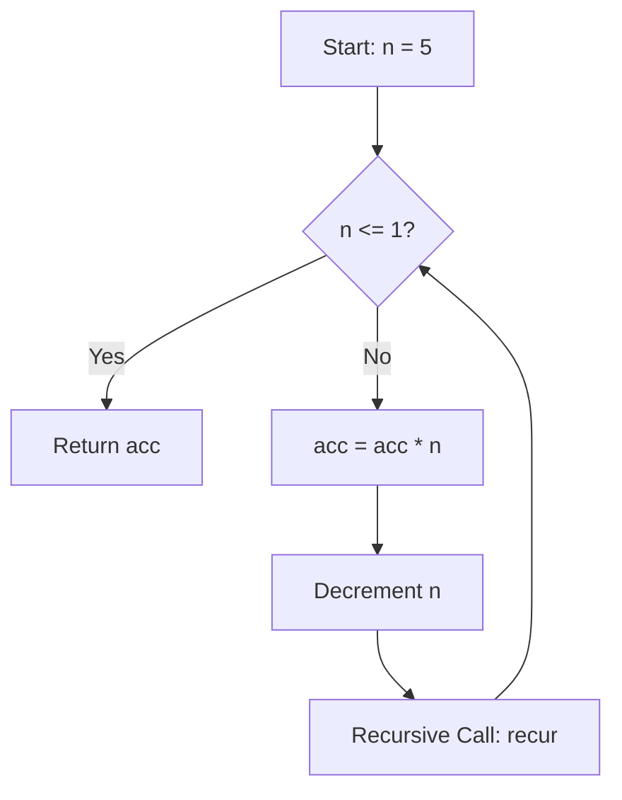

## 7.2 Recursive Functions in Clojure

In the realm of functional programming, recursion is a fundamental concept that allows us to solve problems by defining a function that calls itself. Clojure, a modern Lisp dialect, embraces recursion as a core mechanism for iteration and problem-solving, often replacing traditional loops found in imperative languages like Java. In this section, we'll delve into defining recursive functions in Clojure, explore potential pitfalls, and discuss strategies to optimize recursive calls for efficiency.

### Defining Recursive Functions

Recursive functions in Clojure are defined similarly to other functions, but with a key difference: they call themselves within their own definition. This self-reference allows the function to perform repeated computations, breaking down complex problems into simpler sub-problems.

#### Example: Calculating Factorial

Let's start with a classic example: calculating the factorial of a number. The factorial of a non-negative integer `n` is the product of all positive integers less than or equal to `n`. The recursive definition of factorial is:

- `factorial(0) = 1`
- `factorial(n) = n * factorial(n - 1)`, for `n > 0`

Here's how you can implement this in Clojure:

```clojure
(defn factorial [n]
  (if (<= n 1)
    1
    (* n (factorial (dec n)))))
```

**Explanation:**

- **Base Case**: The function checks if `n` is less than or equal to 1. If true, it returns 1, as the factorial of 0 or 1 is 1.
- **Recursive Case**: If `n` is greater than 1, the function multiplies `n` by the factorial of `n-1`, effectively reducing the problem size with each recursive call.

### Potential Issues: Stack Overflows

While recursion is elegant and expressive, it comes with potential pitfalls, particularly the risk of stack overflow. Each recursive call consumes stack space, and a deep recursion can exhaust the stack, leading to a `StackOverflowError`.

#### Example of Stack Overflow

Consider a naive recursive function to compute the nth Fibonacci number:

```clojure
(defn fibonacci [n]
  (if (<= n 1)
    n
    (+ (fibonacci (- n 1)) (fibonacci (- n 2)))))
```

This function is inefficient for large `n` due to its exponential time complexity and can quickly lead to stack overflow.

### Improving Efficiency: Tail Recursion

To mitigate stack overflow risks, we can optimize recursive functions using tail recursion. In tail recursion, the recursive call is the last operation in the function, allowing the compiler to optimize the call stack and reuse stack frames.

#### Tail Recursive Factorial

Let's rewrite the factorial function using tail recursion:

```clojure
(defn factorial-tail-rec [n]
  (letfn [(factorial-helper [n acc]
            (if (<= n 1)
              acc
              (recur (dec n) (* n acc))))]
    (factorial-helper n 1)))
```

**Explanation:**

- **Helper Function**: We introduce a helper function `factorial-helper` with an accumulator `acc` to carry the result.
- **Tail Call**: The `recur` form is used for the recursive call, ensuring it's in tail position. This allows Clojure to optimize the recursion, preventing stack overflow.

### Visualizing Recursion

To better understand how recursion works, let's visualize the recursive process using a flowchart for the factorial function.



**Diagram Description**: This flowchart illustrates the tail-recursive process for calculating factorial. The function checks if `n` is less than or equal to 1, returning the accumulator if true. Otherwise, it updates the accumulator and decrements `n`, making a tail-recursive call.

### Comparing with Java

For Java developers transitioning to Clojure, understanding recursion can be challenging due to the absence of traditional loops. In Java, you might use a for-loop or while-loop to calculate a factorial:

```java
public static int factorial(int n) {
    int result = 1;
    for (int i = 1; i <= n; i++) {
        result *= i;
    }
    return result;
}
```

In contrast, Clojure's recursive approach emphasizes immutability and function composition, aligning with functional programming principles.

### Strategies for Efficient Recursion

To write efficient recursive functions in Clojure, consider the following strategies:

1. **Use Tail Recursion**: Always aim for tail-recursive functions to leverage stack optimization.
2. **Memoization**: Cache results of expensive recursive calls to avoid redundant computations.
3. **Iterative Processes**: Convert recursive processes to iterative ones using loops or higher-order functions like `reduce` when possible.

### Try It Yourself

Experiment with the following modifications to deepen your understanding of recursion in Clojure:

- Modify the `factorial-tail-rec` function to handle negative inputs gracefully.
- Implement a tail-recursive version of the Fibonacci function.
- Explore the use of `reduce` to calculate factorial iteratively.

### Further Reading

For more on recursion and functional programming in Clojure, explore these resources:

- [Clojure Official Documentation](https://clojure.org/reference)
- [Transitioning from OOP to Functional Programming](https://www.lispcast.com/oo-to-fp/)
- [Understanding Tail Recursion](https://clojure.org/guides/tail_recursion)

### Knowledge Check

Before moving on, test your understanding with the following quiz:

## **Test Your Knowledge: Recursive Functions in Clojure Quiz**



### What is the base case in a recursive function?

- [x] The condition under which the function stops calling itself
- [ ] The initial value passed to the function
- [ ] The recursive call itself
- [ ] The final result of the function

> **Explanation:** The base case is the condition that terminates the recursion, preventing infinite loops.

### Which of the following is a risk of naive recursion?

- [x] Stack Overflow
- [ ] Memory Leak
- [ ] Compilation Error
- [ ] Syntax Error

> **Explanation:** Naive recursion can lead to stack overflow due to excessive stack usage.

### What is tail recursion?

- [x] A recursive call that is the last operation in a function
- [ ] A recursive call that occurs first in a function
- [ ] A recursive call that uses an accumulator
- [ ] A recursive call that does not return a value

> **Explanation:** Tail recursion allows the compiler to optimize the stack by making the recursive call the last operation.

### How can you optimize a recursive function in Clojure?

- [x] Use `recur` for tail recursion
- [ ] Use `loop` for non-recursive functions
- [ ] Use `map` for recursive functions
- [ ] Use `filter` for recursive functions

> **Explanation:** Using `recur` in tail position optimizes recursion by reusing stack frames.

### Which function is used to prevent stack overflow in tail recursion?

- [x] `recur`
- [ ] `loop`
- [ ] `reduce`
- [ ] `map`

> **Explanation:** `recur` is used to perform tail-recursive calls efficiently.

### What is the main advantage of tail recursion?

- [x] It prevents stack overflow
- [ ] It increases code readability
- [ ] It decreases execution time
- [ ] It simplifies code logic

> **Explanation:** Tail recursion optimizes stack usage, preventing overflow.

### Which of the following is a strategy to optimize recursion?

- [x] Memoization
- [x] Tail Recursion
- [ ] Using global variables
- [ ] Using mutable state

> **Explanation:** Memoization and tail recursion are effective strategies for optimizing recursive functions.

### What is the purpose of an accumulator in tail recursion?

- [x] To carry the result through recursive calls
- [ ] To store intermediate values
- [ ] To increase stack usage
- [ ] To decrease function parameters

> **Explanation:** An accumulator holds the result, allowing the function to be tail-recursive.

### How does Clojure handle recursion differently from Java?

- [x] Clojure uses recursion instead of loops
- [ ] Clojure uses loops instead of recursion
- [ ] Clojure does not support recursion
- [ ] Clojure uses recursion only for mathematical functions

> **Explanation:** Clojure emphasizes recursion over traditional loops, aligning with functional programming principles.

### True or False: Tail recursion is always more efficient than naive recursion.

- [x] True
- [ ] False

> **Explanation:** Tail recursion is more efficient because it optimizes stack usage, preventing overflow.



By mastering recursive functions in Clojure, you unlock the potential to solve complex problems elegantly and efficiently. Embrace recursion as a powerful tool in your functional programming toolkit, and continue exploring its applications in the next section on tail recursion.
