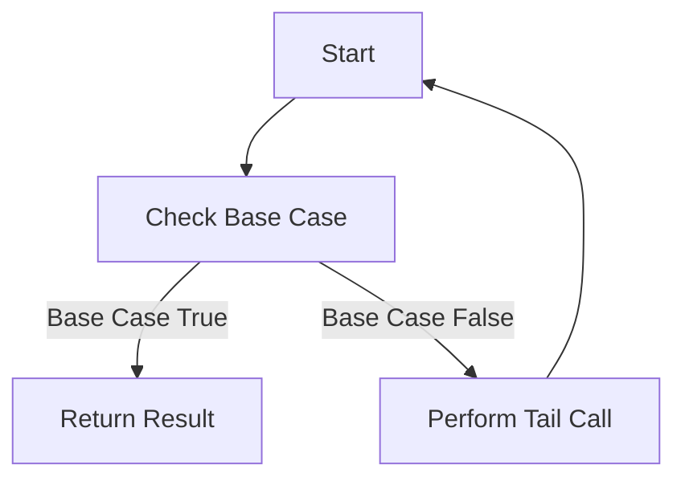

## 7.3 Tail Recursion and the `recur` Special Form

In functional programming, recursion is a fundamental concept that allows functions to call themselves to solve problems. However, traditional recursion can lead to stack overflow errors due to the accumulation of stack frames. Tail recursion is a powerful technique that optimizes recursive calls, preventing the stack from growing and enabling efficient execution. Clojure, a functional programming language, provides the `recur` special form to support tail recursion by reusing the current stack frame. In this section, we'll explore tail recursion, the `recur` special form, and how to apply these concepts to optimize recursive functions in Clojure.

### Tail Recursion Explained

Tail recursion is a specific form of recursion where the recursive call is the last operation in a function. This means that the current function's stack frame can be replaced with the next function call's stack frame, effectively reusing the same memory space. This optimization prevents the call stack from growing, allowing for recursion over large data sets without risking a stack overflow.

In languages like Java, which do not inherently support tail call optimization, recursive functions can lead to stack overflow errors when the recursion depth becomes too large. However, Clojure, being a Lisp dialect with a focus on functional programming, provides mechanisms to ensure that tail-recursive functions can execute efficiently.

**Example of a Non-Tail-Recursive Function:**

```clojure
(defn factorial [n]
  (if (<= n 1)
    1
    (* n (factorial (dec n)))))
```

In the above example, the multiplication operation `(* n ...)` is performed after the recursive call, making it non-tail-recursive. Each recursive call creates a new stack frame, which can lead to stack overflow for large `n`.

### Using `recur` for Tail Recursion

Clojure provides the `recur` special form to facilitate tail recursion. The `recur` form allows a function to call itself in a tail-recursive manner by reusing the current stack frame. This is achieved by placing the recursive call in the tail position, which is the last operation executed in the function.

**Rules for Using `recur`:**

1. **Tail Position**: The `recur` call must be in the tail position, meaning it is the last operation performed before the function returns.
2. **Same Function**: `recur` can only be used to call the current function or loop.
3. **Arity Matching**: The arguments passed to `recur` must match the arity of the function or loop.

**Converting to a Tail-Recursive Function Using `recur`:**

To convert the previous factorial function into a tail-recursive version using `recur`, we introduce an accumulator parameter to carry the result through each recursive call.

```clojure
(defn tail-recursive-factorial [n]
  (letfn [(helper [n acc]
            (if (<= n 1)
              acc
              (recur (dec n) (* n acc))))]
    (helper n 1)))
```

In this version, the `helper` function uses `recur` to call itself in the tail position. The accumulator `acc` carries the intermediate results, allowing the function to execute efficiently without growing the stack.

### Examples and Practice

Let's explore more examples to solidify our understanding of tail recursion and the `recur` special form.

**Example 1: Calculating Fibonacci Numbers**

The Fibonacci sequence is another classic example where recursion is often used. A naive recursive implementation can lead to exponential time complexity and stack overflow. By using tail recursion, we can optimize the function.

**Naive Recursive Fibonacci:**

```clojure
(defn naive-fibonacci [n]
  (if (<= n 1)
    n
    (+ (naive-fibonacci (- n 1)) (naive-fibonacci (- n 2)))))
```

**Tail-Recursive Fibonacci Using `recur`:**

```clojure
(defn tail-recursive-fibonacci [n]
  (letfn [(fib-helper [a b n]
            (if (zero? n)
              a
              (recur b (+ a b) (dec n))))]
    (fib-helper 0 1 n)))
```

In the tail-recursive version, we use a helper function `fib-helper` with two accumulators `a` and `b` to carry the previous two Fibonacci numbers. The `recur` call is in the tail position, ensuring efficient execution.

**Example 2: Sum of a List**

Calculating the sum of a list is another common task that can benefit from tail recursion.

**Non-Tail-Recursive Sum:**

```clojure
(defn sum-list [lst]
  (if (empty? lst)
    0
    (+ (first lst) (sum-list (rest lst)))))
```

**Tail-Recursive Sum Using `recur`:**

```clojure
(defn tail-recursive-sum [lst]
  (letfn [(sum-helper [lst acc]
            (if (empty? lst)
              acc
              (recur (rest lst) (+ acc (first lst)))))]
    (sum-helper lst 0)))
```

Here, `sum-helper` is a tail-recursive function that accumulates the sum in `acc`. The `recur` call is in the tail position, allowing the function to execute efficiently for large lists.

### Visualizing Tail Recursion

To better understand how tail recursion works, let's visualize the process using a flowchart. This will help illustrate how the stack frame is reused in a tail-recursive function.



**Diagram Description:** The flowchart illustrates the process of tail recursion. The function checks the base case and returns the result if true. If false, it performs a tail call using `recur`, reusing the current stack frame and looping back to the start.

### Comparing Tail Recursion in Java and Clojure

In Java, recursion is often limited by the risk of stack overflow due to the lack of tail call optimization. While Java 8 introduced the concept of lambdas and functional interfaces, it does not natively support tail call optimization. Developers must rely on iterative solutions or complex workarounds to handle deep recursion.

In contrast, Clojure's `recur` special form provides a straightforward way to achieve tail recursion, making it a powerful tool for functional programming. This allows developers to write elegant recursive solutions without worrying about stack overflow, enhancing both performance and readability.

### Try It Yourself: Experiment with Tail Recursion

To deepen your understanding of tail recursion and `recur`, try modifying the provided examples:

- **Modify the `tail-recursive-factorial` function** to calculate the factorial of a number using addition instead of multiplication.
- **Create a tail-recursive function** to reverse a list using `recur`.
- **Implement a tail-recursive version** of a function that calculates the greatest common divisor (GCD) of two numbers.

Experimenting with these variations will help reinforce the concepts and demonstrate the power of tail recursion in Clojure.

### Key Takeaways

- **Tail recursion** allows functions to call themselves without growing the call stack, enabling efficient recursion.
- **Clojure's `recur` special form** supports tail recursion by reusing the current stack frame, preventing stack overflow.
- **Ensure `recur` is used in the tail position** and matches the arity of the function or loop.
- **Tail recursion in Clojure** contrasts with Java's lack of native tail call optimization, offering a more efficient approach to recursion.

### Further Reading and Resources

- [Clojure Official Documentation](https://clojure.org/reference)
- [Clojure Community Resources](https://clojure.org/community/resources)
- [Transitioning from OOP to Functional Programming](https://www.lispcast.com/oo-to-fp/)
- [Understanding Tail Call Optimization](https://en.wikipedia.org/wiki/Tail_call)

## **Test Your Knowledge: Tail Recursion and the `recur` Special Form Quiz**



### What is tail recursion?

- [x] A form of recursion where the recursive call is the last operation in the function
- [ ] A recursion technique that uses multiple stack frames
- [ ] A non-recursive function
- [ ] A method of recursion that always results in a stack overflow

> **Explanation:** Tail recursion is a specific form of recursion where the recursive call is the last operation performed, allowing the stack frame to be reused.

### What is the primary benefit of tail recursion?

- [x] It prevents the call stack from growing, avoiding stack overflow
- [ ] It makes the code more readable
- [ ] It allows recursion to be used in non-functional languages
- [ ] It increases the complexity of the code

> **Explanation:** Tail recursion optimizes recursive calls by reusing the current stack frame, preventing stack overflow.

### How does Clojure support tail recursion?

- [x] By using the `recur` special form
- [ ] By automatically converting recursion to iteration
- [ ] By using Java's tail call optimization
- [ ] By limiting recursion depth

> **Explanation:** Clojure uses the `recur` special form to support tail recursion by reusing the current stack frame.

### What is a requirement for using `recur` in Clojure?

- [x] The `recur` call must be in the tail position
- [ ] The `recur` call must be the first operation in the function
- [ ] The `recur` call must be used with a loop
- [ ] The `recur` call must be outside the function

> **Explanation:** The `recur` call must be in the tail position, meaning it is the last operation before the function returns.

### Which of the following is a tail-recursive function?

- [x] A function where the recursive call is the last operation
- [ ] A function that uses iteration instead of recursion
- [x] A function that uses `recur` in the tail position
- [ ] A function that calls itself multiple times

> **Explanation:** A tail-recursive function has the recursive call as the last operation, and in Clojure, it uses `recur` in the tail position.

### How can you convert a non-tail-recursive function to a tail-recursive one?

- [x] By introducing an accumulator parameter
- [ ] By using more stack frames
- [ ] By removing the base case
- [ ] By increasing the recursion depth

> **Explanation:** Introducing an accumulator parameter allows the function to carry intermediate results, enabling tail recursion.

### What is the role of an accumulator in tail recursion?

- [x] To carry intermediate results through recursive calls
- [ ] To increase recursion depth
- [x] To enable the function to execute efficiently
- [ ] To decrease the complexity of the function

> **Explanation:** An accumulator carries intermediate results, allowing the function to execute efficiently without growing the stack.

### What happens if `recur` is not in the tail position?

- [x] The function will not be tail-recursive, and the stack will grow
- [ ] The function will execute faster
- [ ] The function will not compile
- [ ] The function will automatically convert to iteration

> **Explanation:** If `recur` is not in the tail position, the function will not be tail-recursive, and the stack will grow with each call.

### Can `recur` be used to call any function?

- [x] No, it can only call the current function or loop
- [ ] Yes, it can call any function
- [ ] No, it can only call external functions
- [ ] Yes, it can call any function within the same namespace

> **Explanation:** `recur` can only be used to call the current function or loop, not any function.

### Is tail recursion supported natively in Java?

- [ ] True
- [x] False

> **Explanation:** Java does not natively support tail call optimization, unlike Clojure, which provides the `recur` special form for tail recursion.


