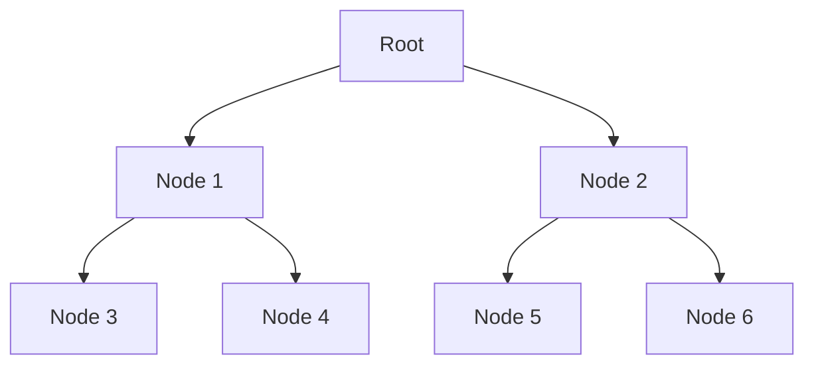

## 7.4 Working with Recursive Data Structures

In this section, we delve into the fascinating world of recursive data structures in Clojure, a critical aspect of functional programming that allows us to elegantly handle complex data models. Recursive data structures, such as trees and linked lists, are fundamental in representing hierarchical data. We will explore how to traverse, manipulate, and apply these structures in real-world scenarios.

### Understanding Recursive Structures

Recursive data structures are those that are defined in terms of themselves. This self-referential nature makes them particularly suited for representing hierarchical data, such as file systems, organizational charts, or abstract syntax trees. In Clojure, we can efficiently work with recursive structures thanks to its powerful functional programming paradigm.

#### Trees

A tree is a classic example of a recursive data structure. Each node in a tree can have zero or more child nodes, and this pattern can repeat indefinitely. Trees are widely used in computer science for tasks such as parsing expressions, organizing data, and implementing search algorithms.

```clojure
(defn tree-example []
  {:value 1
   :children [{:value 2
               :children [{:value 4 :children []}
                          {:value 5 :children []}]}
              {:value 3
               :children [{:value 6 :children []}
                          {:value 7 :children []}]}]})
```

In this example, we define a simple tree structure using Clojure maps and vectors. Each node contains a `:value` and a `:children` key, where `:children` is a vector of more nodes.

#### Linked Lists

Linked lists are another type of recursive data structure where each element points to the next, forming a chain. Clojure’s native list type is inherently linked, making it a natural fit for recursive operations.

```clojure
(defn linked-list-example []
  '(1 2 3 4 5))
```

### Traversing Trees

Traversing a tree involves visiting each node in the tree, typically using a recursive function. We can apply different traversal strategies, such as depth-first or breadth-first, depending on the use case.

#### Depth-First Traversal

Depth-first traversal explores as far as possible along each branch before backtracking. This is often implemented using recursion.

```clojure
(defn depth-first-traverse [node]
  (println (:value node))
  (doseq [child (:children node)]
    (depth-first-traverse child)))

;; Usage
(depth-first-traverse (tree-example))
```

In this code, we define a recursive function `depth-first-traverse` that prints the value of each node before recursively visiting its children.

#### Breadth-First Traversal

Breadth-first traversal visits all the nodes at the present depth level before moving on to nodes at the next depth level. This can be implemented using a queue.

```clojure
(defn breadth-first-traverse [root]
  (loop [queue [root]]
    (when (seq queue)
      (let [node (first queue)]
        (println (:value node))
        (recur (concat (rest queue) (:children node)))))))

;; Usage
(breadth-first-traverse (tree-example))
```

Here, we use a `loop` and `recur` to manage the queue of nodes to be visited, ensuring that we process nodes level by level.

### Manipulating Nested Data

In Clojure, nested data structures are common, especially when dealing with JSON or XML data. We can use recursion to manipulate these structures effectively.

#### Example: Updating Nested Maps

Consider a scenario where we need to update values deep within a nested map. We can write a recursive function to achieve this.

```clojure
(defn update-nested [m path f & args]
  (if (empty? path)
    (apply f m args)
    (let [key (first path)
          rest-path (rest path)]
      (assoc m key (update-nested (get m key) rest-path f args)))))

;; Usage
(def nested-map {:a {:b {:c 1}}})
(update-nested nested-map [:a :b :c] inc)
```

This function `update-nested` takes a map `m`, a path to the target value, a function `f`, and additional arguments. It recursively navigates the map, applying `f` to the target value.

### Practical Applications

Recursive data structures are not just theoretical constructs; they have numerous practical applications. Let's explore some real-world scenarios where these concepts shine.

#### Parsing JSON

JSON data is inherently hierarchical, making it a perfect candidate for recursive processing. We can parse and transform JSON data using recursive functions.

```clojure
(require '[cheshire.core :as json])

(defn parse-json [json-str]
  (let [data (json/parse-string json-str true)]
    (println "Parsed JSON:" data)
    data))

;; Usage
(parse-json "{\"a\": {\"b\": {\"c\": 1}}}")
```

Using the `cheshire` library, we can parse JSON strings into Clojure maps and process them recursively.

#### XML Processing

Similar to JSON, XML data is also hierarchical. We can use recursive functions to navigate and transform XML documents.

```clojure
(require '[clojure.data.xml :as xml])

(defn parse-xml [xml-str]
  (let [data (xml/parse-str xml-str)]
    (println "Parsed XML:" data)
    data))

;; Usage
(parse-xml "<root><a><b><c>1</c></b></a></root>")
```

Here, we use the `clojure.data.xml` library to parse XML strings, allowing us to work with XML data in a structured way.

### Try It Yourself

Experiment with the following exercises to deepen your understanding of recursive data structures in Clojure:

1. Modify the `depth-first-traverse` function to collect node values in a list instead of printing them.
2. Implement a function to calculate the depth of a tree.
3. Write a recursive function to flatten a nested list structure.

### Visual Aids

To better understand how recursive data structures work, consider the following diagram illustrating a simple tree traversal:



**Diagram Description:** This diagram shows a tree structure with a root node `A` and its children. It illustrates how nodes are connected in a hierarchical manner.

### References and Links

For further reading and exploration, consider the following resources:

- [Clojure Official Documentation](https://clojure.org/reference)
- [Clojure Community Resources](https://clojure.org/community/resources)
- [Transitioning from OOP to Functional Programming](https://www.lispcast.com/oo-to-fp/)
- [Cheshire JSON Library](https://github.com/dakrone/cheshire)
- [Clojure Data XML](https://github.com/clojure/data.xml)

### Knowledge Check

To reinforce your understanding, try answering these questions:

1. What is a recursive data structure, and why is it useful?
2. How does depth-first traversal differ from breadth-first traversal?
3. What are some practical applications of recursive data structures in real-world programming?

### Conclusion

Working with recursive data structures in Clojure allows us to elegantly handle complex, hierarchical data. By mastering these concepts, we can build scalable and efficient applications that leverage the full power of functional programming. As you continue your journey, remember that recursion is a powerful tool in your functional programming toolkit, enabling you to tackle a wide range of problems with elegance and simplicity.

## **Test Your Knowledge: Working with Recursive Data Structures Quiz**



### What is a recursive data structure?

- [x] A data structure that references itself
- [ ] A data structure that is always linear
- [ ] A data structure that cannot be nested
- [ ] A data structure that only contains primitive data types

> **Explanation:** Recursive data structures are defined in terms of themselves, making them ideal for hierarchical data representation.

### Which of the following is an example of a recursive data structure?

- [x] Tree
- [x] Linked List
- [ ] Array
- [ ] HashMap

> **Explanation:** Trees and linked lists are recursive because they can contain instances of themselves, unlike arrays and hashmaps.

### How does depth-first traversal work?

- [x] It explores as far as possible along each branch before backtracking
- [ ] It visits all nodes at the current depth before moving to the next
- [ ] It processes nodes in alphabetical order
- [ ] It uses a queue to manage nodes

> **Explanation:** Depth-first traversal dives deep into each branch before moving to the next, often implemented using recursion.

### What is the key difference between depth-first and breadth-first traversal?

- [x] Depth-first uses recursion, breadth-first uses a queue
- [ ] Depth-first processes nodes level by level, breadth-first goes deep
- [ ] Depth-first is faster than breadth-first
- [ ] Depth-first requires more memory than breadth-first

> **Explanation:** Depth-first uses recursion to explore branches deeply, while breadth-first uses a queue to process nodes level by level.

### How can we update a deeply nested map in Clojure?

- [x] Using a recursive function to navigate and update the map
- [ ] Using a loop to iterate over all keys
- [ ] Using a single `assoc` call
- [ ] Using a for loop

> **Explanation:** A recursive function can navigate through the nested structure to apply updates at the desired location.

### What library can be used for JSON parsing in Clojure?

- [x] Cheshire
- [ ] clojure.data.xml
- [ ] Ring
- [ ] Compojure

> **Explanation:** Cheshire is a popular library for parsing and generating JSON in Clojure.

### What is the purpose of the `recur` special form in Clojure?

- [x] To enable tail recursion
- [ ] To create a new thread
- [ ] To handle exceptions
- [ ] To define a new function

> **Explanation:** `recur` is used in Clojure to optimize recursive calls, allowing for tail recursion.

### Why are recursive data structures useful in programming?

- [x] They allow for elegant representation of hierarchical data
- [ ] They are always faster than non-recursive structures
- [ ] They require less memory
- [ ] They are easier to implement than other structures

> **Explanation:** Recursive data structures are particularly useful for representing and processing hierarchical data.

### How do we handle XML data in Clojure?

- [x] Using clojure.data.xml library
- [ ] Using Cheshire library
- [ ] Using core.async
- [ ] Using Ring

> **Explanation:** The `clojure.data.xml` library is used for parsing and processing XML data in Clojure.

### True or False: Recursive data structures can only be used in functional programming languages.

- [ ] True
- [x] False

> **Explanation:** Recursive data structures are used in many programming paradigms, including both functional and object-oriented programming.


