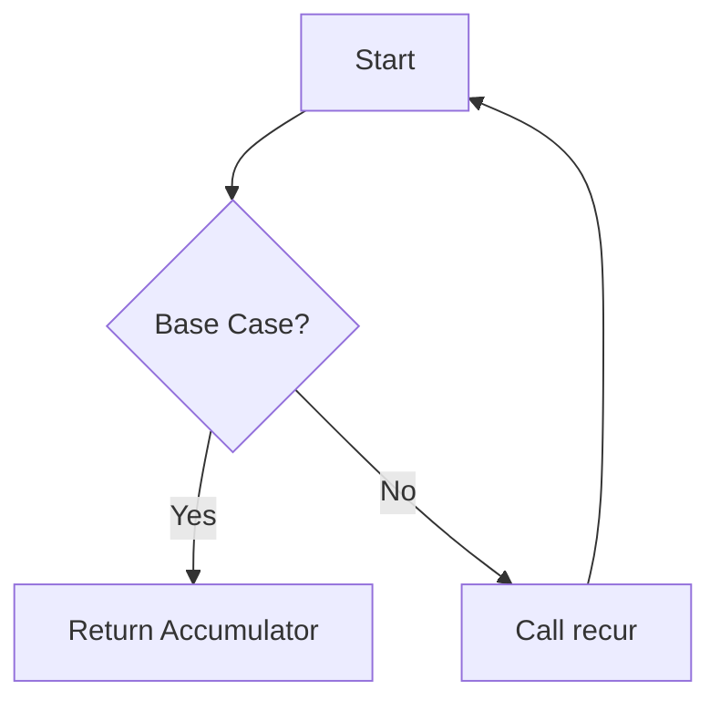

## 7.5 Optimizing Recursive Solutions

Recursion is a powerful tool in functional programming, allowing developers to solve complex problems elegantly. However, recursive solutions can sometimes be inefficient, especially when they involve redundant computations or deep recursion stacks. In this section, we will explore techniques to optimize recursive solutions in Clojure, focusing on eliminating redundant computations, considering iterative alternatives, understanding the limitations of tail call optimization, and employing performance profiling.

### Eliminating Redundant Computations

One of the primary challenges with recursive functions is the potential for redundant computations. This is particularly evident in functions like the naive recursive Fibonacci sequence calculation, where the same values are recalculated multiple times.

#### Memoization: Caching Results

Memoization is a technique used to cache the results of expensive function calls and return the cached result when the same inputs occur again. In Clojure, memoization can be achieved using the `memoize` function.

**Example: Memoizing Fibonacci Function**

```clojure
(defn fib [n]
  (if (<= n 1)
    n
    (+ (fib (- n 1)) (fib (- n 2)))))

(def memo-fib (memoize fib))

;; Usage
(memo-fib 40) ; Much faster on subsequent calls
```

In the example above, `memo-fib` is a memoized version of the Fibonacci function. The first call to `memo-fib` with a particular argument will compute the result and store it. Subsequent calls with the same argument will return the cached result, significantly improving performance.

**Try It Yourself**

Experiment by removing the `memoize` function and observe the difference in performance for large inputs. You can also try memoizing other recursive functions to see the impact.

#### When to Use Memoization

Memoization is most beneficial when:
- The recursive function has overlapping subproblems.
- The function is pure (i.e., it has no side effects).
- The input space is relatively small, ensuring that the cache does not grow too large.

### Iterative Alternatives

While recursion is elegant, it is not always the most efficient approach. In some cases, iterative solutions can be more performant and easier to understand, especially when dealing with large input sizes.

#### Converting Recursion to Iteration

Consider the factorial function, which can be implemented both recursively and iteratively:

**Recursive Factorial**

```clojure
(defn factorial-rec [n]
  (if (<= n 1)
    1
    (* n (factorial-rec (dec n)))))
```

**Iterative Factorial**

```clojure
(defn factorial-iter [n]
  (loop [acc 1, i n]
    (if (<= i 1)
      acc
      (recur (* acc i) (dec i)))))
```

The iterative version uses a `loop` and `recur` to maintain an accumulator, avoiding the overhead of recursive function calls and the risk of stack overflow.

**Try It Yourself**

Convert other recursive functions you have written into iterative versions using `loop` and `recur`. Compare their performance and readability.

### Tail Call Optimization Limits

Tail call optimization (TCO) is a technique used by some languages to optimize recursive function calls, allowing them to be executed in constant stack space. Unfortunately, the Java Virtual Machine (JVM), which Clojure runs on, does not support TCO natively.

#### Using `recur` for Tail Recursion

Clojure provides the `recur` special form to optimize tail-recursive functions. `recur` allows a function to call itself without growing the call stack, effectively simulating TCO.

**Example: Tail-Recursive Sum**

```clojure
(defn sum-tail-rec [n acc]
  (if (zero? n)
    acc
    (recur (dec n) (+ acc n))))

;; Usage
(sum-tail-rec 1000 0) ; Efficiently computes the sum
```

In this example, `sum-tail-rec` uses `recur` to perform a tail-recursive sum, ensuring that the function call does not consume additional stack space.

**Visualizing Tail Recursion**



**Explanation:** This flowchart illustrates the process of a tail-recursive function using `recur`. The function checks for the base case and either returns the accumulator or calls `recur` to continue the process.

#### Limitations of `recur`

While `recur` is powerful, it can only be used for self-recursive calls within the same function or loop. It does not support mutual recursion or recursion across multiple functions.

### Performance Profiling

To optimize recursive functions effectively, it is crucial to profile them and identify bottlenecks. Clojure provides several tools for performance profiling.

#### Using `clojure.core` for Profiling

Clojure's core library includes functions that can help measure execution time and identify performance issues.

**Example: Profiling Execution Time**

```clojure
(defn profile-fn [f & args]
  (let [start (System/nanoTime)
        result (apply f args)
        end (System/nanoTime)]
    (println "Execution time:" (/ (- end start) 1e6) "ms")
    result))

;; Usage
(profile-fn factorial-iter 1000)
```

In this example, `profile-fn` measures the execution time of a function in milliseconds, allowing you to identify slow functions and optimize them.

**Try It Yourself**

Profile different recursive and iterative functions to compare their execution times. Experiment with optimizing slow functions using memoization, iteration, or `recur`.

### Conclusion

Optimizing recursive solutions in Clojure involves a combination of techniques, including memoization, iterative alternatives, and tail recursion with `recur`. By understanding the limitations of the JVM's tail call optimization and employing performance profiling, you can write efficient and scalable recursive functions.

**Key Takeaways:**
- Use memoization to cache results of expensive recursive calls and eliminate redundant computations.
- Consider iterative alternatives when recursion is inefficient or risks stack overflow.
- Leverage `recur` to optimize tail-recursive functions and avoid stack growth.
- Profile recursive functions to identify bottlenecks and optimize performance.

### References and Further Reading

- [Clojure Official Documentation](https://clojure.org/reference)
- [Clojure Community Resources](https://clojure.org/community/resources)
- [Transitioning from OOP to Functional Programming](https://www.lispcast.com/oo-to-fp/)

## **Test Your Knowledge: Optimizing Recursive Solutions Quiz**



### What is memoization used for in recursive functions?

- [x] Caching results of expensive function calls
- [ ] Increasing stack space
- [ ] Reducing code complexity
- [ ] Improving readability

> **Explanation:** Memoization caches the results of expensive function calls to avoid redundant computations and improve performance.


### Which Clojure function is used to memoize a function?

- [x] `memoize`
- [ ] `recur`
- [ ] `loop`
- [ ] `apply`

> **Explanation:** The `memoize` function in Clojure is used to cache the results of function calls.


### Why might you choose an iterative approach over a recursive one?

- [x] To avoid stack overflow
- [x] For better performance with large inputs
- [ ] To increase code readability
- [ ] To use more memory

> **Explanation:** Iterative approaches can avoid stack overflow and often perform better with large inputs compared to recursion.


### What does the `recur` special form do in Clojure?

- [x] Optimizes tail-recursive functions to prevent stack growth
- [ ] Caches function results
- [ ] Increases recursion depth
- [ ] Simplifies function syntax

> **Explanation:** `recur` is used in Clojure to optimize tail-recursive functions by preventing additional stack growth.


### What is a limitation of `recur` in Clojure?

- [x] It can only be used for self-recursive calls
- [ ] It increases memory usage
- [ ] It reduces function readability
- [x] It does not support mutual recursion

> **Explanation:** `recur` can only be used for self-recursive calls within the same function or loop and does not support mutual recursion.


### How can you measure the execution time of a function in Clojure?

- [x] Using `System/nanoTime`
- [ ] Using `recur`
- [ ] Using `memoize`
- [ ] Using `loop`

> **Explanation:** `System/nanoTime` can be used to measure the execution time of a function in Clojure.


### What is a key benefit of using memoization?

- [x] Eliminating redundant computations
- [ ] Increasing code complexity
- [ ] Reducing execution time
- [ ] Improving syntax

> **Explanation:** Memoization helps eliminate redundant computations by caching results of expensive function calls.


### Which of the following is a benefit of tail recursion?

- [x] It prevents stack overflow
- [ ] It increases recursion depth
- [ ] It simplifies function syntax
- [ ] It uses more memory

> **Explanation:** Tail recursion prevents stack overflow by optimizing recursive calls to use constant stack space.


### What tool can help identify performance bottlenecks in Clojure?

- [x] Profiling tools
- [ ] Memoization
- [ ] Tail recursion
- [ ] Iteration

> **Explanation:** Profiling tools can help identify performance bottlenecks by measuring execution times and resource usage.


### True or False: The JVM natively supports tail call optimization.

- [ ] True
- [x] False

> **Explanation:** The JVM does not natively support tail call optimization, which is why Clojure uses `recur` to optimize tail-recursive functions.


