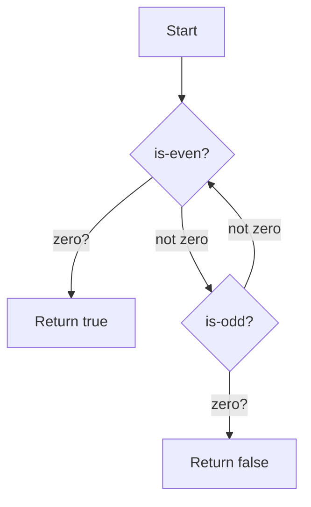

## 7.6 Mutual Recursion and Trampolining

In the realm of functional programming, recursion is a fundamental concept that allows functions to call themselves in order to solve problems. However, when two or more functions call each other recursively, we enter the domain of **mutual recursion**. This technique, while powerful, introduces challenges, particularly in languages running on the Java Virtual Machine (JVM) due to stack growth issues. In this section, we'll explore mutual recursion, the challenges it presents, and how Clojure's `trampoline` function provides an elegant solution to optimize recursive calls without consuming excessive stack space.

### Understanding Mutual Recursion

**Mutual recursion** occurs when two or more functions are defined in terms of each other. This pattern is useful in scenarios where a problem naturally decomposes into multiple interdependent subproblems. For example, consider a simple problem of determining whether a number is even or odd. We can define two mutually recursive functions, `isEven` and `isOdd`, where `isEven` calls `isOdd` and vice versa.

#### Example: Even and Odd

Let's define these functions in Clojure:

```clojure
(defn is-even? [n]
  (if (zero? n)
    true
    (is-odd? (dec n))))

(defn is-odd? [n]
  (if (zero? n)
    false
    (is-even? (dec n))))
```

In this example, `is-even?` calls `is-odd?` and vice versa, creating a mutually recursive relationship. While this example is simple, it illustrates the concept of mutual recursion effectively.

### Challenges of Mutual Recursion on the JVM

The JVM, which Clojure runs on, uses a call stack to keep track of function calls. Each recursive call adds a new frame to the stack, and if the recursion is too deep, it can lead to a `StackOverflowError`. This is particularly problematic with mutual recursion, as the stack grows with each call between functions.

#### Stack Growth Problem

Consider a scenario where we use mutual recursion to solve a problem with a large input size. The stack frames accumulate quickly, leading to potential stack overflow. This is a significant limitation when implementing algorithms that rely heavily on recursion.

### Introducing Trampolining

Clojure offers a powerful solution to the stack growth problem with mutual recursion through the use of **trampolining**. The `trampoline` function in Clojure allows us to convert recursive calls into a loop, effectively managing stack usage by reusing the same stack frame.

#### How Trampolining Works

The `trampoline` function repeatedly calls a function until it returns a non-function value. If the function returns another function, `trampoline` calls it again, effectively simulating tail recursion and preventing stack growth.

Let's revisit our even and odd example using `trampoline`:

```clojure
(defn is-even? [n]
  (if (zero? n)
    true
    #(is-odd? (dec n))))

(defn is-odd? [n]
  (if (zero? n)
    false
    #(is-even? (dec n))))

(trampoline is-even? 1000000)
```

In this revised version, the functions return a new function (using the `#()` syntax) instead of calling each other directly. The `trampoline` function then takes care of calling these functions repeatedly until a non-function value is returned.

### Implementation Examples

Let's explore a more complex example to see how trampolining can be applied to optimize mutual recursion.

#### Example: Fibonacci Sequence

The Fibonacci sequence is a classic example of a problem that can be solved recursively. However, calculating Fibonacci numbers using naive recursion can quickly lead to stack overflow. Let's define a mutually recursive solution and optimize it with trampolining.

```clojure
(defn fib-a [n a b]
  (if (zero? n)
    a
    #(fib-b (dec n) b (+ a b))))

(defn fib-b [n a b]
  (if (zero? n)
    a
    #(fib-a (dec n) b (+ a b))))

(trampoline fib-a 100000 0 1)
```

In this example, `fib-a` and `fib-b` are mutually recursive functions that calculate Fibonacci numbers. By using `trampoline`, we can calculate Fibonacci numbers for large `n` without stack overflow.

### Try It Yourself

To deepen your understanding of mutual recursion and trampolining, try modifying the Fibonacci example to include additional parameters or conditions. Experiment with different recursive problems and see how trampolining can be applied to optimize them.

### Visualizing Mutual Recursion and Trampolining

To better understand how mutual recursion and trampolining work together, let's visualize the process using a flowchart.



This flowchart illustrates the decision-making process in our even and odd example, showing how the `trampoline` function manages the recursive calls.

### Conclusion

Mutual recursion is a powerful technique in functional programming, but it poses challenges on the JVM due to stack growth. Clojure's `trampoline` function provides an elegant solution by converting recursive calls into a loop, allowing us to manage stack usage effectively. By understanding and applying trampolining, we can build efficient and scalable applications that leverage the full power of recursion.

### Further Reading

- [Clojure Official Documentation](https://clojure.org/reference)
- [Transitioning from OOP to Functional Programming](https://www.lispcast.com/oo-to-fp/)
- [Clojure Community Resources](https://clojure.org/community/resources)

### Knowledge Check

To reinforce your understanding of mutual recursion and trampolining, try the following exercises:

1. Modify the Fibonacci example to include a base case for negative numbers.
2. Implement a mutually recursive solution for calculating factorials.
3. Explore how trampolining can be used in conjunction with other Clojure features, such as lazy sequences.

## **Test Your Knowledge: Mutual Recursion and Trampolining Quiz**



### What is mutual recursion?

- [x] When two or more functions call each other recursively.
- [ ] When a single function calls itself recursively.
- [ ] When functions are defined in a loop.
- [ ] When functions are defined without recursion.

> **Explanation:** Mutual recursion occurs when two or more functions call each other recursively, creating a loop of function calls.

### What problem does mutual recursion pose on the JVM?

- [x] Stack overflow due to stack growth.
- [ ] Memory leaks due to unclosed resources.
- [ ] Slow execution due to lack of optimization.
- [ ] Compilation errors due to syntax issues.

> **Explanation:** Mutual recursion can lead to stack overflow on the JVM because each recursive call adds a new frame to the stack.

### How does trampolining help with mutual recursion?

- [x] It prevents stack growth by reusing the same stack frame.
- [ ] It optimizes memory usage by freeing unused resources.
- [ ] It improves execution speed by compiling functions.
- [ ] It enhances readability by simplifying code.

> **Explanation:** Trampolining prevents stack growth by repeatedly calling functions until a non-function value is returned, reusing the same stack frame.

### What does the `trampoline` function do in Clojure?

- [x] Calls a function repeatedly until it returns a non-function value.
- [ ] Converts recursive functions into iterative loops.
- [ ] Optimizes memory usage in recursive functions.
- [ ] Compiles functions for faster execution.

> **Explanation:** The `trampoline` function in Clojure calls a function repeatedly until it returns a non-function value, effectively simulating tail recursion.

### In the even/odd example, what does `#()` syntax represent?

- [x] A function that returns another function.
- [ ] A loop that executes a block of code.
- [ ] A conditional statement for decision-making.
- [ ] A data structure for storing values.

> **Explanation:** The `#()` syntax in Clojure represents a function that returns another function, allowing for delayed execution.

### Why is trampolining beneficial for large input sizes?

- [x] It prevents stack overflow by managing stack usage.
- [ ] It speeds up execution by compiling functions.
- [ ] It reduces memory usage by freeing unused resources.
- [ ] It simplifies code by removing recursion.

> **Explanation:** Trampolining is beneficial for large input sizes because it prevents stack overflow by managing stack usage, allowing for deep recursion without errors.

### How can trampolining be combined with lazy sequences?

- [x] By using delayed execution to manage data flow.
- [ ] By compiling functions for faster execution.
- [ ] By freeing memory resources after use.
- [ ] By simplifying code through iteration.

> **Explanation:** Trampolining can be combined with lazy sequences by using delayed execution to manage data flow, allowing for efficient processing of large datasets.

### What is the primary advantage of using trampolining in Clojure?

- [x] Efficient stack management for recursive functions.
- [ ] Faster execution through function compilation.
- [ ] Simplified code through iteration.
- [ ] Reduced memory usage through optimization.

> **Explanation:** The primary advantage of using trampolining in Clojure is efficient stack management for recursive functions, preventing stack overflow.

### Can trampolining be used with non-recursive functions?

- [ ] Yes, it optimizes all types of functions.
- [x] No, it is specifically for recursive functions.
- [ ] Yes, it improves execution speed.
- [ ] No, it is only for compiled functions.

> **Explanation:** Trampolining is specifically designed for recursive functions, as it manages stack usage by converting recursive calls into a loop.

### True or False: Trampolining is a feature unique to Clojure.

- [x] True
- [ ] False

> **Explanation:** Trampolining is a feature unique to Clojure, providing an elegant solution for managing stack usage in recursive functions.


