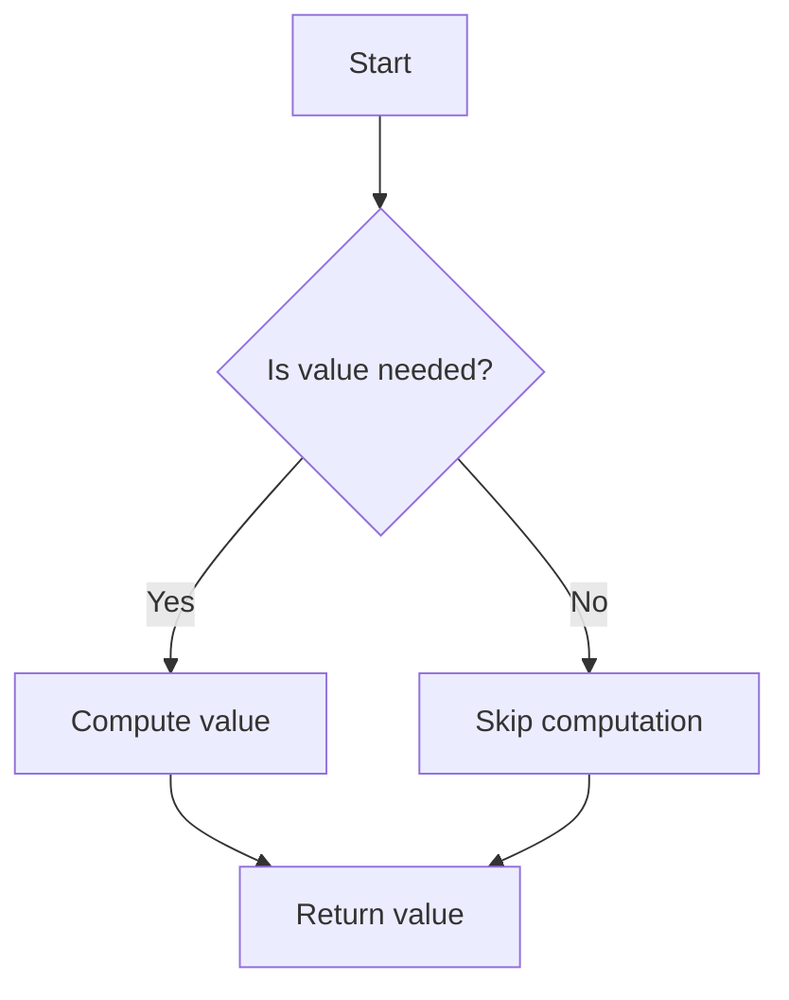

## 8.1 Introduction to Lazy Evaluation

Lazy evaluation is a powerful concept in functional programming that can significantly enhance the performance and efficiency of your applications. In this section, we will explore what lazy evaluation is, how it works in Clojure, and why it is a valuable tool for developers transitioning from object-oriented programming in Java.

### Lazy Evaluation Concept

**Define Lazy Evaluation**: Lazy evaluation is a strategy in which the computation of an expression is delayed until its value is actually needed. This approach can lead to performance improvements by avoiding unnecessary calculations, especially when dealing with large or potentially infinite data structures.

#### Benefits of Laziness

- **Improved Performance**: By deferring computation until necessary, lazy evaluation can reduce the workload on your system, leading to faster execution times and reduced memory usage. This is particularly beneficial when working with large datasets or complex calculations.
  
- **Handling Infinite Data Structures**: Lazy evaluation allows you to work with infinite sequences without running out of memory. This is achieved by computing elements on-the-fly as they are needed, rather than all at once.

- **Enhanced Composability**: Laziness enables more modular and composable code. Functions can be chained together without evaluating intermediate results, leading to cleaner and more concise code.

- **Resource Efficiency**: By only computing what is necessary, lazy evaluation can lead to more efficient use of system resources, which is especially important in environments with limited computational power.

#### Clojure's Approach to Lazy Evaluation

Clojure, as a functional programming language, embraces lazy evaluation in its core design, particularly in its sequence processing capabilities. Let's delve into how Clojure implements laziness and the implications for developers.

**Lazy Sequences in Clojure**: In Clojure, sequences are often lazy by default. This means that when you create a sequence, Clojure does not immediately compute all its elements. Instead, it generates elements as they are accessed. This is achieved using constructs like `lazy-seq`, `map`, `filter`, and `take`.

```clojure
;; Example of a lazy sequence in Clojure
(defn lazy-numbers []
  (lazy-seq (cons 1 (map inc (lazy-numbers)))))

;; Accessing elements of the lazy sequence
(take 5 (lazy-numbers))
;; Output: (1 2 3 4 5)
```

In this example, the `lazy-numbers` function generates an infinite sequence of numbers starting from 1. The sequence is only realized when we explicitly request elements using `take`.

**Comparison with Java**: In Java, sequences are typically eager, meaning all elements are computed upfront. This can lead to inefficiencies when working with large datasets. In contrast, Clojure's lazy sequences allow for more efficient processing by deferring computation.

#### Real-World Implications

Lazy evaluation has several practical applications that can lead to more efficient and responsive programs:

- **Data Processing Pipelines**: In scenarios where data is processed in stages, laziness allows each stage to operate only on the data it needs, reducing overhead and improving throughput.

- **User Interfaces**: Lazy evaluation can enhance the responsiveness of user interfaces by deferring expensive calculations until absolutely necessary, leading to smoother user experiences.

- **Concurrency and Parallelism**: In concurrent applications, laziness can help manage resource contention by ensuring that only the necessary computations are performed, thus reducing the likelihood of bottlenecks.

### Code Examples and Practical Applications

Let's explore some practical examples to illustrate the benefits of lazy evaluation in Clojure.

**Example 1: Filtering Large Datasets**

Suppose we have a large dataset and we want to filter out certain elements based on a condition. Using lazy evaluation, we can achieve this without loading the entire dataset into memory.

```clojure
(defn even-numbers [nums]
  (filter even? nums))

;; Using lazy evaluation to filter a large dataset
(def large-dataset (range 1 1000000))
(def even-dataset (even-numbers large-dataset))

(take 10 even-dataset)
;; Output: (2 4 6 8 10 12 14 16 18 20)
```

In this example, the `even-numbers` function uses `filter`, which is lazy in Clojure. This means that the dataset is processed incrementally, and only the even numbers are computed as needed.

**Example 2: Infinite Sequences**

Clojure's lazy evaluation allows us to work with infinite sequences seamlessly. Consider the generation of an infinite sequence of Fibonacci numbers.

```clojure
(defn fib-seq
  ([] (fib-seq 0 1))
  ([a b] (lazy-seq (cons a (fib-seq b (+ a b))))))

;; Accessing the first 10 Fibonacci numbers
(take 10 (fib-seq))
;; Output: (0 1 1 2 3 5 8 13 21 34)
```

Here, the `fib-seq` function generates an infinite sequence of Fibonacci numbers. The sequence is realized only when we request elements using `take`.

### Visual Aids

To better understand how lazy evaluation works, let's visualize the process using a flowchart.



**Diagram Description**: This flowchart illustrates the decision-making process in lazy evaluation. If a value is needed, it is computed; otherwise, computation is skipped, optimizing resource usage.

### Try It Yourself

Experiment with the following code examples to deepen your understanding of lazy evaluation in Clojure:

1. Modify the `even-numbers` function to filter odd numbers instead. Observe the changes in output.
2. Create a lazy sequence that generates prime numbers and retrieve the first 10 primes.
3. Implement a lazy sequence that generates the sequence of squares of natural numbers and access the first 15 elements.

### References and Further Reading

- [Clojure Official Documentation](https://clojure.org/reference)
- [Transitioning from OOP to Functional Programming](https://www.lispcast.com/oo-to-fp/)
- [Clojure Community Resources](https://clojure.org/community/resources)

### Knowledge Check

To reinforce your understanding of lazy evaluation, consider the following questions:

1. What is lazy evaluation and how does it differ from eager evaluation?
2. How does Clojure implement lazy sequences, and what are the benefits?
3. In what scenarios might lazy evaluation lead to performance improvements?

### Summary and Key Takeaways

Lazy evaluation is a fundamental concept in functional programming that offers significant performance benefits. By deferring computation until necessary, Clojure's lazy sequences enable efficient processing of large and infinite datasets. This approach enhances modularity, composability, and resource efficiency, making it a valuable tool for developers transitioning from Java OOP to Clojure's functional paradigm.

## **Test Your Knowledge: Introduction to Lazy Evaluation Quiz**



### What is lazy evaluation?

- [x] A strategy that delays computation until the value is needed
- [ ] A method of precomputing values
- [ ] A technique for caching results
- [ ] A way to parallelize computations

> **Explanation:** Lazy evaluation defers computation until the value is actually required, optimizing performance and resource usage.

### Which of the following is a benefit of lazy evaluation?

- [x] Improved performance
- [ ] Increased memory usage
- [ ] Immediate computation of all values
- [ ] Reduced code readability

> **Explanation:** Lazy evaluation improves performance by computing only what is necessary, reducing unnecessary calculations.

### How does Clojure handle infinite sequences?

- [x] Using lazy evaluation to compute elements on demand
- [ ] By storing all elements in memory
- [ ] By limiting the sequence length
- [ ] By precomputing a fixed number of elements

> **Explanation:** Clojure uses lazy evaluation to handle infinite sequences, generating elements as needed.

### What is the primary difference between lazy and eager evaluation?

- [x] Lazy evaluation defers computation, while eager evaluation computes immediately
- [ ] Lazy evaluation uses more memory than eager evaluation
- [ ] Eager evaluation is slower than lazy evaluation
- [ ] Lazy evaluation requires more code than eager evaluation

> **Explanation:** Lazy evaluation defers computation until necessary, whereas eager evaluation computes values immediately.

### In Clojure, which function is used to create a lazy sequence?

- [x] `lazy-seq`
- [ ] `map`
- [ ] `filter`
- [ ] `reduce`

> **Explanation:** The `lazy-seq` function in Clojure is used to create lazy sequences.

### What is a real-world application of lazy evaluation?

- [x] Processing large datasets efficiently
- [ ] Increasing the complexity of algorithms
- [ ] Reducing the speed of computation
- [ ] Storing all data in memory

> **Explanation:** Lazy evaluation is particularly useful for processing large datasets efficiently by only computing necessary elements.

### How can lazy evaluation enhance user interfaces?

- [x] By deferring expensive calculations until necessary
- [ ] By increasing the number of computations
- [ ] By precomputing all possible outcomes
- [ ] By reducing the responsiveness of the interface

> **Explanation:** Lazy evaluation can improve user interface responsiveness by deferring heavy computations until needed.

### What is a potential pitfall of lazy evaluation?

- [x] Unexpected delays in computation
- [ ] Increased memory usage
- [ ] Decreased code modularity
- [ ] Reduced code readability

> **Explanation:** Lazy evaluation can sometimes lead to unexpected delays if computations are deferred too long.

### How does lazy evaluation affect composability?

- [x] It enhances composability by allowing functions to be chained without evaluating intermediate results
- [ ] It reduces composability by requiring immediate computation
- [ ] It has no impact on composability
- [ ] It complicates function chaining

> **Explanation:** Lazy evaluation enhances composability by allowing functions to be chained together without evaluating intermediate results.

### True or False: Lazy evaluation can help manage resource contention in concurrent applications.

- [x] True
- [ ] False

> **Explanation:** Lazy evaluation can help manage resource contention by ensuring only necessary computations are performed, reducing bottlenecks.


