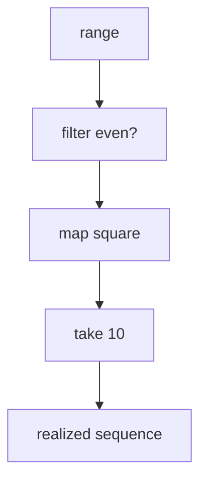

## 8.2 Creating and Using Lazy Sequences

Lazy sequences are a powerful feature in Clojure that allow you to work with potentially infinite data structures without immediately evaluating them. This section will guide you through understanding and leveraging lazy sequences, from built-in functions to creating custom lazy sequences, and demonstrate how they can optimize your programs by delaying computation until necessary.

### **Built-In Lazy Sequences**

Clojure provides several built-in functions that generate lazy sequences. These functions are instrumental in writing efficient and expressive code. Let's explore some of the most commonly used ones:

#### **`range` Function**

The `range` function generates a lazy sequence of numbers. It can take up to three arguments: start, end, and step.

```clojure
;; Infinite sequence of numbers starting from 0
(def infinite-range (range))

;; Finite sequence from 0 to 9
(def finite-range (range 10))

;; Sequence from 5 to 14
(def custom-range (range 5 15))

;; Sequence from 0 to 20 with a step of 2
(def stepped-range (range 0 21 2))

;; Print the first 10 numbers from the infinite range
(println (take 10 infinite-range)) ; Output: (0 1 2 3 4 5 6 7 8 9)
```

The `range` function is particularly useful for generating sequences of numbers without precomputing them, which can save memory and processing time.

#### **`iterate` Function**

The `iterate` function creates an infinite lazy sequence by repeatedly applying a function to a starting value.

```clojure
;; Sequence of powers of 2
(def powers-of-2 (iterate #(* 2 %) 1))

;; Take the first 10 powers of 2
(println (take 10 powers-of-2)) ; Output: (1 2 4 8 16 32 64 128 256 512)
```

This is useful for generating sequences where each element is derived from the previous one, such as mathematical progressions or state transformations.

#### **`repeatedly` Function**

The `repeatedly` function generates a lazy sequence by repeatedly calling a no-argument function.

```clojure
;; Infinite sequence of random numbers
(def random-numbers (repeatedly #(rand-int 100)))

;; Take 5 random numbers
(println (take 5 random-numbers))
```

This function is ideal for generating sequences of random values or other computations that do not depend on the previous sequence elements.

### **Custom Lazy Sequences**

While built-in functions cover many use cases, you might need to create custom lazy sequences tailored to specific requirements. Clojure's `lazy-seq` macro allows you to define such sequences.

#### **Using `lazy-seq` Macro**

The `lazy-seq` macro is used to define a lazy sequence by wrapping a sequence expression. Let's create a lazy sequence that generates Fibonacci numbers:

```clojure
(defn fibonacci
  ([] (fibonacci 0 1))
  ([a b] (lazy-seq (cons a (fibonacci b (+ a b))))))

;; Take the first 10 Fibonacci numbers
(println (take 10 (fibonacci))) ; Output: (0 1 1 2 3 5 8 13 21 34)
```

In this example, `fibonacci` is a recursive function that uses `lazy-seq` to defer computation. The `cons` function constructs a new sequence by adding an element to the front of an existing sequence.

#### **Try It Yourself**

Experiment by modifying the Fibonacci sequence generator to start from different initial values or to generate a different mathematical sequence, such as the sequence of prime numbers.

### **Working with Lazy Collections**

Lazy sequences in Clojure can be manipulated using the same core functions that operate on regular collections. This includes functions like `map`, `filter`, and `reduce`, which are also lazy when applied to lazy sequences.

#### **Example: Filtering a Lazy Sequence**

```clojure
(def even-numbers (filter even? (range)))

;; Take the first 10 even numbers
(println (take 10 even-numbers)) ; Output: (0 2 4 6 8 10 12 14 16 18)
```

In this example, `filter` creates a lazy sequence of even numbers from an infinite sequence generated by `range`. The computation is deferred until we explicitly request the first 10 elements.

#### **Combining Lazy Operations**

You can chain multiple operations on lazy sequences to create complex transformations without evaluating intermediate results.

```clojure
(defn square [x] (* x x))

;; Square the first 10 even numbers
(def squared-evens (map square (filter even? (range))))

(println (take 10 squared-evens)) ; Output: (0 4 16 36 64 100 144 196 256 324)
```

### **Delayed Computation**

One of the key advantages of lazy sequences is delayed computation. This means that elements of a lazy sequence are not computed until they are explicitly needed. This can lead to significant performance improvements, especially when working with large or infinite sequences.

#### **Understanding Delayed Computation**

Delayed computation allows you to define sequences that are potentially infinite without running into memory or performance issues. For example, consider an infinite sequence of natural numbers:

```clojure
(def naturals (range))

;; Take the first 1000 numbers and sum them
(println (reduce + (take 1000 naturals))) ; Output: 499500
```

Here, only the first 1000 numbers are realized, and the rest of the sequence remains unevaluated.

#### **Visualizing Lazy Evaluation**

To better understand lazy evaluation, consider the following diagram illustrating the flow of data through lazy operations:



**Diagram Description**: This flowchart shows how data flows from an infinite range through a series of lazy operations (`filter`, `map`, and `take`) before being realized as a finite sequence.

### **Java OOP vs. Clojure Lazy Sequences**

For Java developers transitioning to Clojure, the concept of lazy sequences may resemble Java's `Stream` API introduced in Java 8, which also supports lazy evaluation. However, Clojure's lazy sequences are more deeply integrated into the language and can be used in a broader range of contexts.

#### **Comparison with Java Streams**

- **Creation**: In Java, streams are created from collections or arrays, whereas in Clojure, lazy sequences can be generated from a variety of sources, including functions.
- **Transformation**: Both Java streams and Clojure lazy sequences support operations like `map`, `filter`, and `reduce`.
- **Evaluation**: Java streams are terminal, meaning they must be consumed to produce a result, while Clojure sequences can be partially realized, allowing for more flexible composition.

For more information on Clojure's sequence capabilities, refer to the [Clojure Official Documentation](https://clojure.org/reference/sequences).

### **Knowledge Check**

To reinforce your understanding of lazy sequences in Clojure, consider the following questions:

1. What is the primary advantage of using lazy sequences?
2. How does the `lazy-seq` macro help in creating custom sequences?
3. Compare the use of `range` in Clojure with Java's `Stream.iterate`.
4. What happens if you try to realize an infinite lazy sequence without limiting it?
5. How can lazy sequences improve performance in data processing tasks?

### **Practice Exercise**

Create a custom lazy sequence that generates the sequence of prime numbers. Use the `lazy-seq` macro and test your sequence by printing the first 10 prime numbers.

### **Summary and Key Takeaways**

- Lazy sequences in Clojure allow for efficient data processing by deferring computation until necessary.
- Built-in functions like `range`, `iterate`, and `repeatedly` provide convenient ways to generate lazy sequences.
- The `lazy-seq` macro enables the creation of custom lazy sequences, offering flexibility in sequence generation.
- Lazy sequences can be manipulated using core functions, similar to regular collections.
- Delayed computation is a powerful feature that can optimize performance, especially with large or infinite data sets.

By mastering lazy sequences, you can write more efficient and expressive Clojure programs that handle large data sets with ease.

## **Test Your Knowledge: Creating and Using Lazy Sequences Quiz**



### What is the primary advantage of using lazy sequences in Clojure?

- [x] Deferred computation
- [ ] Immediate evaluation
- [ ] Simplified syntax
- [ ] Enhanced security

> **Explanation:** Lazy sequences allow deferred computation, meaning values are only calculated when needed, optimizing performance and memory usage.


### Which function generates an infinite sequence by repeatedly applying a function to a starting value?

- [ ] range
- [x] iterate
- [ ] repeatedly
- [ ] lazy-seq

> **Explanation:** The `iterate` function creates an infinite lazy sequence by applying a function to a starting value repeatedly.


### How can you create a custom lazy sequence in Clojure?

- [ ] Using the `range` function
- [ ] Using the `map` function
- [x] Using the `lazy-seq` macro
- [ ] Using the `filter` function

> **Explanation:** The `lazy-seq` macro allows you to define custom lazy sequences by wrapping a sequence expression.


### What happens if you try to realize an infinite lazy sequence without limiting it?

- [ ] It will complete successfully
- [ ] It will throw an exception
- [x] It will run indefinitely
- [ ] It will return `nil`

> **Explanation:** Realizing an infinite lazy sequence without limiting it will cause the program to run indefinitely, as it tries to compute an endless number of elements.


### How does `range` in Clojure differ from Java's `Stream.iterate`?

- [x] `range` can generate infinite sequences
- [ ] `range` requires a terminal operation
- [ ] `range` is eager
- [ ] `range` is only for finite sequences

> **Explanation:** Clojure's `range` can generate infinite sequences, whereas Java's `Stream.iterate` requires terminal operations to produce results.


### Which function is ideal for generating sequences of random values?

- [ ] range
- [ ] iterate
- [x] repeatedly
- [ ] lazy-seq

> **Explanation:** The `repeatedly` function generates a lazy sequence by repeatedly calling a no-argument function, making it ideal for sequences of random values.


### What is the result of combining `map`, `filter`, and `take` on a lazy sequence?

- [x] A transformed, finite sequence
- [ ] An infinite sequence
- [ ] A single value
- [ ] An error

> **Explanation:** Combining `map`, `filter`, and `take` on a lazy sequence results in a transformed, finite sequence based on the specified operations.


### How does lazy evaluation improve performance?

- [x] By deferring computation
- [ ] By increasing memory usage
- [ ] By simplifying syntax
- [ ] By reducing code complexity

> **Explanation:** Lazy evaluation improves performance by deferring computation until values are needed, reducing unnecessary calculations and memory usage.


### What is the role of the `cons` function in creating lazy sequences?

- [x] It constructs a new sequence by adding an element to the front
- [ ] It filters elements from a sequence
- [ ] It maps a function over a sequence
- [ ] It reduces a sequence to a single value

> **Explanation:** The `cons` function constructs a new sequence by adding an element to the front of an existing sequence, often used in conjunction with `lazy-seq`.


### True or False: Lazy sequences in Clojure can be used interchangeably with regular collections in most scenarios.

- [x] True
- [ ] False

> **Explanation:** True. Lazy sequences in Clojure can be manipulated using the same core functions as regular collections, making them versatile and interchangeable in many scenarios.


