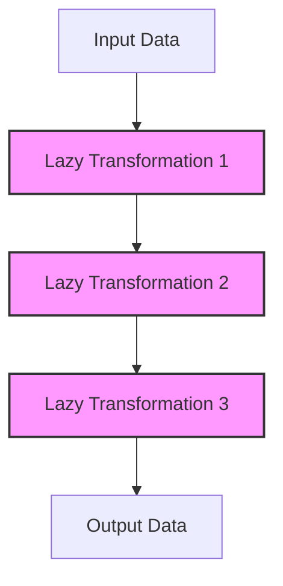

## 8.3 Benefits of Laziness in Processing Data

In this section, we delve into the concept of lazy evaluation in Clojure and how it can be a powerful tool for processing data efficiently. Lazy evaluation, or laziness, is a fundamental feature in Clojure that allows computations to be deferred until their results are actually needed. This approach offers several benefits, including memory efficiency, composability, the ability to work with infinite data structures, and performance gains. Let's explore each of these benefits in detail.

### Memory Efficiency

One of the most significant advantages of lazy evaluation is its ability to process large datasets without consuming excessive memory. In traditional eager evaluation, all elements of a data structure are computed and stored in memory at once. This can lead to high memory usage, especially when dealing with large datasets. Lazy sequences in Clojure, on the other hand, compute elements on demand, allowing for more efficient memory usage.

#### Example: Processing a Large Dataset

Consider a scenario where you need to process a large dataset, such as a log file with millions of entries. Using lazy sequences, you can process each entry one at a time without loading the entire file into memory.

```clojure
;; Define a lazy sequence to read lines from a file
(defn lazy-file-lines [file-path]
  (let [reader (clojure.java.io/reader file-path)]
    (line-seq reader)))

;; Process each line lazily
(defn process-log-file [file-path]
  (->> (lazy-file-lines file-path)
       (map process-line)
       (filter relevant-entry?)
       (take 100)))  ;; Only take the first 100 relevant entries

;; Usage
(process-log-file "large-log-file.txt")
```

In this example, `line-seq` creates a lazy sequence of lines from the file. The sequence is processed one line at a time, allowing us to handle very large files without running out of memory.

### Composability

Laziness in Clojure promotes composability, enabling developers to build complex data processing pipelines by chaining together simple transformations. Each transformation is applied lazily, meaning that the data is only processed as needed, avoiding unnecessary computations.

#### Example: Composing Data Transformations

Let's demonstrate how laziness allows for seamless composition of data transformations.

```clojure
;; Define a lazy sequence of numbers
(def numbers (range 1 1000000))

;; Compose transformations
(defn process-numbers [nums]
  (->> nums
       (map inc)
       (filter even?)
       (map #(* % %))
       (take 10)))  ;; Take the first 10 results

;; Usage
(process-numbers numbers)
```

Here, we define a lazy sequence of numbers and apply a series of transformations: incrementing each number, filtering even numbers, squaring them, and finally taking the first 10 results. The entire pipeline is composed lazily, ensuring that each transformation is only applied when necessary.

### Infinite Data Structures

Lazy evaluation enables the creation and manipulation of infinite sequences, which can be particularly useful for modeling streams of data or generating sequences on the fly. In Clojure, you can define infinite sequences using constructs like `iterate`, `repeat`, and `cycle`.

#### Example: Infinite Sequence of Fibonacci Numbers

Let's explore how laziness allows us to work with infinite sequences by generating an infinite sequence of Fibonacci numbers.

```clojure
;; Define a lazy sequence of Fibonacci numbers
(defn fib-seq
  ([] (fib-seq 0 1))
  ([a b] (cons a (lazy-seq (fib-seq b (+ a b))))))

;; Take the first 10 Fibonacci numbers
(take 10 (fib-seq))
```

In this example, `fib-seq` is a lazy sequence that generates Fibonacci numbers indefinitely. We can take as many numbers as we need without worrying about the sequence's size.

### Performance Gains

Lazy evaluation can lead to significant performance improvements by avoiding unnecessary computations. In many cases, only a subset of the data is required, and laziness ensures that only the necessary computations are performed.

#### Example: Efficient Filtering

Consider a scenario where you need to find the first prime number greater than a million. Using lazy evaluation, you can efficiently filter through numbers without computing them all upfront.

```clojure
;; Define a function to check for prime numbers
(defn prime? [n]
  (and (> n 1)
       (not-any? #(zero? (mod n %)) (range 2 (Math/sqrt n)))))

;; Find the first prime number greater than a million
(defn first-large-prime []
  (->> (iterate inc 1000001)
       (filter prime?)
       (first)))

;; Usage
(first-large-prime)
```

In this example, we use `iterate` to create an infinite sequence of numbers starting from 1,000,001. The `filter` function is applied lazily, ensuring that only numbers necessary to find the first prime are computed.

### Visualizing Laziness

To better understand how lazy evaluation works, let's visualize the data flow in a lazy processing pipeline using a flowchart.



**Figure 1: Lazy Processing Pipeline**  
This diagram illustrates how data flows through a series of lazy transformations, with each step only computing the necessary elements.

### Try It Yourself

To deepen your understanding of lazy evaluation, try modifying the examples above:

1. **Memory Efficiency**: Experiment with processing different sizes of datasets and observe the memory usage.
2. **Composability**: Add additional transformations to the data processing pipeline and see how it affects performance.
3. **Infinite Data Structures**: Create your own infinite sequence, such as an infinite sequence of random numbers.
4. **Performance Gains**: Implement a similar example where laziness can lead to performance improvements.

### Knowledge Check

Let's reinforce what we've learned with a few questions and exercises:

- What are the key benefits of lazy evaluation in Clojure?
- How does lazy evaluation improve memory efficiency when processing large datasets?
- Provide an example of how laziness can lead to performance gains in a real-world scenario.
- How can you use lazy evaluation to work with infinite sequences?
- Experiment with the code examples provided and modify them to solve a different problem.

### Conclusion

Lazy evaluation is a powerful feature in Clojure that offers numerous benefits for processing data. By deferring computations until they are needed, laziness enhances memory efficiency, promotes composability, enables the use of infinite data structures, and can lead to significant performance gains. Embracing lazy evaluation in your Clojure applications can help you build more efficient and scalable systems.

For further reading on lazy evaluation and its applications, consider exploring the following resources:

- [Clojure Official Documentation](https://clojure.org/reference)
- [Clojure Community Resources](https://clojure.org/community/resources)
- [Transitioning from OOP to Functional Programming](https://www.lispcast.com/oo-to-fp/)

## **Test Your Knowledge: Benefits of Laziness in Processing Data Quiz**



### What is a primary benefit of lazy evaluation in Clojure?

- [x] Memory efficiency
- [ ] Increased code complexity
- [ ] Immediate computation
- [ ] Synchronous processing

> **Explanation:** Lazy evaluation allows for memory efficiency by computing elements only when needed, reducing memory usage.

### How does lazy evaluation improve composability?

- [x] By allowing transformations to be composed without immediate computation
- [ ] By forcing all computations to occur at once
- [ ] By requiring explicit memory management
- [ ] By simplifying data structures

> **Explanation:** Laziness enables the composition of transformations without immediate computation, promoting modular and composable code.

### What is an example of an infinite data structure enabled by laziness?

- [x] An infinite sequence of Fibonacci numbers
- [ ] A finite list of integers
- [ ] A fixed-size array
- [ ] A mutable map

> **Explanation:** Laziness allows for the creation of infinite sequences, such as the Fibonacci sequence, which can be computed on demand.

### How can lazy evaluation lead to performance gains?

- [x] By avoiding unnecessary computations
- [ ] By increasing CPU usage
- [ ] By loading all data into memory at once
- [ ] By reducing code readability

> **Explanation:** Lazy evaluation avoids unnecessary computations, which can lead to significant performance improvements.

### Which function creates a lazy sequence of numbers in Clojure?

- [x] `iterate`
- [ ] `map`
- [ ] `filter`
- [ ] `reduce`

> **Explanation:** The `iterate` function creates a lazy sequence by applying a function repeatedly.

### What is a key characteristic of lazy sequences?

- [x] Elements are computed on demand
- [ ] Elements are precomputed and stored
- [ ] Elements are mutable
- [ ] Elements are synchronized

> **Explanation:** Lazy sequences compute elements on demand, allowing for efficient memory usage and processing.

### Why is lazy evaluation beneficial for processing large datasets?

- [x] It reduces memory usage by computing elements as needed
- [ ] It increases memory usage by storing all elements
- [ ] It simplifies data transformations
- [ ] It requires less code

> **Explanation:** Lazy evaluation reduces memory usage by computing only the necessary elements, making it ideal for large datasets.

### How can you visualize the flow of data in a lazy processing pipeline?

- [x] Using a flowchart
- [ ] Using a pie chart
- [ ] Using a bar graph
- [ ] Using a scatter plot

> **Explanation:** A flowchart can effectively visualize the flow of data through a series of lazy transformations.

### What is the purpose of the `lazy-seq` function in Clojure?

- [x] To create a lazy sequence
- [ ] To force immediate computation
- [ ] To define a mutable sequence
- [ ] To synchronize data access

> **Explanation:** The `lazy-seq` function is used to create a lazy sequence, deferring computation until needed.

### True or False: Lazy evaluation in Clojure always leads to better performance.

- [ ] True
- [x] False

> **Explanation:** While lazy evaluation can lead to performance improvements, it is not always the case. The benefits depend on the specific use case and how laziness is applied.


