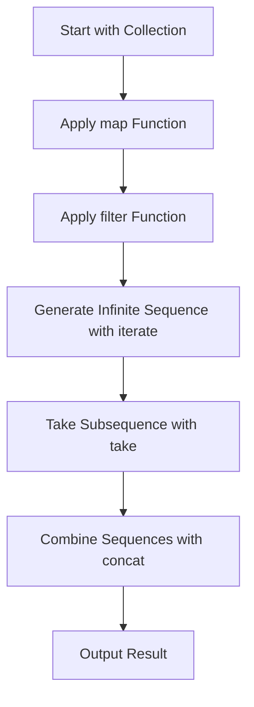

## 8.4 Core Lazy Sequence Functions

In this section, we delve into the core lazy sequence functions of Clojure, a language that excels in handling large datasets and infinite collections through lazy evaluation. Lazy sequences are a cornerstone of Clojure's approach to functional programming, allowing us to process data efficiently and elegantly. We'll explore how functions like `map`, `filter`, `iterate`, `repeat`, `cycle`, `take`, `drop`, `concat`, and `interleave` can be leveraged to build scalable applications.

### Mapping and Filtering

Lazy sequences in Clojure allow us to work with potentially infinite data structures without the need to load the entire dataset into memory. Two fundamental functions that produce lazy sequences are `map` and `filter`.

#### `map`

The `map` function applies a given function to each element of a collection, producing a new lazy sequence of results. This is particularly useful when transforming data in a collection.

```clojure
;; Example: Doubling each number in a collection
(def numbers (range 1 10))
(def doubled (map #(* 2 %) numbers))

;; doubled is a lazy sequence: (2 4 6 8 10 12 14 16 18)
```

In Java, you might achieve a similar result using a loop or a stream with a map function. However, Clojure's `map` is inherently lazy, meaning it only computes values as needed.

#### `filter`

The `filter` function creates a lazy sequence of elements for which a predicate function returns true. This is useful for selecting a subset of data from a collection.

```clojure
;; Example: Filtering even numbers
(def even-numbers (filter even? numbers))

;; even-numbers is a lazy sequence: (2 4 6 8)
```

Both `map` and `filter` are designed to work with infinite sequences, making them powerful tools for data processing.

### Sequence Generation

Clojure provides several functions for generating lazy sequences, which can be particularly useful when working with infinite data streams.

#### `iterate`

The `iterate` function generates an infinite sequence by repeatedly applying a function to an initial value.

```clojure
;; Example: Generating powers of 2
(def powers-of-2 (iterate #(* 2 %) 1))

;; Take the first 10 powers of 2
(take 10 powers-of-2)
;; Output: (1 2 4 8 16 32 64 128 256 512)
```

#### `repeat`

The `repeat` function produces an infinite sequence where each element is the same specified value.

```clojure
;; Example: Repeating the value 5
(def fives (repeat 5))

;; Take the first 10 fives
(take 10 fives)
;; Output: (5 5 5 5 5 5 5 5 5 5)
```

#### `cycle`

The `cycle` function creates an infinite sequence by repeating a given collection.

```clojure
;; Example: Cycling through a list of colors
(def colors (cycle [:red :green :blue]))

;; Take the first 9 colors
(take 9 colors)
;; Output: (:red :green :blue :red :green :blue :red :green :blue)
```

### Subsequence Operations

Clojure's lazy evaluation shines when dealing with subsequence operations, allowing us to efficiently handle large datasets.

#### `take` and `drop`

The `take` function returns a lazy sequence of the first n elements of a collection, while `drop` skips the first n elements.

```clojure
;; Example: Taking and dropping elements
(def first-five (take 5 numbers))
;; Output: (1 2 3 4 5)

(def after-five (drop 5 numbers))
;; Output: (6 7 8 9)
```

#### `take-while` and `drop-while`

These functions work similarly to `take` and `drop`, but they operate based on a predicate function.

```clojure
;; Example: Taking while numbers are less than 5
(def less-than-five (take-while #(< % 5) numbers))
;; Output: (1 2 3 4)

;; Dropping while numbers are less than 5
(def from-five-onward (drop-while #(< % 5) numbers))
;; Output: (5 6 7 8 9)
```

### Combining Sequences

Combining sequences is a common task in functional programming, and Clojure provides elegant solutions for this.

#### `concat`

The `concat` function merges multiple sequences into a single lazy sequence.

```clojure
;; Example: Concatenating sequences
(def seq1 [1 2 3])
(def seq2 [4 5 6])
(def combined (concat seq1 seq2))
;; Output: (1 2 3 4 5 6)
```

#### `interleave`

The `interleave` function combines elements from multiple sequences into a single sequence, alternating elements from each.

```clojure
;; Example: Interleaving two sequences
(def letters [:a :b :c])
(def numbers [1 2 3])
(def interleaved (interleave letters numbers))
;; Output: (:a 1 :b 2 :c 3)
```

### Visualizing Lazy Sequence Operations

To better understand how lazy sequences operate, let's visualize the process using a flowchart. This diagram illustrates the flow of data through a series of lazy sequence operations.



**Figure 1:** Flowchart of Lazy Sequence Operations in Clojure

### Practical Applications

Lazy sequences are not just theoretical constructs; they have practical applications in real-world scenarios. Consider processing large log files or streaming data where loading the entire dataset into memory is impractical. Lazy sequences allow us to process data on-the-fly, reducing memory usage and improving performance.

### Try It Yourself

Experiment with the code examples provided in this section. Try modifying the initial values, functions, and predicates to see how the lazy sequences behave. For instance, change the predicate in `filter` to select odd numbers or modify the function in `map` to perform a different transformation.

### Knowledge Check

Before moving to the next section, ensure you understand the key concepts of lazy sequences. Can you explain how `map` and `filter` differ from their Java counterparts? How do `take` and `drop` manage large datasets efficiently? Try implementing a small program that uses lazy sequences to process a dataset of your choice.

### Further Reading

For more information on lazy sequences and their applications, consider exploring the following resources:

- [Clojure Official Documentation](https://clojure.org/reference)
- [Transitioning from OOP to Functional Programming](https://www.lispcast.com/oo-to-fp/)
- [Clojure Community Resources](https://clojure.org/community/resources)

## **Test Your Knowledge: Core Lazy Sequence Functions Quiz**



### What is the primary advantage of using lazy sequences in Clojure?

- [x] Efficient memory usage
- [ ] Faster computation
- [ ] Easier syntax
- [ ] More readable code

> **Explanation:** Lazy sequences allow Clojure to handle large datasets efficiently by not loading the entire dataset into memory at once.

### Which function would you use to apply a transformation to each element in a collection?

- [x] map
- [ ] filter
- [ ] take
- [ ] drop

> **Explanation:** The `map` function is used to apply a transformation function to each element in a collection, producing a new lazy sequence.

### How does the `filter` function operate on a collection?

- [x] It creates a lazy sequence of elements that satisfy a predicate.
- [ ] It transforms each element in a collection.
- [ ] It combines multiple sequences into one.
- [ ] It generates an infinite sequence.

> **Explanation:** The `filter` function creates a lazy sequence of elements for which a predicate function returns true.

### Which function generates an infinite sequence by repeating a given value?

- [x] repeat
- [ ] iterate
- [ ] cycle
- [ ] concat

> **Explanation:** The `repeat` function produces an infinite sequence where each element is the same specified value.

### What is the purpose of the `take` function in Clojure?

- [x] To return a lazy sequence of the first n elements of a collection
- [ ] To skip the first n elements of a collection
- [ ] To apply a function to each element of a collection
- [ ] To filter elements based on a predicate

> **Explanation:** The `take` function returns a lazy sequence of the first n elements of a collection.

### How does the `concat` function operate?

- [x] It merges multiple sequences into a single lazy sequence.
- [ ] It interleaves elements from multiple sequences.
- [ ] It generates an infinite sequence.
- [ ] It filters elements based on a predicate.

> **Explanation:** The `concat` function merges multiple sequences into a single lazy sequence.

### Which function would you use to alternate elements from two sequences?

- [x] interleave
- [ ] concat
- [ ] map
- [ ] filter

> **Explanation:** The `interleave` function combines elements from multiple sequences into a single sequence, alternating elements from each.

### What does the `take-while` function do?

- [x] It returns a lazy sequence of elements as long as a predicate is true.
- [ ] It skips elements as long as a predicate is true.
- [ ] It applies a function to each element of a collection.
- [ ] It merges multiple sequences into one.

> **Explanation:** The `take-while` function returns a lazy sequence of elements as long as a predicate function returns true.

### How does the `drop` function differ from `take`?

- [x] `drop` skips the first n elements, while `take` returns the first n elements.
- [ ] `drop` returns the first n elements, while `take` skips them.
- [ ] `drop` applies a function to each element, while `take` filters them.
- [ ] `drop` merges sequences, while `take` interleaves them.

> **Explanation:** The `drop` function skips the first n elements of a collection, while the `take` function returns the first n elements.

### True or False: Lazy sequences in Clojure are evaluated immediately.

- [ ] True
- [x] False

> **Explanation:** Lazy sequences in Clojure are not evaluated immediately; they are computed as needed.


