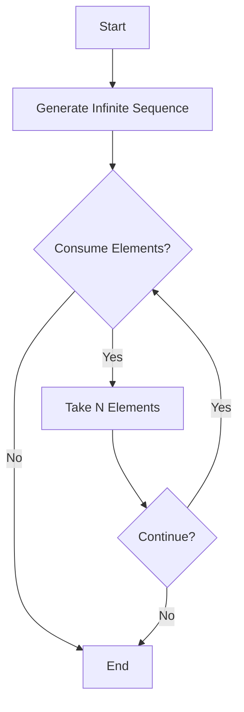

## 8.5 Working with Infinite Sequences

In the realm of functional programming, infinite sequences stand out as a powerful concept that can transform how we handle data streams, simulations, and other continuous processes. Clojure, with its emphasis on immutability and laziness, provides robust tools for working with infinite sequences efficiently and effectively. In this section, we will delve into how to generate infinite sequences, safely consume them, explore their practical applications, and understand how laziness facilitates complex control flows.

### Generating Infinite Sequences

Infinite sequences in Clojure are made possible through lazy evaluation. This means that elements of the sequence are computed only as needed, allowing us to work with potentially unbounded data without exhausting system resources. Let’s explore how to generate infinite sequences in Clojure.

#### Example: Endless Sequence of Natural Numbers

One of the simplest infinite sequences is the sequence of natural numbers. We can generate this using the `iterate` function:

```clojure
(def natural-numbers (iterate inc 0))

;; To view the first 10 natural numbers
(take 10 natural-numbers)
;; => (0 1 2 3 4 5 6 7 8 9)
```

In this example, `iterate` takes a function `inc` (increment) and an initial value `0`, producing an infinite sequence of numbers starting from zero.

#### Example: Infinite Sequence of Random Numbers

Generating an infinite sequence of random numbers can be useful for simulations or testing. Here’s how you can achieve this:

```clojure
(def random-numbers (repeatedly rand))

;; To get the first 5 random numbers
(take 5 random-numbers)
;; => (0.123456 0.234567 0.345678 0.456789 0.567890)
```

The `repeatedly` function calls `rand` indefinitely, creating an infinite sequence of random numbers.

#### Example: Infinite Timestamps

For applications requiring continuous time data, such as logging or monitoring systems, an infinite sequence of timestamps can be useful:

```clojure
(defn current-timestamp []
  (java.time.Instant/now))

(def timestamps (repeatedly current-timestamp))

;; To get the first 3 timestamps
(take 3 timestamps)
;; => (#inst "2024-11-25T10:15:30.00Z" #inst "2024-11-25T10:15:31.00Z" #inst "2024-11-25T10:15:32.00Z")
```

Here, `repeatedly` is used with a custom function `current-timestamp` to generate an infinite sequence of current timestamps.

### Safely Consuming Infinite Data

Working with infinite sequences requires caution to avoid infinite loops or memory issues. Clojure provides several functions to manage this safely.

#### Using `take` to Limit Consumption

The `take` function is essential for safely consuming infinite sequences. It allows us to specify how many elements we want to retrieve:

```clojure
(take 10 natural-numbers)
;; => (0 1 2 3 4 5 6 7 8 9)
```

By using `take`, we ensure that only the specified number of elements are realized, preventing infinite consumption.

#### Using `take-while` for Conditional Consumption

Sometimes, we need to consume elements based on a condition. The `take-while` function is perfect for this:

```clojure
(take-while #(< % 10) natural-numbers)
;; => (0 1 2 3 4 5 6 7 8 9)
```

`take-while` consumes elements as long as the condition (`< 10`) holds true, stopping once it is no longer satisfied.

#### Combining `take` with Other Functions

Combining `take` with other functions like `map` or `filter` allows for complex data transformations:

```clojure
(def even-numbers (filter even? natural-numbers))

(take 5 even-numbers)
;; => (0 2 4 6 8)
```

Here, `filter` creates a lazy sequence of even numbers, and `take` limits the output to the first five elements.

### Practical Use Cases

Infinite sequences have numerous practical applications, particularly in scenarios involving continuous data streams or simulations.

#### Simulations

In simulations, infinite sequences can represent ongoing processes or events. For example, simulating a random walk:

```clojure
(defn random-step [position]
  (+ position (rand-nth [-1 1])))

(def random-walk (iterate random-step 0))

(take 10 random-walk)
;; => (0 1 0 1 2 1 2 3 2 1)
```

This simulation uses an infinite sequence to model a random walk, where each step is either +1 or -1.

#### Continuous Data Streams

For applications that process continuous data streams, such as financial tickers or sensor data, infinite sequences provide a natural representation:

```clojure
(defn sensor-data []
  {:temperature (rand-int 100)
   :humidity (rand-int 100)})

(def sensor-stream (repeatedly sensor-data))

(take 3 sensor-stream)
;; => ({:temperature 23, :humidity 45} {:temperature 67, :humidity 89} {:temperature 12, :humidity 34})
```

The `sensor-stream` sequence generates continuous random sensor data, simulating a live data feed.

### Laziness and Control Flow

One of the key benefits of laziness is its ability to simplify control flow structures without explicit loops. This is particularly useful in functional programming, where recursion and higher-order functions replace traditional looping constructs.

#### Lazy Evaluation in Action

Lazy evaluation ensures that elements of a sequence are only computed when needed. This allows for efficient processing of large or infinite datasets:

```clojure
(defn fibonacci []
  ((fn rfib [a b] (lazy-seq (cons a (rfib b (+ a b))))) 0 1))

(take 10 (fibonacci))
;; => (0 1 1 2 3 5 8 13 21 34)
```

In this example, the Fibonacci sequence is generated lazily, computing each number only when requested.

#### Control Flow with Lazy Sequences

Lazy sequences enable complex control flows without explicit loops. For instance, generating prime numbers:

```clojure
(defn primes []
  (letfn [(sieve [s]
            (lazy-seq
              (cons (first s)
                    (sieve (filter #(not (zero? (mod % (first s))))
                                   (rest s))))))]
    (sieve (iterate inc 2))))

(take 10 (primes))
;; => (2 3 5 7 11 13 17 19 23 29)
```

Here, the Sieve of Eratosthenes algorithm is implemented using lazy sequences, elegantly managing control flow without loops.

### Visualizing Infinite Sequences

To better understand how infinite sequences work, let's visualize the process of generating and consuming an infinite sequence using a flowchart.



**Figure 1: Flowchart of Infinite Sequence Generation and Consumption**

This flowchart illustrates the process of generating an infinite sequence, consuming a specified number of elements, and deciding whether to continue or terminate.

### References and Further Reading

- [Clojure Official Documentation](https://clojure.org/reference)
- [Clojure Community Resources](https://clojure.org/community/resources)
- [Transitioning from OOP to Functional Programming](https://www.lispcast.com/oo-to-fp/)

### Knowledge Check

Before we conclude this section, let's test your understanding with a series of questions designed to reinforce the concepts we've covered.

## **Test Your Knowledge: Working with Infinite Sequences Quiz**



### What function is used to generate an infinite sequence of natural numbers in Clojure?

- [x] `iterate`
- [ ] `repeat`
- [ ] `cycle`
- [ ] `map`

> **Explanation:** The `iterate` function is used to generate an infinite sequence by repeatedly applying a function to an initial value.

### Which function is used to safely consume a specified number of elements from an infinite sequence?

- [x] `take`
- [ ] `filter`
- [ ] `map`
- [ ] `reduce`

> **Explanation:** The `take` function is used to limit the number of elements consumed from a sequence, preventing infinite loops.

### How does Clojure's lazy evaluation benefit working with infinite sequences?

- [x] It computes elements only as needed, saving resources.
- [ ] It pre-computes all elements, ensuring quick access.
- [ ] It stores all elements in memory, improving performance.
- [ ] It discards unused elements, reducing memory usage.

> **Explanation:** Lazy evaluation computes elements only when required, allowing efficient handling of large or infinite datasets.

### What is a practical use case for infinite sequences in simulations?

- [x] Modeling continuous processes like a random walk.
- [ ] Storing large datasets in memory.
- [ ] Pre-computing all possible outcomes.
- [ ] Generating static reports.

> **Explanation:** Infinite sequences can represent ongoing processes in simulations, such as a random walk, without pre-computing all steps.

### Which function can be used to generate an infinite sequence of random numbers?

- [x] `repeatedly`
- [ ] `cycle`
- [ ] `map`
- [ ] `filter`

> **Explanation:** The `repeatedly` function calls a given function indefinitely, creating an infinite sequence of its results.

### How can you generate an infinite sequence of timestamps in Clojure?

- [x] Use `repeatedly` with a function returning the current timestamp.
- [ ] Use `iterate` with a timestamp increment function.
- [ ] Use `cycle` with a list of timestamps.
- [ ] Use `map` over a finite list of timestamps.

> **Explanation:** `repeatedly` can be used with a custom function to generate an infinite sequence of current timestamps.

### What is the role of the `take-while` function in consuming sequences?

- [x] It consumes elements as long as a condition is true.
- [ ] It consumes a fixed number of elements.
- [ ] It filters elements based on a predicate.
- [ ] It maps a function over each element.

> **Explanation:** `take-while` consumes elements from a sequence until a specified condition is no longer met.

### How does laziness enable complex control flows in functional programming?

- [x] By allowing sequences to be processed without explicit loops.
- [ ] By pre-computing all possible paths.
- [ ] By storing all elements in memory for quick access.
- [ ] By discarding unused elements immediately.

> **Explanation:** Laziness allows sequences to be processed as needed, enabling complex control flows without explicit loops.

### What is the benefit of using lazy sequences for data streams?

- [x] They efficiently handle continuous data without exhausting resources.
- [ ] They store all data in memory for fast access.
- [ ] They pre-compute all possible data points.
- [ ] They discard old data to save space.

> **Explanation:** Lazy sequences allow efficient handling of continuous data streams by computing elements only when needed.

### True or False: Infinite sequences in Clojure are always stored entirely in memory.

- [ ] True
- [x] False

> **Explanation:** False. Due to lazy evaluation, infinite sequences are not stored entirely in memory; elements are computed as needed.



By mastering the use of infinite sequences, we unlock the potential to handle continuous data streams and complex simulations efficiently. The power of lazy evaluation in Clojure allows us to manage these sequences without overwhelming system resources, making it an invaluable tool in the functional programming toolkit.
