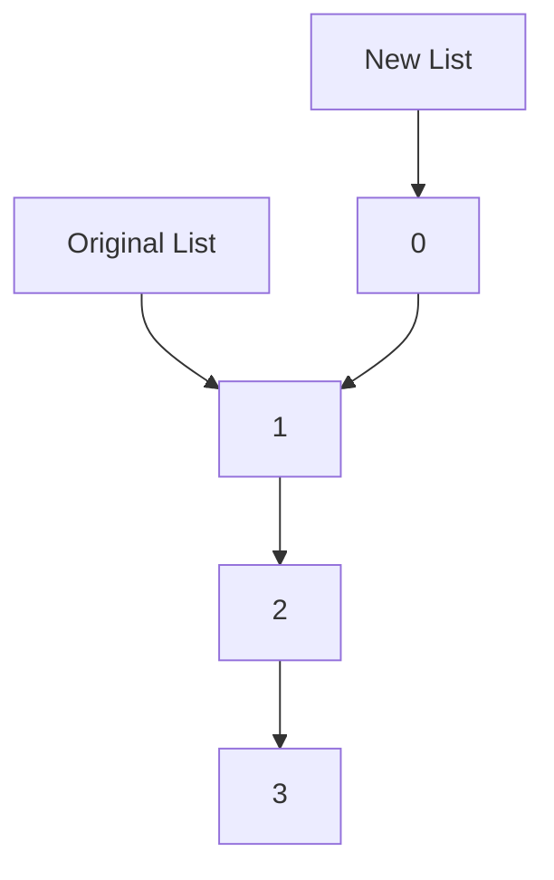
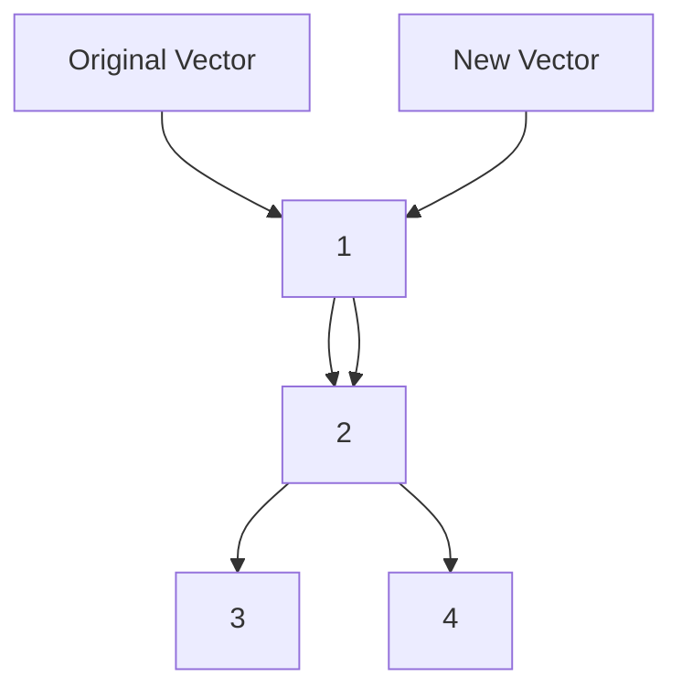

## 9.1 Persistent Data Structures Explained

In the realm of functional programming, persistent data structures stand as a cornerstone for building robust, scalable applications. Clojure, a language that embraces the functional paradigm, offers a rich set of persistent data structures that enable developers to write code that is both efficient and easy to reason about. In this section, we'll explore the concept of persistence, delve into the mechanics of structural sharing, and examine the benefits and practical applications of Clojure's persistent collections.

### Definition of Persistence

**Persistence** in the context of data structures refers to the ability to preserve previous versions of a data structure when modifications are made. Unlike mutable data structures, which change in place and lose their previous state, persistent data structures maintain their history, allowing access to both old and new versions. This characteristic is crucial in functional programming, where immutability is a fundamental principle.

#### Mutable vs. Persistent Data Structures

To understand the distinction, let's consider a simple example in Java, an object-oriented language known for its mutable data structures:

```java
import java.util.ArrayList;
import java.util.List;

public class MutableExample {
    public static void main(String[] args) {
        List<Integer> numbers = new ArrayList<>();
        numbers.add(1);
        numbers.add(2);
        numbers.add(3);
        
        // Mutating the list
        numbers.set(1, 42);
        System.out.println(numbers); // Output: [1, 42, 3]
    }
}
```

In this Java example, the `ArrayList` is mutable. When we change an element, the original list is altered, and the previous state is lost.

In contrast, Clojure's persistent data structures allow for modifications without altering the original structure:

```clojure
(def numbers [1 2 3])

;; Creating a new vector with a modification
(def new-numbers (assoc numbers 1 42))

(println numbers)      ;; Output: [1 2 3]
(println new-numbers)  ;; Output: [1 42 3]
```

Here, `assoc` creates a new vector with the desired change, leaving the original vector intact. This immutability is achieved through a concept known as **structural sharing**.

### Structural Sharing

**Structural sharing** is a technique used in persistent data structures to efficiently manage memory and performance. Instead of duplicating the entire data structure when making changes, only the parts that are modified are copied. The unchanged parts are shared between the old and new versions.

#### How Structural Sharing Works

Consider a simple linked list. In a naive implementation, adding an element would require copying the entire list. However, with structural sharing, only the new element and the references to the rest of the list need to be created:



In the diagram above, adding `0` to the front of the list involves creating a new node for `0` and pointing it to the existing list. The original list remains unchanged, and the new list shares the structure of the original.

#### Advantages of Structural Sharing

- **Efficiency**: By sharing unchanged parts of the data structure, memory usage is minimized, and operations can be performed in logarithmic time rather than linear time.
- **Immutability**: Structural sharing supports immutability by allowing modifications without altering the original structure.
- **Thread Safety**: Since persistent data structures are immutable, they are inherently thread-safe, eliminating the need for locks in concurrent environments.

### Benefits of Persistent Data Structures

Persistent data structures offer several advantages that make them ideal for functional programming and concurrent applications:

1. **Immutability**: Immutability simplifies reasoning about code, as data does not change unexpectedly. This leads to fewer bugs and easier maintenance.

2. **Thread Safety**: In multi-threaded applications, immutable data structures eliminate race conditions and the need for synchronization, as data cannot be altered by other threads.

3. **Ease of Reasoning**: With persistent data structures, developers can easily reason about the state of the application at any point in time, as previous states are preserved.

4. **Undo/Redo Functionality**: The ability to access previous versions of data structures makes implementing undo/redo functionality straightforward.

5. **Functional Programming Paradigm**: Persistent data structures align with the principles of functional programming, where functions operate on immutable data and return new data structures.

### Examples in Clojure

Clojure provides a rich set of built-in persistent data structures, including lists, vectors, maps, and sets. Let's explore each of these with examples:

#### Persistent Lists

Lists in Clojure are linked lists, optimized for sequential access. They are ideal for scenarios where elements are frequently added or removed from the front.

```clojure
(def my-list '(1 2 3 4))

;; Adding an element to the front
(def new-list (cons 0 my-list))

(println my-list)   ;; Output: (1 2 3 4)
(println new-list)  ;; Output: (0 1 2 3 4)
```

#### Persistent Vectors

Vectors are indexed collections, optimized for random access and append operations.

```clojure
(def my-vector [1 2 3 4])

;; Adding an element to the end
(def new-vector (conj my-vector 5))

(println my-vector)   ;; Output: [1 2 3 4]
(println new-vector)  ;; Output: [1 2 3 4 5]
```

#### Persistent Maps

Maps are key-value pairs, optimized for lookups and updates.

```clojure
(def my-map {:a 1 :b 2 :c 3})

;; Updating a value
(def new-map (assoc my-map :b 42))

(println my-map)   ;; Output: {:a 1, :b 2, :c 3}
(println new-map)  ;; Output: {:a 1, :b 42, :c 3}
```

#### Persistent Sets

Sets are collections of unique elements, optimized for membership tests.

```clojure
(def my-set #{1 2 3})

;; Adding an element
(def new-set (conj my-set 4))

(println my-set)   ;; Output: #{1 2 3}
(println new-set)  ;; Output: #{1 2 3 4}
```

### Try It Yourself

Experiment with the examples above by modifying them. Try adding elements to different positions, updating values, or combining data structures. Observe how the original structures remain unchanged, demonstrating the power of immutability.

### Visualizing Structural Sharing

To better understand structural sharing, let's visualize how a vector is modified in Clojure:



In this diagram, adding `4` to the vector involves creating a new node for `4` and sharing the existing structure. The original vector remains unchanged.

### References and Links

For further reading on Clojure's persistent data structures and functional programming principles, consider the following resources:

- [Clojure Official Documentation](https://clojure.org/reference)
- [Clojure Community Resources](https://clojure.org/community/resources)
- [Transitioning from OOP to Functional Programming](https://www.lispcast.com/oo-to-fp/)

### Knowledge Check

1. **What is a persistent data structure?**
   - A data structure that preserves previous versions when modified.

2. **How does structural sharing contribute to efficiency?**
   - By sharing unchanged parts of the data structure, minimizing memory usage.

3. **What are the benefits of using persistent data structures?**
   - Immutability, thread safety, ease of reasoning, and support for functional programming.

4. **Give an example of a persistent data structure in Clojure.**
   - Vectors, lists, maps, and sets.

### Encouraging Engagement

Embracing persistent data structures can revolutionize the way we approach programming. By leveraging immutability and structural sharing, we can build applications that are not only efficient but also easier to maintain and scale. As you explore these concepts, remember that each step brings you closer to mastering functional programming with Clojure.

## **Test Your Knowledge: Persistent Data Structures Explained Quiz**



### What is a persistent data structure?

- [x] A data structure that preserves previous versions when modified
- [ ] A data structure that changes in place
- [ ] A data structure that is always mutable
- [ ] A data structure that cannot be shared

> **Explanation:** Persistent data structures maintain their history, allowing access to both old and new versions without altering the original structure.

### How does structural sharing work in persistent data structures?

- [x] By sharing unchanged parts of the data structure
- [ ] By duplicating the entire data structure
- [ ] By deleting old versions of the data structure
- [ ] By using mutable references

> **Explanation:** Structural sharing allows for efficient memory usage by only copying the parts of the data structure that are modified, while the rest is shared.

### What is one advantage of persistent data structures?

- [x] Immutability
- [ ] Increased memory usage
- [ ] Complexity in reasoning
- [ ] Difficulty in concurrent environments

> **Explanation:** Immutability simplifies reasoning about code and ensures thread safety, making persistent data structures ideal for concurrent applications.

### Which of the following is a persistent data structure in Clojure?

- [x] Vector
- [ ] ArrayList
- [ ] HashMap
- [ ] LinkedList

> **Explanation:** Clojure provides persistent data structures like vectors, which are immutable and support efficient data manipulation.

### How does Clojure handle updates in persistent maps?

- [x] By creating a new map with the updated value
- [ ] By altering the original map
- [ ] By deleting the original map
- [ ] By using mutable keys

> **Explanation:** Clojure's persistent maps create a new map with the desired changes, preserving the original map's state.

### What is the benefit of immutability in persistent data structures?

- [x] Thread safety
- [ ] Increased complexity
- [ ] Mutable state
- [ ] In-place changes

> **Explanation:** Immutability ensures that data cannot be changed unexpectedly, which leads to thread safety and easier reasoning about code.

### What does the `assoc` function do in Clojure?

- [x] Creates a new map with an updated value
- [ ] Alters the original map
- [ ] Deletes a key-value pair
- [ ] Creates a mutable reference

> **Explanation:** The `assoc` function in Clojure creates a new map with the specified key-value pair, leaving the original map unchanged.

### Why are persistent data structures ideal for functional programming?

- [x] They align with immutability and pure functions
- [ ] They increase memory usage
- [ ] They require complex synchronization
- [ ] They are mutable

> **Explanation:** Persistent data structures align with the principles of functional programming, where immutability and pure functions are emphasized.

### What is the role of structural sharing in memory efficiency?

- [x] Minimizes memory usage by sharing unchanged parts
- [ ] Increases memory usage by duplicating data
- [ ] Deletes old versions to save memory
- [ ] Uses mutable references to save space

> **Explanation:** Structural sharing minimizes memory usage by sharing unchanged parts of the data structure, making operations efficient.

### True or False: Persistent data structures in Clojure are inherently thread-safe.

- [x] True
- [ ] False

> **Explanation:** Persistent data structures are immutable, which makes them inherently thread-safe, as they cannot be altered by concurrent threads.


