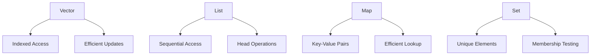

## 9.2 Vectors, Lists, Maps, and Sets in Depth

In this section, we delve into some of the most fundamental data structures in Clojure: vectors, lists, maps, and sets. These structures form the backbone of functional programming in Clojure, offering immutable and efficient ways to manage data. Understanding their characteristics, performance implications, and appropriate use cases is crucial for building scalable applications.

### Vectors

**Vectors** in Clojure are akin to arrays in Java, providing efficient indexed access and updates. They are designed for scenarios where you need to access elements by their position or index.

#### Characteristics and Performance

- **Indexed Access**: Vectors offer O(1) time complexity for accessing elements by index, making them suitable for random access.
- **Immutability**: Like all Clojure data structures, vectors are immutable. Any operation that modifies a vector returns a new vector.
- **Persistent Data Structure**: Vectors use structural sharing to efficiently create new versions without duplicating the entire structure.

#### Common Operations

```clojure
(def my-vector [1 2 3 4 5])

;; Accessing elements
(println (my-vector 2)) ; => 3

;; Adding elements
(def new-vector (conj my-vector 6))
(println new-vector) ; => [1 2 3 4 5 6]

;; Updating elements
(def updated-vector (assoc my-vector 1 10))
(println updated-vector) ; => [1 10 3 4 5]
```

#### Use Cases

Vectors are ideal for:
- **Random Access**: When you need to frequently access elements by index.
- **Ordered Collections**: When maintaining the order of elements is important.

### Lists

**Lists** in Clojure are linked lists, optimized for sequential access and operations at the head of the list.

#### Characteristics and Performance

- **Sequential Access**: Lists are best accessed sequentially, with O(1) time complexity for operations at the head.
- **Immutability**: Lists are immutable and support efficient creation of new lists through structural sharing.
- **Functional Nature**: Lists align with the functional programming paradigm, supporting operations like map, filter, and reduce.

#### Common Operations

```clojure
(def my-list '(1 2 3 4 5))

;; Accessing the head
(println (first my-list)) ; => 1

;; Adding elements to the front
(def new-list (cons 0 my-list))
(println new-list) ; => (0 1 2 3 4 5)

;; Removing elements
(println (rest my-list)) ; => (2 3 4 5)
```

#### Use Cases

Lists are suitable for:
- **Sequential Processing**: When processing elements in order is required.
- **Stack-like Operations**: When operations are primarily at the head of the collection.

### Maps

**Maps** in Clojure provide key-value associations, similar to Java's `HashMap` or `TreeMap`.

#### Characteristics and Performance

- **Key-Value Pairs**: Maps store data as key-value pairs, allowing efficient retrieval by key.
- **Hash Maps vs. Sorted Maps**: Clojure supports both hash maps (unordered) and sorted maps (ordered by key).
- **Immutability**: Maps are immutable, supporting efficient updates through structural sharing.

#### Common Operations

```clojure
(def my-map {:a 1 :b 2 :c 3})

;; Accessing values
(println (:a my-map)) ; => 1

;; Adding key-value pairs
(def updated-map (assoc my-map :d 4))
(println updated-map) ; => {:a 1, :b 2, :c 3, :d 4}

;; Removing key-value pairs
(def reduced-map (dissoc my-map :b))
(println reduced-map) ; => {:a 1, :c 3}
```

#### Use Cases

Maps are ideal for:
- **Associative Data**: When data is best represented as key-value pairs.
- **Lookup Operations**: When fast retrieval by key is necessary.

### Sets

**Sets** in Clojure are collections of unique elements, similar to Java's `HashSet`.

#### Characteristics and Performance

- **Uniqueness**: Sets automatically enforce uniqueness of elements.
- **Hash Sets vs. Sorted Sets**: Clojure supports both hash sets (unordered) and sorted sets (ordered).
- **Immutability**: Sets are immutable, allowing efficient creation of new sets through structural sharing.

#### Common Operations

```clojure
(def my-set #{1 2 3 4 5})

;; Checking membership
(println (contains? my-set 3)) ; => true

;; Adding elements
(def new-set (conj my-set 6))
(println new-set) ; => #{1 2 3 4 5 6}

;; Removing elements
(def reduced-set (disj my-set 2))
(println reduced-set) ; => #{1 3 4 5}
```

#### Use Cases

Sets are suitable for:
- **Unique Collections**: When you need to ensure all elements are unique.
- **Membership Testing**: When checking for the presence of elements is frequent.

### Operations Across Data Structures

Clojure provides a rich set of functions to manipulate these data structures. Here are some common operations:

- **Mapping**: Apply a function to each element.
- **Filtering**: Select elements that satisfy a predicate.
- **Reducing**: Aggregate elements using a binary function.

```clojure
(def numbers [1 2 3 4 5])

;; Mapping
(println (map inc numbers)) ; => (2 3 4 5 6)

;; Filtering
(println (filter even? numbers)) ; => (2 4)

;; Reducing
(println (reduce + numbers)) ; => 15
```

### Diagrams and Visual Aids

To better understand the relationships and operations of these data structures, consider the following diagrams:



**Diagram Explanation**: This diagram illustrates the primary characteristics and operations associated with each data structure in Clojure.

### Transitioning from Java OOP

For Java developers, understanding these Clojure data structures involves recognizing their immutable nature and functional operations. While Java collections are mutable, Clojure's collections are designed to be immutable, promoting a functional style of programming.

- **Java Arrays vs. Clojure Vectors**: Both offer indexed access, but vectors are immutable.
- **Java Lists vs. Clojure Lists**: Java lists are mutable, whereas Clojure lists are immutable and optimized for head operations.
- **Java Maps vs. Clojure Maps**: Both provide key-value associations, but Clojure maps are immutable.
- **Java Sets vs. Clojure Sets**: Both ensure uniqueness, but Clojure sets are immutable.

### Try It Yourself

Experiment with the following code snippets to deepen your understanding:

1. Modify the vector example to add multiple elements at once.
2. Create a list and use `map` to apply a function to each element.
3. Construct a map and practice adding and removing key-value pairs.
4. Build a set and test adding duplicate elements.

### References and Further Reading

- [Clojure Official Documentation](https://clojure.org/reference)
- [Clojure Community Resources](https://clojure.org/community/resources)
- [Transitioning from OOP to Functional Programming](https://www.lispcast.com/oo-to-fp/)

### Knowledge Check

To reinforce your learning, consider the following questions:

- What are the performance characteristics of vectors and lists?
- How do you ensure uniqueness in a collection of elements?
- What operations are most efficient with maps?

### Test Your Knowledge: Vectors, Lists, Maps, and Sets in Depth Quiz



### What is the time complexity for accessing an element by index in a Clojure vector?

- [x] O(1)
- [ ] O(n)
- [ ] O(log n)
- [ ] O(n^2)

> **Explanation:** Vectors in Clojure provide O(1) time complexity for indexed access due to their underlying implementation.

### How are Clojure lists optimized?

- [x] For head operations
- [ ] For random access
- [ ] For key-value storage
- [ ] For uniqueness

> **Explanation:** Clojure lists are linked lists optimized for operations at the head, such as adding or removing elements.

### What is a key characteristic of Clojure maps?

- [x] They are immutable
- [ ] They allow duplicate keys
- [ ] They are unordered
- [ ] They provide O(n) lookup

> **Explanation:** Clojure maps are immutable, meaning any modification results in a new map with structural sharing.

### Which data structure ensures all elements are unique?

- [x] Set
- [ ] List
- [ ] Vector
- [ ] Map

> **Explanation:** Sets in Clojure ensure that all elements are unique, automatically handling duplicates.

### Which operation is efficient with Clojure maps?

- [x] Lookup by key
- [ ] Indexed access
- [ ] Head operations
- [ ] Ensuring uniqueness

> **Explanation:** Clojure maps provide efficient lookup by key, similar to hash maps in other languages.

### What is the primary use case for vectors in Clojure?

- [x] Indexed access
- [ ] Sequential processing
- [ ] Key-value storage
- [ ] Uniqueness

> **Explanation:** Vectors are ideal for scenarios where indexed access is frequent and necessary.

### How do Clojure sets handle duplicate elements?

- [x] They ignore duplicates
- [ ] They throw an error
- [ ] They store duplicates
- [ ] They convert duplicates to lists

> **Explanation:** Sets automatically ignore duplicate elements, maintaining only unique values.

### What is the result of `(assoc {:a 1} :b 2)` in Clojure?

- [x] {:a 1, :b 2}
- [ ] {:a 1}
- [ ] {:b 2}
- [ ] {:a 1, :b 1}

> **Explanation:** The `assoc` function adds a key-value pair to a map, resulting in `{:a 1, :b 2}`.

### Which function adds an element to the front of a list in Clojure?

- [x] cons
- [ ] conj
- [ ] assoc
- [ ] disj

> **Explanation:** The `cons` function adds an element to the front of a list, creating a new list.

### True or False: Clojure vectors are mutable.

- [ ] True
- [x] False

> **Explanation:** Clojure vectors are immutable, meaning they cannot be changed after creation.



By mastering these data structures, you will be well-equipped to leverage Clojure's functional programming capabilities, building efficient and scalable applications. Embrace the immutability and functional operations that Clojure offers, and you'll find new ways to solve complex problems with elegance and simplicity.

---
