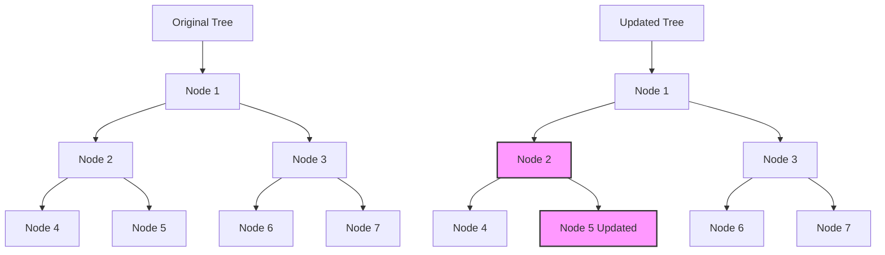
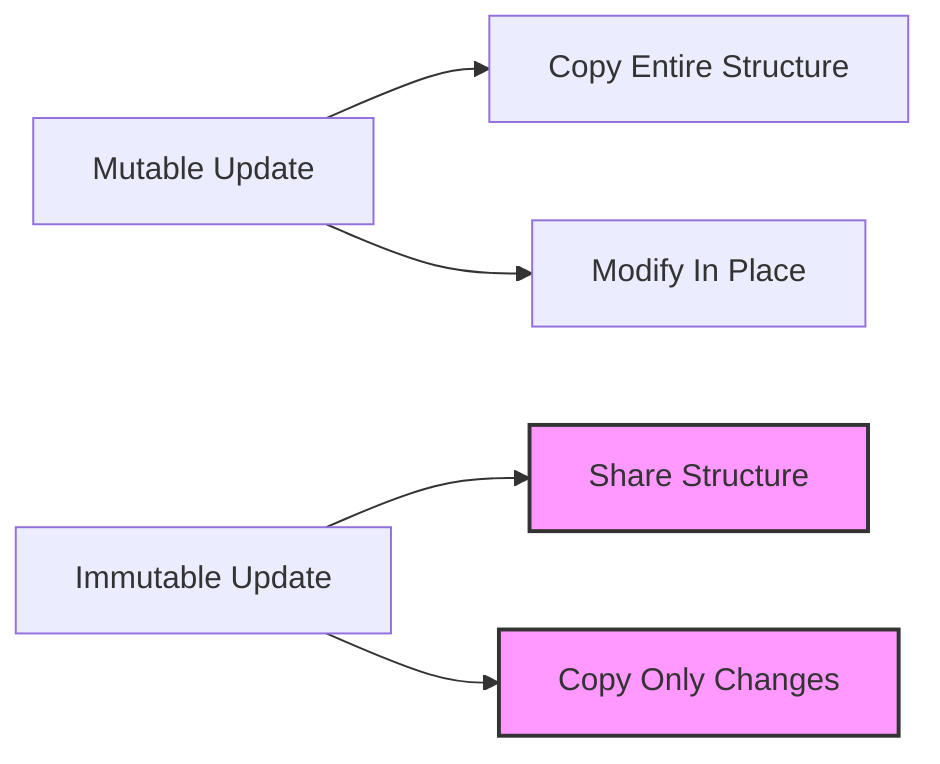

## 9.3 Understanding Structural Sharing

In functional programming, immutability is a cornerstone principle that offers numerous benefits, such as simplifying reasoning about code and enhancing concurrency safety. However, immutability can also pose challenges, particularly in terms of performance and memory usage. This is where **structural sharing** comes into play. Structural sharing is a technique used to efficiently manage immutable data structures by reusing parts of existing structures, thereby conserving memory and improving performance. In this section, we will delve into the concept of structural sharing, explore how it is implemented in Clojure, and examine its implications for time and space complexity.

### Mechanism of Structural Sharing

Structural sharing allows new versions of data structures to be created without duplicating the entire structure. Instead, only the parts that have changed are copied, while the unchanged parts are shared with the original structure. This approach is not only memory-efficient but also allows for fast creation of new versions of data structures.

#### How Structural Sharing Works

Consider a simple example of a binary tree. In an imperative programming language like Java, updating a node in the tree would typically involve creating a new tree with the updated node, which could be costly in terms of both time and space. In Clojure, however, structural sharing allows us to only update the necessary node and share the rest of the tree structure.

```clojure
(def tree {:value 1
           :left  {:value 2
                   :left  {:value 4}
                   :right {:value 5}}
           :right {:value 3
                   :left  {:value 6}
                   :right {:value 7}}})

(def updated-tree (assoc-in tree [:left :right :value] 10))

;; The updated-tree shares most of its structure with the original tree
```

In the example above, only the path to the updated node is changed, while the rest of the tree remains shared between `tree` and `updated-tree`. This is the essence of structural sharing.

#### Diagrams to Illustrate Structural Sharing

To better understand structural sharing, let's visualize it using a diagram. Consider the following tree before and after an update:



In this diagram, the nodes in pink represent the updated parts of the tree, while the rest of the nodes are shared between the original and updated trees.

### Immutable Updates

Immutable updates in Clojure leverage structural sharing to create new versions of data structures without duplicating the entire structure. This is achieved through persistent data structures, which are designed to efficiently handle updates by sharing structure.

#### Persistent Data Structures

Clojure's core data structures, such as vectors, maps, and sets, are persistent, meaning they are immutable and support efficient updates through structural sharing. Let's explore how this works with a vector:

```clojure
(def v [1 2 3 4 5])

(def v-updated (assoc v 2 99))

;; v-updated is a new vector with the third element changed
```

In this example, `v-updated` is a new vector where only the third element has been changed. The rest of the vector is shared with the original vector `v`.

#### Efficiency of Immutable Updates

The efficiency of immutable updates is a key advantage of structural sharing. By sharing structure, Clojure can perform updates in logarithmic time complexity for most operations, such as adding or updating elements in vectors or maps. This makes immutable data structures not only memory-efficient but also performant.

### Efficiency Considerations

Structural sharing has significant implications for both time and space complexity. Understanding these implications is crucial for designing efficient functional programs.

#### Time Complexity

The time complexity of operations on persistent data structures is typically logarithmic with respect to the size of the structure. For example, accessing or updating an element in a vector or map is O(log n), where n is the number of elements. This is achieved through the use of trees or similar data structures that allow for efficient access and updates.

#### Space Complexity

The space complexity of structural sharing is also favorable. By reusing existing structure, persistent data structures minimize the amount of memory required for updates. This is particularly important in functional programming, where immutability is a core principle.

#### Comparison with Java OOP

In Java, data structures are often mutable, and updates involve modifying the existing structure in place. This can lead to issues with concurrency and reasoning about code. In contrast, Clojure's use of structural sharing and immutability simplifies these challenges by providing a clear and efficient way to manage data.

### Try It Yourself

To better understand structural sharing, try experimenting with the following code examples:

```clojure
;; Create a vector and update an element
(def original-vector [1 2 3 4 5])
(def new-vector (assoc original-vector 3 99))

;; Print both vectors to see the shared structure
(println "Original Vector:" original-vector)
(println "New Vector:" new-vector)

;; Create a map and update a value
(def original-map {:a 1 :b 2 :c 3})
(def new-map (assoc original-map :b 99))

;; Print both maps to see the shared structure
(println "Original Map:" original-map)
(println "New Map:" new-map)
```

**Try modifying the code** to update different elements or add new ones. Observe how the original structures remain unchanged and how new structures are created efficiently.

### Visual Aids

To further illustrate the concept of structural sharing, consider the following diagram that compares memory usage between mutable and immutable updates:



This diagram highlights the difference between mutable and immutable updates, emphasizing the efficiency of structural sharing.

### Knowledge Check

To reinforce your understanding of structural sharing, consider the following questions:

- What is structural sharing, and why is it important in functional programming?
- How does structural sharing improve the efficiency of immutable updates?
- Compare the time and space complexities of operations on persistent data structures with those on mutable data structures in Java.

### Further Reading

For more information on structural sharing and persistent data structures, consider the following resources:

- [Clojure Official Documentation](https://clojure.org/reference)
- [Persistent Data Structures](https://en.wikipedia.org/wiki/Persistent_data_structure)
- [Transitioning from OOP to Functional Programming](https://www.lispcast.com/oo-to-fp/)

### Conclusion

Structural sharing is a powerful technique that enables efficient management of immutable data structures in Clojure. By reusing existing structure, Clojure can provide both memory efficiency and performance, making it an ideal choice for functional programming. Understanding and leveraging structural sharing can help you build scalable, maintainable applications that take full advantage of Clojure's strengths.

## **Test Your Knowledge: Understanding Structural Sharing Quiz**



### What is structural sharing in Clojure?

- [x] A technique for reusing parts of existing data structures to create new ones efficiently
- [ ] A method for copying entire data structures when making updates
- [ ] A process for converting mutable structures to immutable ones
- [ ] A strategy for optimizing memory allocation in Java

> **Explanation:** Structural sharing involves reusing parts of existing structures to efficiently create new versions without duplicating the entire structure.

### How does structural sharing affect memory usage?

- [x] It reduces memory usage by sharing unchanged parts of data structures
- [ ] It increases memory usage by creating copies of data structures
- [ ] It has no effect on memory usage
- [ ] It requires additional memory for managing shared structures

> **Explanation:** Structural sharing reduces memory usage by allowing new data structures to share unchanged parts with the original structure.

### Which of the following is a benefit of structural sharing?

- [x] Improved performance for immutable updates
- [ ] Simplified mutable state management
- [ ] Enhanced security of data structures
- [ ] Increased complexity of data structures

> **Explanation:** Structural sharing improves performance by allowing efficient updates to immutable data structures.

### What is the time complexity of accessing an element in a Clojure vector?

- [x] O(log n)
- [ ] O(1)
- [ ] O(n)
- [ ] O(n^2)

> **Explanation:** Accessing an element in a Clojure vector, which uses structural sharing, typically has a time complexity of O(log n).

### In Clojure, how are updates to data structures typically handled?

- [x] By creating a new version of the structure with shared parts
- [ ] By modifying the original structure in place
- [ ] By copying the entire structure and making changes
- [ ] By converting the structure to a mutable form

> **Explanation:** Updates in Clojure involve creating a new version of the structure that shares parts with the original, thanks to structural sharing.

### What is a persistent data structure?

- [x] An immutable data structure that supports efficient updates through structural sharing
- [ ] A mutable data structure that can be modified in place
- [ ] A data structure that persists changes across program executions
- [ ] A data structure that is stored on disk for long-term access

> **Explanation:** Persistent data structures are immutable and allow efficient updates by sharing structure, making them ideal for functional programming.

### How does structural sharing compare to Java's mutable updates?

- [x] Structural sharing avoids in-place modifications, improving concurrency safety
- [ ] Java's mutable updates are more memory-efficient
- [ ] Structural sharing requires more memory than Java's mutable updates
- [ ] Java's mutable updates are faster due to in-place changes

> **Explanation:** Structural sharing avoids in-place modifications, which enhances concurrency safety and simplifies reasoning about code.

### What is the primary advantage of using persistent data structures in Clojure?

- [x] Efficient memory usage and performance through structural sharing
- [ ] Simplified syntax for data manipulation
- [ ] Enhanced security features for sensitive data
- [ ] Compatibility with Java's mutable data structures

> **Explanation:** Persistent data structures in Clojure provide efficient memory usage and performance by reusing structure through structural sharing.

### How does structural sharing impact the design of functional programs?

- [x] It allows for efficient handling of immutable data, simplifying program design
- [ ] It complicates program design by requiring manual memory management
- [ ] It necessitates the use of mutable data structures for efficiency
- [ ] It has no impact on the design of functional programs

> **Explanation:** Structural sharing enables efficient handling of immutable data, which simplifies the design of functional programs by reducing complexity.

### True or False: Structural sharing is only applicable to tree-based data structures.

- [ ] True
- [x] False

> **Explanation:** Structural sharing is applicable to various types of data structures, including vectors, maps, and sets, not just tree-based structures.


