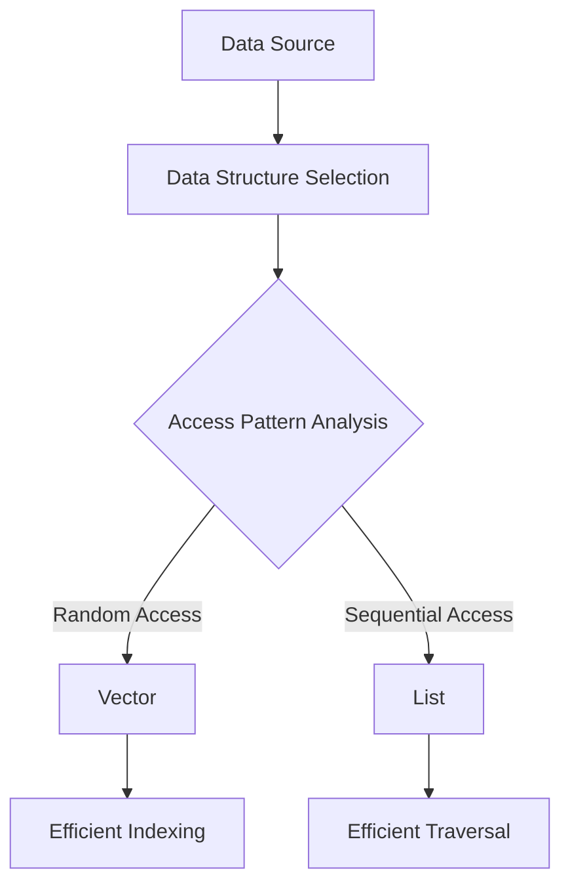

## 9.4 Efficient Data Manipulation Techniques

In this section, we delve into efficient data manipulation techniques in Clojure, focusing on transients, batch updates, and optimizing data access patterns. These strategies are crucial for building scalable applications that can handle large volumes of data with minimal performance overhead. Let's explore how Clojure's functional paradigm, coupled with strategic use of mutable state, can lead to efficient and elegant solutions.

### Using Transients for Performance-Critical Sections

In Clojure, immutability is a core principle that ensures data safety and consistency across concurrent operations. However, there are scenarios where performance is critical, and the overhead of creating new immutable data structures becomes a bottleneck. This is where **transients** come into play.

**Transients** provide a way to perform mutable operations on data structures in a controlled manner. They allow temporary mutability for performance gains while ensuring that the final result is immutable. This approach is particularly useful in performance-critical sections of your code where you need to perform a large number of updates.

#### Understanding Transients

Transients are available for Clojure's core data structures: vectors, maps, and sets. They offer a mutable interface that can be used within a specific scope, after which the data structure can be converted back to an immutable form.

Here's a simple example of using transients with a vector:

```clojure
(defn build-large-vector []
  (let [transient-vec (transient [])]
    (loop [i 0, v transient-vec]
      (if (< i 1000000)
        (recur (inc i) (conj! v i))
        (persistent! v)))))
```

In this example, we use `transient` to create a mutable vector and `conj!` to add elements to it. The `persistent!` function is used to convert the transient back to an immutable vector once all updates are complete.

#### Benefits of Transients

- **Performance**: Transients can significantly reduce the time complexity of operations that involve a large number of updates, as they avoid the overhead of creating new immutable structures at each step.
- **Safety**: Transients are designed to be used in a controlled scope, ensuring that once the mutable operations are complete, the data structure is safely converted back to an immutable form.

#### Best Practices for Using Transients

1. **Scope Limitation**: Use transients within a limited scope to ensure that they are not exposed to other parts of your program.
2. **Conversion**: Always convert transients back to persistent data structures using `persistent!` before returning them from a function.
3. **Avoid Side Effects**: Ensure that transient operations do not introduce side effects that could affect the rest of your program.

### Batch Updates: Strategies for Efficient Bulk Updates

Batch updates involve modifying multiple elements of a data structure in a single operation. This approach can be more efficient than updating each element individually, especially when dealing with large data sets.

#### Techniques for Batch Updates

1. **Using Transients**: As discussed, transients are ideal for performing batch updates due to their mutable nature. You can accumulate changes in a transient data structure and then convert it back to an immutable form.

2. **Functional Composition**: Leverage higher-order functions like `map`, `reduce`, and `filter` to apply transformations across collections efficiently. These functions can be composed to perform complex updates in a single pass.

3. **Partitioning Data**: Split large data sets into smaller chunks that can be processed independently. This technique can be combined with parallel processing to further enhance performance.

#### Example: Batch Updating a Map

Consider a scenario where you need to update a map with new key-value pairs:

```clojure
(defn update-map-batch [data updates]
  (reduce (fn [m [k v]] (assoc m k v))
          data
          updates))

(let [initial-map {:a 1 :b 2 :c 3}
      updates [[:a 10] [:b 20] [:d 4]]]
  (update-map-batch initial-map updates))
```

In this example, `reduce` is used to apply a series of updates to the map. This approach is efficient as it processes the updates in a single pass.

### Optimizing Data Access: Choosing the Right Data Structure

Choosing the right data structure is crucial for optimizing data access patterns. Different data structures have varying performance characteristics, and selecting the appropriate one can lead to significant performance gains.

#### Considerations for Data Structure Selection

1. **Access Patterns**: Analyze how your data is accessed and modified. For example, if frequent random access is required, a vector may be more suitable than a list.

2. **Operation Complexity**: Consider the time complexity of operations such as insertion, deletion, and lookup. Use data structures that offer the best performance for your specific use case.

3. **Memory Usage**: Evaluate the memory footprint of different data structures, especially when working with large data sets.

#### Example: Comparing Vectors and Lists

Vectors and lists are both common data structures in Clojure, but they have different performance characteristics:

- **Vectors**: Provide efficient random access and update operations. They are implemented as trees, allowing for fast indexing.
- **Lists**: Are optimized for sequential access and are best used when you need to process elements in order.

Here's an example comparing the two:

```clojure
(defn access-vector [v]
  (nth v 500000))

(defn access-list [l]
  (nth l 500000))

(let [large-vector (vec (range 1000000))
      large-list (apply list (range 1000000))]
  (println "Vector access time:" (time (access-vector large-vector)))
  (println "List access time:" (time (access-list large-list))))
```

In this example, accessing an element in a vector is significantly faster than in a list due to the vector's underlying tree structure.

### Visualizing Data Flow and Structure Selection

To better understand how data flows through your application and how to select the appropriate data structure, let's use a diagram:



**Diagram Description**: This diagram illustrates the decision-making process for selecting data structures based on access patterns. It shows how data flows from the source to the selection process and the resulting choice of data structure.

### Conclusion

Efficient data manipulation is a cornerstone of building scalable applications in Clojure. By leveraging transients for performance-critical operations, employing batch updates, and selecting the right data structures based on access patterns, you can optimize your applications for both speed and memory usage. As you continue to explore Clojure's rich ecosystem, keep these techniques in mind to harness the full potential of functional programming.

### Further Reading

- [Clojure Official Documentation](https://clojure.org/reference)
- [Transitioning from OOP to Functional Programming](https://www.lispcast.com/oo-to-fp/)
- [Clojure Community Resources](https://clojure.org/community/resources)

---

## **Test Your Knowledge: Efficient Data Manipulation Techniques Quiz**



### What is the primary benefit of using transients in Clojure?

- [x] Performance improvement for bulk updates
- [ ] Ensuring data immutability
- [ ] Simplifying code readability
- [ ] Enhancing security features

> **Explanation:** Transients allow temporary mutability, leading to significant performance gains in scenarios involving bulk updates.

### Which function is used to convert a transient back to an immutable data structure?

- [x] `persistent!`
- [ ] `immutable!`
- [ ] `finalize!`
- [ ] `commit!`

> **Explanation:** The `persistent!` function is used to convert a transient data structure back to its immutable form.

### What is a key consideration when using transients?

- [x] Limiting their scope
- [ ] Increasing their visibility
- [ ] Avoiding their use in loops
- [ ] Ensuring they are never converted

> **Explanation:** Transients should be used within a limited scope to prevent unintended side effects and ensure safe conversion back to immutable structures.

### Which data structure is optimized for random access in Clojure?

- [x] Vector
- [ ] List
- [ ] Set
- [ ] Map

> **Explanation:** Vectors in Clojure are optimized for random access due to their tree-based implementation.

### How can batch updates be efficiently performed in Clojure?

- [x] Using transients and higher-order functions
- [ ] By iterating over each element individually
- [ ] Through manual memory management
- [ ] By avoiding data structures altogether

> **Explanation:** Combining transients with higher-order functions like `map` and `reduce` allows for efficient batch updates.

### What is the advantage of using functional composition for data manipulation?

- [x] It allows complex transformations in a single pass
- [ ] It increases code verbosity
- [ ] It eliminates the need for data structures
- [ ] It reduces function reusability

> **Explanation:** Functional composition enables complex data transformations to be performed efficiently in a single pass.

### When should you consider using a list over a vector in Clojure?

- [x] When you need sequential access
- [ ] When you require random access
- [ ] When memory usage is a concern
- [ ] When immutability is not needed

> **Explanation:** Lists are optimized for sequential access, making them suitable for scenarios where elements are processed in order.

### What is the primary concern when performing data manipulation in functional programming?

- [x] Maintaining immutability
- [ ] Maximizing mutability
- [ ] Reducing code complexity
- [ ] Increasing side effects

> **Explanation:** Maintaining immutability is crucial in functional programming to ensure data safety and consistency.

### Which of the following is NOT a benefit of using transients?

- [ ] Performance improvement
- [ ] Controlled mutability
- [ ] Safe conversion to immutable form
- [x] Automatic memory management

> **Explanation:** Transients do not provide automatic memory management; they offer performance improvements and controlled mutability.

### True or False: Transients can be used across multiple threads safely.

- [ ] True
- [x] False

> **Explanation:** Transients are not thread-safe and should be used within a single thread to avoid concurrency issues.


