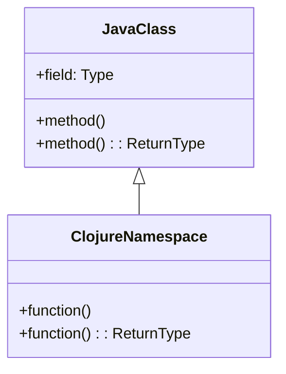

## 9.5 Designing Custom Functional Data Structures

Designing custom functional data structures in Clojure requires a deep understanding of the functional programming paradigm, which emphasizes immutability, pure functions, and declarative code. In this section, we will explore how to create new data structures that adhere to these principles, using Clojure's powerful features such as protocols and polymorphism. We will also discuss the performance trade-offs involved in designing these data structures, ensuring that they are efficient and scalable.

### Creating New Data Structures

In functional programming, data structures are typically immutable, meaning that once created, their state cannot be changed. This immutability offers several benefits, including easier reasoning about code, thread safety, and the ability to share data without copying. However, it also presents challenges when designing custom data structures, as we must ensure that operations on these structures are efficient.

#### Understanding Immutability

Before diving into the design process, let's revisit the concept of immutability. In Clojure, data structures such as lists, vectors, maps, and sets are immutable by default. This means that any operation that modifies a data structure actually returns a new version of that structure, leaving the original unchanged.

Consider the following example:

```clojure
(def original-vector [1 2 3])
(def new-vector (conj original-vector 4))

(println original-vector) ; Output: [1 2 3]
(println new-vector)      ; Output: [1 2 3 4]
```

Here, `conj` adds an element to the vector, but instead of modifying `original-vector`, it returns a new vector `new-vector`.

#### Designing Custom Data Structures

When designing a custom data structure, we must consider how it will be used and what operations it needs to support. This involves defining the data representation and the functions that operate on it.

Let's design a simple custom data structure: a functional stack. A stack is a last-in, first-out (LIFO) data structure with two main operations: `push` (to add an element) and `pop` (to remove the most recently added element).

```clojure
(defn create-stack []
  '())

(defn push [stack element]
  (cons element stack))

(defn pop [stack]
  (if (empty? stack)
    (throw (Exception. "Stack is empty"))
    [(first stack) (rest stack)]))

(def stack (create-stack))
(def stack1 (push stack 1))
(def stack2 (push stack1 2))
(def [top stack3] (pop stack2))

(println stack2) ; Output: (2 1)
(println top)    ; Output: 2
(println stack3) ; Output: (1)
```

In this example, `create-stack` initializes an empty stack, `push` adds an element to the stack, and `pop` removes the top element. Note that each operation returns a new stack, preserving immutability.

### Protocols and Polymorphism

Clojure's protocols provide a way to define a set of functions that can be implemented by different types, similar to interfaces in Java. This allows us to define common operations for our custom data structures and enable polymorphic behavior.

#### Defining Protocols

Let's define a protocol for our stack data structure:

```clojure
(defprotocol StackProtocol
  (push [stack element] "Push an element onto the stack")
  (pop [stack] "Pop the top element from the stack"))

(defrecord FunctionalStack [elements]
  StackProtocol
  (push [stack element]
    (FunctionalStack. (cons element elements)))
  (pop [stack]
    (if (empty? elements)
      (throw (Exception. "Stack is empty"))
      [(first elements) (FunctionalStack. (rest elements))])))

(def my-stack (->FunctionalStack '()))
(def my-stack1 (push my-stack 1))
(def my-stack2 (push my-stack1 2))
(def [top my-stack3] (pop my-stack2))

(println (:elements my-stack2)) ; Output: (2 1)
(println top)                   ; Output: 2
(println (:elements my-stack3)) ; Output: (1)
```

In this example, we define a `StackProtocol` with `push` and `pop` methods. We then create a `FunctionalStack` record that implements this protocol. This approach allows us to easily extend the stack's functionality or create new data structures that adhere to the same interface.

#### Polymorphism in Clojure

Polymorphism allows us to write code that can operate on different types of data structures without knowing their specific implementations. In Clojure, this is achieved through protocols and multimethods.

Consider a scenario where we have multiple stack implementations, such as a linked list-based stack and an array-based stack. By defining a common protocol, we can write functions that work with any stack implementation:

```clojure
(defrecord ArrayStack [elements]
  StackProtocol
  (push [stack element]
    (ArrayStack. (conj elements element)))
  (pop [stack]
    (if (empty? elements)
      (throw (Exception. "Stack is empty"))
      [(peek elements) (ArrayStack. (pop elements))])))

(defn stack-size [stack]
  (count (:elements stack)))

(def array-stack (->ArrayStack []))
(def array-stack1 (push array-stack 1))
(def array-stack2 (push array-stack1 2))
(def [top array-stack3] (pop array-stack2))

(println (stack-size array-stack2)) ; Output: 2
(println top)                       ; Output: 2
(println (stack-size array-stack3)) ; Output: 1
```

Here, we define an `ArrayStack` that implements the same `StackProtocol`. The `stack-size` function operates on any stack implementation, demonstrating polymorphism.

### Performance Trade-offs

When designing custom data structures, it's crucial to consider the performance implications of immutability and the chosen data representation. Let's explore some key considerations.

#### Structural Sharing

Clojure's persistent data structures leverage structural sharing to minimize memory usage and improve performance. When a data structure is modified, only the parts that change are copied, while the rest is shared with the original structure.

For example, when adding an element to a vector, Clojure creates a new vector that shares most of its structure with the original:

```clojure
(def original-vector [1 2 3])
(def new-vector (conj original-vector 4))

; Both vectors share the structure for the first three elements.
```

Structural sharing is a powerful technique that allows immutable data structures to be efficient in both time and space.

#### Time Complexity

The choice of data representation affects the time complexity of operations. For instance, adding an element to a list is O(1) because it involves prepending to the list, while accessing an element by index is O(n) because it requires traversing the list.

When designing custom data structures, we must carefully consider the time complexity of common operations and choose representations that optimize for these operations.

#### Memory Usage

Immutability can lead to increased memory usage, as each modification creates a new version of the data structure. However, structural sharing mitigates this by reusing existing structure.

It's essential to balance memory usage with performance, especially in memory-constrained environments. Profiling and benchmarking can help identify bottlenecks and guide optimization efforts.

### Try It Yourself

Now that we've explored the design of custom functional data structures, let's encourage you to experiment with your own implementations. Consider modifying the stack example to include additional operations, such as `peek` or `is-empty`. You could also try implementing other data structures, such as queues or trees, using Clojure's protocols and immutability principles.

### Visual Aids

To better understand the relationship between Java OOP concepts and Clojure's functional paradigm, let's visualize how Java classes map to Clojure namespaces and functions.



**Diagram Description**: This diagram illustrates the mapping between a Java class and a Clojure namespace. In Java, a class encapsulates fields and methods, while in Clojure, a namespace groups related functions. This highlights the shift from object-oriented design to functional design.

### References and Links

- [Clojure Official Documentation](https://clojure.org/reference)
- [Clojure Community Resources](https://clojure.org/community/resources)
- [Transitioning from OOP to Functional Programming](https://www.lispcast.com/oo-to-fp/)
- [Clojure Protocols Guide](https://clojure.org/reference/protocols)
- [Clojure Performance Tips](https://clojure.org/guides/performance)

### Knowledge Check

To reinforce your understanding of designing custom functional data structures, consider the following questions:

1. How does immutability affect the design of data structures in Clojure?
2. What is the role of protocols in enabling polymorphism for custom data structures?
3. How does structural sharing improve the performance of immutable data structures?
4. What are the time complexity considerations when designing a functional stack?
5. How can you balance memory usage and performance when designing custom data structures?

### Exercises

1. Implement a functional queue data structure using Clojure's protocols. Consider the operations `enqueue`, `dequeue`, and `peek`.
2. Modify the stack implementation to include a `peek` operation that returns the top element without removing it.
3. Benchmark the performance of your custom data structures using Clojure's `criterium` library.

### Encouraging Engagement

Designing custom functional data structures can be challenging, but with practice, you'll develop a deeper understanding of Clojure's functional paradigm and see tangible benefits in your codebase. Embrace the principles of immutability and polymorphism, and explore the rich possibilities that Clojure offers for building efficient, scalable applications.

### Summary

In this section, we've explored the design of custom functional data structures in Clojure, focusing on immutability, protocols, and performance trade-offs. By leveraging Clojure's powerful features, we can create data structures that are both efficient and easy to reason about, enabling us to build scalable applications with confidence.

## **Test Your Knowledge: Designing Custom Functional Data Structures Quiz**



### How does immutability affect the design of data structures in Clojure?

- [x] It ensures that data structures cannot be changed after creation.
- [ ] It allows data structures to be modified in place.
- [ ] It increases the complexity of data structures.
- [ ] It reduces the need for memory management.

> **Explanation:** Immutability ensures that data structures cannot be changed after creation, which simplifies reasoning about code and ensures thread safety.

### What is the role of protocols in enabling polymorphism for custom data structures?

- [x] Protocols define a set of functions that can be implemented by different types.
- [ ] Protocols allow data structures to be modified in place.
- [ ] Protocols increase the complexity of data structures.
- [ ] Protocols reduce the need for memory management.

> **Explanation:** Protocols define a set of functions that can be implemented by different types, enabling polymorphic behavior and allowing code to operate on multiple implementations.

### How does structural sharing improve the performance of immutable data structures?

- [x] It minimizes memory usage by sharing unchanged parts of the structure.
- [ ] It increases memory usage by copying the entire structure.
- [ ] It reduces the complexity of data structures.
- [ ] It allows data structures to be modified in place.

> **Explanation:** Structural sharing minimizes memory usage by sharing unchanged parts of the structure, which improves performance and reduces the need for copying.

### What are the time complexity considerations when designing a functional stack?

- [x] Adding an element is O(1), accessing by index is O(n).
- [ ] Adding an element is O(n), accessing by index is O(1).
- [ ] Both adding and accessing are O(1).
- [ ] Both adding and accessing are O(n).

> **Explanation:** In a functional stack implemented as a list, adding an element is O(1) because it involves prepending, while accessing by index is O(n) because it requires traversal.

### How can you balance memory usage and performance when designing custom data structures?

- [x] By leveraging structural sharing and choosing efficient representations.
- [ ] By copying data structures entirely for each modification.
- [ ] By increasing the complexity of data structures.
- [ ] By allowing data structures to be modified in place.

> **Explanation:** Balancing memory usage and performance involves leveraging structural sharing and choosing efficient representations to minimize copying and optimize operations.

### What is a key benefit of using Clojure's protocols for custom data structures?

- [x] They allow for polymorphic behavior across different implementations.
- [ ] They enable data structures to be modified in place.
- [ ] They increase the complexity of data structures.
- [ ] They reduce the need for memory management.

> **Explanation:** Clojure's protocols allow for polymorphic behavior across different implementations, enabling code to operate on various data structures without knowing their specific details.

### Why is immutability important in functional programming?

- [x] It ensures thread safety and simplifies reasoning about code.
- [ ] It allows data structures to be modified in place.
- [ ] It increases the complexity of data structures.
- [ ] It reduces the need for memory management.

> **Explanation:** Immutability ensures thread safety and simplifies reasoning about code, as data structures cannot be changed after creation, leading to more predictable behavior.

### What is the purpose of structural sharing in Clojure's data structures?

- [x] To minimize memory usage by reusing unchanged parts of the structure.
- [ ] To increase memory usage by copying the entire structure.
- [ ] To reduce the complexity of data structures.
- [ ] To allow data structures to be modified in place.

> **Explanation:** Structural sharing minimizes memory usage by reusing unchanged parts of the structure, which improves performance and reduces the need for copying.

### How does Clojure's approach to data structures differ from Java's?

- [x] Clojure uses immutable data structures, while Java uses mutable ones.
- [ ] Clojure allows data structures to be modified in place, while Java does not.
- [ ] Clojure increases the complexity of data structures compared to Java.
- [ ] Clojure reduces the need for memory management compared to Java.

> **Explanation:** Clojure uses immutable data structures, which cannot be changed after creation, while Java typically uses mutable data structures that can be modified in place.

### True or False: Clojure's protocols are similar to Java interfaces.

- [x] True
- [ ] False

> **Explanation:** True. Clojure's protocols are similar to Java interfaces in that they define a set of functions that can be implemented by different types, enabling polymorphism.




