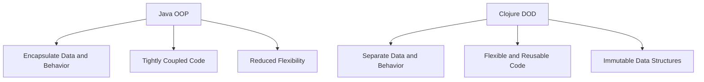

## 9.7 Data-Oriented Design Principles

In the world of software development, data-oriented design (DOD) stands as a paradigm shift from traditional object-oriented programming (OOP). While OOP focuses on encapsulating data and behavior within objects, data-oriented design emphasizes the separation of data and behavior, focusing on data transformations. This approach is particularly powerful in functional programming languages like Clojure, which excel in handling immutable data structures and pure functions.

### Principles of Data-Oriented Design

Data-oriented design is built on several core principles that guide developers in organizing and processing data efficiently:

1. **Focus on Data and Transformations**: Unlike OOP, which centers around objects and methods, data-oriented design prioritizes data itself and the transformations applied to it. This means thinking about how data flows through the system and how it can be efficiently transformed.

2. **Separation of Data and Behavior**: In DOD, data structures are kept separate from the functions that operate on them. This separation allows for more flexible and reusable code, as functions can be applied to different data structures without modification.

3. **Emphasis on Immutability**: Immutable data structures are a cornerstone of data-oriented design. They ensure that data remains consistent throughout the application, reducing the risk of side effects and making concurrent programming more manageable.

4. **Data as a First-Class Citizen**: In DOD, data is treated as a first-class entity, meaning it is the primary focus of the design. This approach encourages developers to think about the data's structure and how it can be optimized for performance.

5. **Transformations over Mutations**: Instead of mutating data in place, data-oriented design encourages creating new data structures through transformations. This approach aligns with functional programming principles and leads to more predictable and testable code.

### Separation of Data and Behavior

One of the key tenets of data-oriented design is the separation of data and behavior. This principle offers several advantages:

- **Flexibility**: By decoupling data from behavior, functions can be reused across different data structures, enhancing code modularity and reducing duplication.

- **Simplicity**: Data structures become simpler and easier to understand when they are not burdened with behavior. This clarity makes it easier to reason about the data and its transformations.

- **Testability**: Functions that operate on data can be tested independently of the data structures, leading to more robust and reliable code.

- **Concurrency**: Separating data from behavior simplifies concurrent programming, as immutable data structures can be safely shared across threads without synchronization.

#### Example: Separation of Data and Behavior in Clojure

Consider a simple example in Clojure where we separate data and behavior:

```clojure
;; Define a data structure
(def person {:name "Alice" :age 30})

;; Define a function that operates on the data
(defn greet [person]
  (str "Hello, " (:name person) "!"))

;; Usage
(greet person) ;; => "Hello, Alice!"
```

In this example, the `person` data structure is separate from the `greet` function. This separation allows us to easily reuse the `greet` function with different data structures.

### Example Applications

Data-oriented design can simplify complex systems by focusing on data transformations rather than object interactions. Here are a few examples where DOD shines:

#### Example 1: Game Development

In game development, data-oriented design is often used to optimize performance. By focusing on data transformations, developers can efficiently process large amounts of data, such as rendering graphics or simulating physics.

```clojure
;; Define a data structure for game entities
(def entities [{:id 1 :position [0 0] :velocity [1 1]}
               {:id 2 :position [10 10] :velocity [-1 -1]}])

;; Define a function to update entity positions
(defn update-positions [entities]
  (map (fn [entity]
         (update entity :position
                 (fn [[x y]]
                   [(+ x (first (:velocity entity)))
                    (+ y (second (:velocity entity)))])))
       entities))

;; Usage
(update-positions entities)
;; => ({:id 1, :position [1 1], :velocity [1 1]}
;;     {:id 2, :position [9 9], :velocity [-1 -1]})
```

In this example, the `update-positions` function transforms the `entities` data structure, updating each entity's position based on its velocity. This approach is efficient and easy to parallelize.

#### Example 2: Data Processing Pipelines

Data-oriented design is also well-suited for building data processing pipelines, where data flows through a series of transformations.

```clojure
;; Define a data structure for raw data
(def raw-data [{:value 10} {:value 20} {:value 30}])

;; Define a series of transformations
(defn process-data [data]
  (->> data
       (map #(update % :value inc))
       (filter #(> (:value %) 20))
       (reduce (fn [acc {:keys [value]}] (+ acc value)) 0)))

;; Usage
(process-data raw-data) ;; => 52
```

In this example, the `process-data` function applies a series of transformations to the `raw-data` structure, incrementing each value, filtering values greater than 20, and reducing the result to a sum.

### Comparison with Object-Oriented Design

Data-oriented design offers several advantages over traditional object-oriented design:

- **Performance**: By focusing on data transformations, DOD can lead to more efficient code, especially in performance-critical applications like games or data processing.

- **Simplicity**: DOD encourages simpler data structures and functions, making the codebase easier to understand and maintain.

- **Concurrency**: Immutable data structures and the separation of data and behavior make concurrent programming more straightforward, reducing the risk of race conditions and deadlocks.

- **Flexibility**: DOD allows for more flexible code, as functions can be reused across different data structures without modification.

#### Java OOP vs. Clojure DOD

To illustrate the differences between Java OOP and Clojure's data-oriented design, consider the following comparison:

**Java OOP Example:**

```java
// Define a class with data and behavior
public class Person {
    private String name;
    private int age;

    public Person(String name, int age) {
        this.name = name;
        this.age = age;
    }

    public String greet() {
        return "Hello, " + name + "!";
    }
}

// Usage
Person person = new Person("Alice", 30);
System.out.println(person.greet()); // => "Hello, Alice!"
```

In this Java example, the `Person` class encapsulates both data and behavior. This approach can lead to tightly coupled code and reduced flexibility.

**Clojure DOD Example:**

```clojure
;; Define a data structure
(def person {:name "Alice" :age 30})

;; Define a function that operates on the data
(defn greet [person]
  (str "Hello, " (:name person) "!"))

;; Usage
(greet person) ;; => "Hello, Alice!"
```

In the Clojure example, data and behavior are separate, leading to more flexible and reusable code.

### Visual Aids

To further illustrate the differences between Java OOP and Clojure's data-oriented design, consider the following diagram:



**Diagram Description:** This diagram compares Java OOP and Clojure's data-oriented design, highlighting the encapsulation of data and behavior in Java and the separation in Clojure.

### References and Links

For further reading on data-oriented design and its application in Clojure, consider the following resources:

- [Clojure Official Documentation](https://clojure.org/reference)
- [Clojure Community Resources](https://clojure.org/community/resources)
- [Transitioning from OOP to Functional Programming](https://www.lispcast.com/oo-to-fp/)
- [Clojure STM Guide](https://clojure.org/reference/refs)

### Knowledge Check

To reinforce your understanding of data-oriented design principles, consider the following questions:

1. What are the key principles of data-oriented design?
2. How does separating data and behavior improve code flexibility?
3. In what scenarios is data-oriented design particularly beneficial?
4. How does data-oriented design compare to object-oriented design in terms of performance and simplicity?
5. Why are immutable data structures important in data-oriented design?

### Exercises

1. **Exercise 1**: Refactor a small Java program that uses classes and methods to a Clojure program that uses data structures and functions. Focus on separating data and behavior.

2. **Exercise 2**: Create a data processing pipeline in Clojure that takes a list of numbers, filters out even numbers, doubles the remaining numbers, and calculates their sum.

3. **Exercise 3**: Implement a simple game simulation in Clojure using data-oriented design principles. Define data structures for game entities and functions to update their state.

### Encouraging Engagement

Embracing data-oriented design can be challenging for developers accustomed to object-oriented programming, but the benefits are substantial. By focusing on data transformations and separating data from behavior, you'll create more flexible, efficient, and maintainable code. As you explore these principles in Clojure, remember that each step you take deepens your understanding and enhances your ability to build scalable applications.

## **Test Your Knowledge: Data-Oriented Design Principles Quiz**



### What is a key principle of data-oriented design?

- [x] Focus on data and transformations
- [ ] Encapsulation of data and behavior
- [ ] Use of mutable data structures
- [ ] Emphasis on inheritance

> **Explanation:** Data-oriented design emphasizes focusing on data and transformations rather than encapsulating data and behavior, as seen in object-oriented design.


### How does separating data and behavior improve code flexibility?

- [x] Functions can be reused across different data structures
- [ ] It makes code more complex
- [x] Enhances code modularity
- [ ] Increases dependency on specific data types

> **Explanation:** By separating data and behavior, functions become more modular and can be reused across different data structures, enhancing code flexibility.


### In what scenarios is data-oriented design particularly beneficial?

- [x] Performance-critical applications
- [ ] Applications with minimal data processing
- [x] Concurrent programming
- [ ] Simple CRUD applications

> **Explanation:** Data-oriented design is beneficial in performance-critical applications and concurrent programming due to its focus on efficient data transformations and immutability.


### How does data-oriented design compare to object-oriented design in terms of performance?

- [x] DOD can lead to more efficient code
- [ ] OOP is generally more efficient
- [ ] DOD increases code complexity, reducing performance
- [ ] OOP is better for concurrent applications

> **Explanation:** Data-oriented design can lead to more efficient code, especially in performance-critical applications, due to its focus on data transformations.


### Why are immutable data structures important in data-oriented design?

- [x] They ensure data consistency
- [ ] They allow for in-place mutations
- [x] They reduce the risk of side effects
- [ ] They make data processing slower

> **Explanation:** Immutable data structures ensure data consistency and reduce the risk of side effects, which are crucial for reliable and predictable code.


### What is a benefit of treating data as a first-class citizen in DOD?

- [x] Encourages optimization of data structure
- [ ] Leads to tightly coupled code
- [ ] Reduces code reusability
- [ ] Increases dependency on specific data types

> **Explanation:** Treating data as a first-class citizen encourages developers to optimize data structures for performance and reusability.


### How does DOD handle transformations?

- [x] By creating new data structures
- [ ] By mutating data in place
- [x] By applying pure functions
- [ ] By using inheritance

> **Explanation:** DOD handles transformations by creating new data structures and applying pure functions, avoiding in-place mutations.


### What is a common pitfall of object-oriented design that DOD addresses?

- [x] Tightly coupled code
- [ ] Lack of encapsulation
- [ ] Excessive use of immutability
- [ ] Overemphasis on data transformations

> **Explanation:** DOD addresses the common pitfall of tightly coupled code found in object-oriented design by separating data and behavior.


### How does DOD simplify concurrent programming?

- [x] By using immutable data structures
- [ ] By relying on inheritance
- [ ] By increasing side effects
- [ ] By encapsulating data and behavior

> **Explanation:** DOD simplifies concurrent programming by using immutable data structures, which can be safely shared across threads without synchronization.


### True or False: Data-oriented design emphasizes the use of mutable data structures.

- [ ] True
- [x] False

> **Explanation:** False. Data-oriented design emphasizes the use of immutable data structures to ensure data consistency and reduce side effects.


